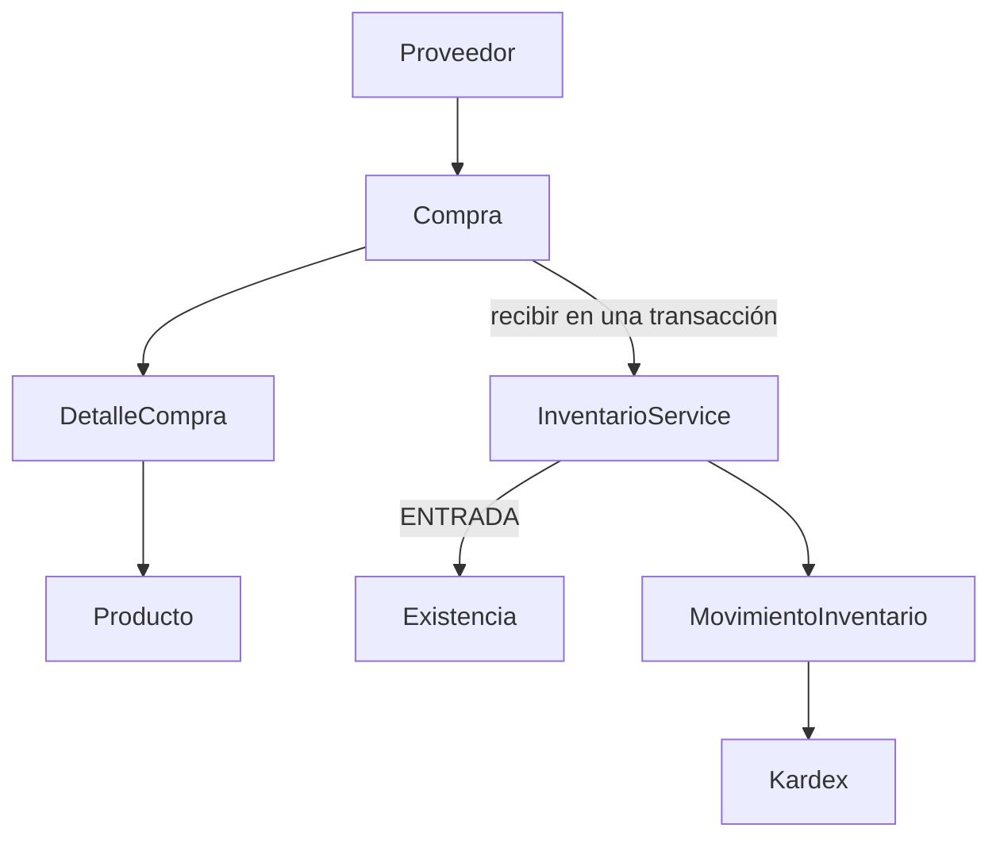

# Proveedores y compras

Los helpers monetarios compartidos se encuentran en `src/common/dinero.ts`; `src/modules/compras/dinero.ts` conserva sus exportaciones para compatibilidad. Ventas reutiliza esos helpers y el núcleo de Inventario para SALIDAS; véase [VENTAS.md](VENTAS.md).

Extensión del backend NestJS existente, ESM y Prisma ORM 8 RC con Contracts. No cambia dependencias ni introduce PrismaClient clásico. Todas las rutas están bajo `/api/v1` y requieren JWT. GET permite usuarios autenticados; POST/PATCH/DELETE requiere ADMINISTRADOR.

## Arquitectura y modelos



Proveedor contiene id, nombre, razonSocial, rfc, email, telefono, direccion, contacto, activo, createdAt y updatedAt. Nombre obligatorio; RFC opcional, normalizado a mayúsculas y UNIQUE. Email opcional, normalizado a minúsculas y validado. RFC acepta un formato simple de 12/13 caracteres; no verifica su validez fiscal. Otros textos opcionales vacíos se normalizan a null. PATCH acepta campos parciales, rechaza null y puede limpiar razonSocial/telefono/direccion/contacto con string vacío. activo se cambia por las rutas dedicadas.

Compra contiene id, folio, proveedorId, estado, subtotal, impuestos, total, observacion, createdByUsuarioId, recibidaPorUsuarioId, fechaRecepcion, createdAt y updatedAt. DetalleCompra contiene id, compraId, productoId, cantidad, costoUnitario, subtotal y createdAt.

Relaciones: Proveedor→Compras, Compra→Detalles, Detalle→Producto y Compra→Usuario creador/receptor. Las FK usan RESTRICT. UNIQUE(compraId,productoId) evita productos repetidos incluso en PostgreSQL. CHECK valida cantidades, costos, subtotales, total y los datos obligatorios de recepción. Los enums de esta RC se almacenan como text con CHECK.

Los folios se generan con `COMP-<año UTC>-<UUID completo en mayúsculas>`, por ejemplo `COMP-2026-925679C2-42B2-4C86-B948-9E3F28C93BD5`. No son consecutivos ni tienen significado fiscal. UUID y UNIQUE permiten creación concurrente sin SELECT MAX ni contadores compartidos. El frontend nunca envía folio.

## Estados y reglas

| Estado actual | Acción | Resultado |
|---|---|---|
| BORRADOR | editar | BORRADOR, totales recalculados |
| BORRADOR | recibir | RECIBIDA, una ENTRADA por detalle |
| BORRADOR | cancelar | CANCELADA, sin tocar stock |
| BORRADOR | DELETE | Elimina encabezado y detalles atómicamente |
| RECIBIDA | editar/recibir/cancelar/DELETE | 409 |
| CANCELADA | editar/recibir/cancelar/DELETE | 409 |

No existe transición RECIBIDA→CANCELADA en esta versión. Una devolución requerirá movimientos compensatorios en el futuro. No se borran movimientos ni se revierte stock silenciosamente.

Proveedor sin compras puede eliminarse. Con cualquier compra, incluida CANCELADA, DELETE devuelve 409; debe usarse desactivar. Se permite desactivar proveedores con historial. Crear/editar/recibir exige proveedor activo. Productos con detalles de compra tampoco pueden eliminarse físicamente: 409 y baja lógica, preservando las FK. Eliminar un BORRADOR retira sus detalles y puede liberar esas referencias.

## Dinero y DTOs

DTOs: CreateProveedorDto, UpdateProveedorDto, ProveedorQueryDto, CompraDetalleDto, CreateCompraDto, UpdateCompraDto, CompraQueryDto y AccionCompraDto. ValidationPipe mantiene transform, whitelist y forbidNonWhitelisted. No se aceptan estado, folio, subtotal, total ni campos de autoría del cliente. Recibir/cancelar solo aceptan body vacío o `{}`.

La compra admite 1..100 detalles, sin repetir producto. IDs y cantidades son enteros positivos int4; costoUnitario e impuestos son números JSON no negativos con hasta dos decimales y máximo 1000000000000. No se aceptan strings monetarios de entrada en esta versión, siguiendo los DTOs de Productos. Las respuestas monetarias son strings Decimal de PostgreSQL.

Cálculos: convertir a centavos BigInt, multiplicar cantidad×costo, sumar subtotales e impuestos y serializar a strings con dos decimales para persistir. Nunca se usa Float para dinero ni se suman importes mediante números binarios. subtotal y total son calculados exclusivamente por backend. impuestos default 0. No se modifica automáticamente el costo del catálogo al recibir.

## Recepción, transacciones y concurrencia

`ComprasService.recibir` abre exactamente una `db.transaction`. Dentro:

1. SELECT de la compra FOR UPDATE, con ID parametrizado.
2. Leer estado después de adquirir el bloqueo; exigir BORRADOR.
3. Validar usuario activo desde JWT y bloquear/validar proveedor activo.
4. Leer los detalles persistidos ordenados por productoId ascendente.
5. Por cada detalle, llamar `InventarioService.entradaEnTransaccion(tx,dto,usuarioId)`.
6. Inventario bloquea Producto FOR UPDATE y reutiliza íntegramente la validación, recuperación de existencia faltante, actualización y creación de movimiento existentes.
7. Marcar RECIBIDA, guardar receptor y fechaRecepcion; leer respuesta usando el mismo tx.
8. Commit únicamente si todo termina correctamente.

El método manual de inventario sigue abriendo su propia transacción y llama al mismo núcleo privado. Compras nunca actualiza Existencia directamente ni hace llamadas HTTP internas. SALIDA y AJUSTE siguen usando el mismo núcleo; AJUSTE mantiene su diferencia con signo.

Cualquier excepción, incluida una falla al insertar el movimiento después de actualizar stock, revierte entradas anteriores, saldo, movimientos y estado. La compra continúa BORRADOR. Dos recepciones simultáneas se serializan por el bloqueo de compra: una termina y la segunda observa RECIBIDA y devuelve 409. Edición, cancelación y DELETE toman ese mismo bloqueo. Distintas compras bloquean productos en orden ascendente, aunque el frontend haya enviado los detalles en orden inverso.

Crear y editar también son transaccionales; bloquean proveedor y productos para validar su estado y proteger referencias concurrentes. CRUD de proveedor bloquea la fila antes de editar, activar/desactivar o DELETE. El RFC duplicado, incluida una carrera concurrente, se traduce de SQLSTATE 23505 a 409; errores inesperados no se disfrazan de conflictos.

Auditoría: creador y receptor se toman de CurrentUser/JWT, validando usuario activo en compras. Las entradas registran usuario, producto, cantidad, stockAnterior, stockNuevo, createdAt y `Entrada por compra <folio>`. No se añade compraId a MovimientoInventario: el folio único e inmutable aporta la referencia mínima requerida sin acoplar el motor de stock al dominio comercial. Datos de usuarios se proyectan como id/nombre/email, nunca password.

## Endpoints

| Método | Ruta | Comportamiento |
|---|---|---|
| GET | /proveedores | Listado paginado y búsqueda |
| GET | /proveedores/:id | Proveedor individual |
| POST | /proveedores | Crear activo, 201 |
| PATCH | /proveedores/:id | Editar parcialmente, 200 |
| PATCH | /proveedores/:id/desactivar | Baja lógica, 200 |
| PATCH | /proveedores/:id/activar | Reactivar, 200 |
| DELETE | /proveedores/:id | Eliminar si no tiene compras, 200 |
| GET | /compras | Listado paginado y filtros |
| GET | /compras/:id | Encabezado, proveedor, creador/receptor, detalles y productos |
| POST | /compras | Crear BORRADOR, 201 |
| PATCH | /compras/:id | Editar BORRADOR y recalcular, 200 |
| POST | /compras/:id/recibir | Recepción atómica, 201 |
| POST | /compras/:id/cancelar | Cancelar BORRADOR, 201 |
| DELETE | /compras/:id | Eliminar BORRADOR y detalles, 200 |

PATCH de detalles reemplaza la colección completa. Campos omitidos se conservan. Un PATCH vacío de proveedor es un no-op. Repetir activar/desactivar devuelve 409.

## Consultas y contratos

Ambos listados: page=1, limit=20; page>=1, limit entre 1 y 100. Proveedores: search por nombre, razonSocial, RFC y email, orden por id desc.

Compras: proveedorId, estado (BORRADOR/RECIBIDA/CANCELADA), fechaInicio, fechaFin, search por folio o nombre del proveedor. Filtros se combinan con AND. sortBy: createdAt (default), folio, estado, total; sortOrder: desc (default) o asc. Whitelist en DTO y servicio; id desempata en la misma dirección. Búsqueda ILIKE con valores parametrizados; %, _ y barra inversa se tratan literalmente.

Fechas sin hora son días completos UTC, igual que Inventario: inicio 00:00:00.000Z, fin 23:59:59.999Z inclusivo. Timestamps requieren Z u offset explícito. fechaInicio>fechaFin devuelve 400. Se filtra createdAt de compra, no fechaRecepcion.

Colecciones siempre responden `{data,pagination}`:

```json
{
  "data": [],
  "pagination": {
    "page": 1,
    "limit": 20,
    "totalItems": 0,
    "totalPages": 0,
    "hasNextPage": false,
    "hasPreviousPage": false
  }
}
```

TotalPages=ceil(totalItems/limit); hasPreviousPage=page>1. No se devuelven colecciones ilimitadas. Listado de compras incluye proveedor y usuarios públicos, sin detalles; consulta individual añade detalles con productos mediante include anidado. No hay loops de consultas de relaciones por elemento para los listados.

Forma de respuesta individual (fechas e IDs de ejemplo):

```json
{
  "id": 1,
  "folio": "COMP-2026-925679C2-42B2-4C86-B948-9E3F28C93BD5",
  "proveedorId": 1,
  "proveedor": {"id": 1, "nombre": "Proveedor Demo", "rfc": "TSE260101ABC"},
  "estado": "RECIBIDA",
  "subtotal": "600000.00",
  "impuestos": "0.00",
  "total": "600000.00",
  "observacion": "Compra inicial",
  "createdByUsuarioId": 1,
  "creadoPor": {"id": 1, "nombre": "Administrador", "email": "admin@inventario.local"},
  "recibidaPorUsuarioId": 1,
  "recibidoPor": {"id": 1, "nombre": "Administrador", "email": "admin@inventario.local"},
  "fechaRecepcion": "2026-10-02T21:00:00.000Z",
  "createdAt": "2026-10-02T20:00:00.000Z",
  "updatedAt": "2026-10-02T21:00:00.000Z",
  "detalles": [{
    "id": 1,
    "compraId": 1,
    "productoId": 1,
    "producto": {"id": 1, "sku": "LAP-DELL-001", "nombre": "LAPTOP DELL"},
    "cantidad": 50,
    "costoUnitario": "12000.00",
    "subtotal": "600000.00",
    "createdAt": "2026-10-02T20:00:00.000Z"
  }]
}
```

BORRADOR/CANCELADA tienen receptor y fechaRecepcion null.

## Errores

400: DTO/query inválido, propiedades desconocidas, producto repetido, detalle vacío, rango invertido, dinero con más de dos decimales. 401: JWT ausente/inválido o usuario de compra inválido/inactivo. 403: mutación sin ADMINISTRADOR. 404: compra/proveedor/producto inexistente. 409: estado incompatible, proveedor/producto inactivo, RFC duplicado, DELETE con historial o recepción que excede el máximo de stock int4.

## Contract, índices y Prisma RC

Se ejecutó contract emit, db update --dry-run y revisión del plan. Se aplicaron únicamente 16 operaciones aditivas: tres tablas, tres restricciones UNIQUE, cinco índices de FK y cinco relaciones RESTRICT. Los CHECK están en CREATE TABLE. No hubo DROP ni cambios sobre las tablas existentes de stock. Se generó el snapshot `d28539c0287b7019f02a166e1316ce3a201cd7758f319bef5ead6d1fc9568002` y se actualizó migrations/app/refs/db.json.

Índices de relación generados por Prisma: Compra(proveedorId), Compra(createdByUsuarioId), Compra(recibidaPorUsuarioId), DetalleCompra(compraId), DetalleCompra(productoId). UNIQUE crea índices para folio, RFC y (compraId,productoId), además de las PK. Corresponden a relaciones, filtros de proveedor, carga de detalles y protección de DELETE. No se añadieron índices especulativos sobre estado/createdAt; evaluar EXPLAIN ANALYZE con volumen representativo antes de índices compuestos.

Prisma RC: Decimal se persiste/devuelve como string; default de Decimal debe ser `@default("0")`, no un literal numérico, para que db update pueda planificar. aggregate(count) reemplaza el terminal count() del cliente clásico. include anidado permite obtener productos y usuarios sin N+1. Los bloqueos usan raw SQL parametrizado con returnsRow y tx.query; nunca runtime externo dentro de una transacción. Errores de unicidad conservan SQLSTATE en meta/cause y se traducen específicamente.

## Postman

Variables: `base_url=http://localhost:3000/api/v1`, `token`, `proveedor_id`, `producto_a_id`, `producto_b_id`, `compra_id`. Usa IDs reales devueltos por las operaciones. Header en todas: `Authorization: Bearer {{token}}`. POST/PATCH JSON: `Content-Type: application/json`.

Crear proveedor:

```text
POST {{base_url}}/proveedores
```

```json
{
  "nombre": "Tecnología del Sureste",
  "razonSocial": "Tecnología del Sureste SA de CV",
  "rfc": "TSE260101ABC",
  "email": "ventas@proveedor.com",
  "telefono": "9931234567"
}
```

Crear compra (guarda proveedor_id e IDs de productos existentes):

```text
POST {{base_url}}/compras
```

```json
{
  "proveedorId": {{proveedor_id}},
  "observacion": "Compra inicial",
  "impuestos": 0,
  "detalles": [
    {"productoId": {{producto_a_id}}, "cantidad": 50, "costoUnitario": 12000},
    {"productoId": {{producto_b_id}}, "cantidad": 20, "costoUnitario": 350.50}
  ]
}
```

Los placeholders numéricos sin comillas los sustituye Postman antes de enviar el JSON.

```text
GET {{base_url}}/proveedores?page=1&limit=20&search=tecnología
GET {{base_url}}/proveedores/{{proveedor_id}}
PATCH {{base_url}}/proveedores/{{proveedor_id}}/desactivar
PATCH {{base_url}}/proveedores/{{proveedor_id}}/activar
GET {{base_url}}/compras/{{compra_id}}
GET {{base_url}}/compras?page=1&limit=20
GET {{base_url}}/compras?estado=RECIBIDA&page=1&limit=20
GET {{base_url}}/compras?proveedorId={{proveedor_id}}&fechaInicio=2026-09-01&fechaFin=2026-09-30&sortBy=total&sortOrder=asc
GET {{base_url}}/compras?search=COMP-2026
POST {{base_url}}/compras/{{compra_id}}/recibir
GET {{base_url}}/inventario/kardex/{{producto_a_id}}?page=1&limit=20
GET {{base_url}}/inventario/existencias/{{producto_a_id}}
```

Recibir no lleva body. Repetirlo devuelve 409 sin duplicar stock ni movimientos.

Editar un BORRADOR:

```text
PATCH {{base_url}}/compras/{{compra_id}}
{"observacion":"Pedido actualizado","impuestos":100.50}

PATCH {{base_url}}/proveedores/{{proveedor_id}}
{"telefono":"9939876543","contacto":"Compras"}
```

Cancelar/eliminar: usar otro BORRADOR; una compra ya RECIBIDA devuelve 409.

```text
POST {{base_url}}/compras/{{compra_id}}/cancelar
DELETE {{base_url}}/compras/{{compra_id}}
DELETE {{base_url}}/proveedores/{{proveedor_id}}
```

## Verificación y deuda técnica

TypeScript, build, unitarias y E2E se ejecutan con:

```bash
./node_modules/.bin/tsc --noEmit --incremental false -p tsconfig.json
npm run build
npm test
TEST_INVENTARIO_DB=1 npm run test:e2e
npx prisma db verify
```

E2E requiere PostgreSQL real y sockets HTTP locales. Usa UUID y limpieza limitada a IDs creados por la suite. Mantiene las pruebas anteriores de inventario. Se cubren recepción 0→50/20, movimientos auditados, doble recepción HTTP concurrente, compras distintas con productos en orden inverso, recepción/cancelación concurrentes, rollback por overflow y falla de inserción de movimiento, estados, DELETE, filtros, dinero, seguridad y regresión de operaciones manuales.

Validación final ejecutada el 2026-10-02: TypeScript sin errores, build correcto, **184 unitarias** (135 existentes + 49 nuevas) y **53 E2E** (20 existentes + 33 nuevos) pasan. Lint finaliza sin errores, con tres advertencias preexistentes en Usuarios/Categorías. `prisma db verify` verifica marcador y esquema sin discrepancias; el dry-run final contiene **cero operaciones pendientes**. No se cambiaron package.json ni package-lock.json.

Archivos creados: `src/common/consulta.ts`, `src/common/errores-db.ts`; módulos de proveedores (service, controller, module y DTOs create/update/query); módulo de compras (service, controller, module, dinero.ts, dinero.spec.ts y DTOs detalle/create/update/query/acción/compras.dto.spec.ts); `test/compras.e2e-spec.ts`; este documento y los dos archivos del nuevo snapshot generado.

Archivos modificados: `src/app.module.ts`, `src/prisma/contract.prisma`, `src/prisma/contract.json`, `src/prisma/contract.d.ts`, `src/modules/inventario/inventario.service.ts`, `src/modules/productos/productos.service.ts`, `src/modules/productos/productos.service.spec.ts`, `INVENTARIO.md` y `migrations/app/refs/db.json`.

Deuda técnica: count y página son lecturas separadas, no un snapshot; OFFSET y búsquedas ILIKE requieren medir con volumen real. El origen de compra es textual en el movimiento; futuras devoluciones podrían justificar una referencia estructurada. No hay recepciones parciales, devoluciones, motor fiscal, moneda mult/divisa ni auditoría separada de ediciones/cancelaciones. Las recepciones se limitan a 100 detalles para acotar tiempo de bloqueo. No se recalculan costos de catálogo. Algunas advertencias de lint e imports antiguos sin .js ya existían en módulos ajenos a esta tarea.
