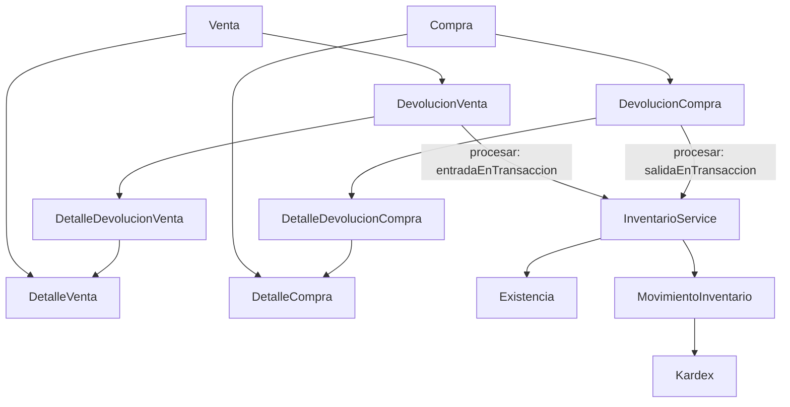

# Devoluciones de ventas y compras

Ampliación del backend existente NestJS/ESM y Prisma ORM 8 RC con Contracts. InventarioService sigue siendo la única autoridad de stock. Las devoluciones constituyen documentos independientes: nunca modifican Compra, Venta, sus detalles históricos, MovimientoInventario original ni Venta.utilidad. El movimiento compensatorio explica físicamente el retorno en Kardex.

## Arquitectura



`DevolucionesModule` registra dos controladores y dos servicios; importa InventarioModule y utiliza el DatabaseModule global existente. Los helpers `reglas.ts` comparten validación, disponibilidad y cálculos monetarios. Los servicios tienen consultas ORM estáticamente tipadas para cada dominio; no utilizan PrismaClient clásico, `$transaction` o `any`. Los imports nuevos conservan `.js`.

## Modelos y relaciones

| Modelo | Campos |
|---|---|
| DevolucionVenta | id, folio, ventaId, estado, motivo, observacion, subtotal, costoTotal, createdByUsuarioId, procesadaPorUsuarioId, fechaProcesamiento, createdAt, updatedAt |
| DetalleDevolucionVenta | id, devolucionVentaId, detalleVentaId, productoId, cantidad, precioUnitario, costoUnitario, subtotal, costoSubtotal, createdAt |
| DevolucionCompra | id, folio, compraId, estado, motivo, observacion, subtotal, createdByUsuarioId, procesadaPorUsuarioId, fechaProcesamiento, createdAt, updatedAt |
| DetalleDevolucionCompra | id, devolucionCompraId, detalleCompraId, productoId, cantidad, costoUnitario, subtotal, createdAt |

Relaciones: encabezado→documento original; encabezado→Usuario creador/procesador; detalle→encabezado, detalle original y Producto. Las relaciones inversas se agregan a Usuario, Compra, Venta, DetalleCompra, DetalleVenta y Producto. No se duplica clienteId/proveedorId en devoluciones: se derivan del documento original. Todas las nuevas FK usan ON DELETE RESTRICT.

Estados del enum compartido `EstadoDevolucion`: BORRADOR, PROCESADA, CANCELADA, almacenados como text según el patrón de esta RC.

Constraints:

- PK autoincrementales y folio UNIQUE en cada encabezado.
- UNIQUE(devolucionVentaId,detalleVentaId) y UNIQUE(devolucionCompraId,detalleCompraId).
- Cantidad >0, importes unitarios >=0 y subtotal exactamente igual al producto histórico por cantidad; venta verifica también costoSubtotal.
- Encabezados con subtotal >=0; devolución de venta también costoTotal >=0.
- Motivo no vacío después de trim y estado válido.
- PROCESADA requiere procesadaPorUsuarioId y fechaProcesamiento; los demás estados exigen ambos null.

Las sumas entre filas, pertenencia exacta al documento/producto, snapshots y el límite acumulado se garantizan en el servicio. Los CHECK de fila no sustituyen esas reglas. Acceso administrativo directo a la BD queda fuera del contrato HTTP; no existen triggers para inmovilizar historial.

Prisma genera índices para cada FK: en encabezados documentoId, createdByUsuarioId y procesadaPorUsuarioId; en detalles devolucionId, detalleOriginalId y productoId. Junto con PK y UNIQUE son **20 índices reales** y **32 constraints reales**. Cubren filtros por documento, joins de disponibilidad, carga de detalles y preservación referencial. No se agregan índices especulativos para estado o fecha. El índice individual de devolucionId y el UNIQUE que empieza por ese campo provienen de la estrategia automática del contract; evaluar redundancia solo cuando el workflow permita controlarlos y haya mediciones.

## Estados y operaciones

| Estado | Acción | Resultado |
|---|---|---|
| BORRADOR | procesar | PROCESADA; movimientos compensatorios atómicos |
| BORRADOR | cancelar | CANCELADA; sin modificar stock |
| BORRADOR | DELETE | Borrado explícito de detalles y encabezado en una transacción |
| PROCESADA | procesar/cancelar/DELETE | 409 |
| CANCELADA | procesar/cancelar/DELETE | 409 |

Crear requiere Venta CONFIRMADA o Compra RECIBIDA. Un documento inexistente devuelve 404; BORRADOR/CANCELADA devuelve 409. Los detalles deben pertenecer exactamente a la operación indicada; detalle ajeno o inexistente en esa operación devuelve 400. No se implementa PATCH ni UpdateDevolucionDto: para corregir un borrador puede eliminarse y crearse otro. No se permite cambiar el documento original de una devolución.

## Endpoints y DTOs

Todas las rutas tienen prefijo `/api/v1` y JWT obligatorio. GET permite usuarios autenticados. POST/DELETE requiere ADMINISTRADOR con los guards y CurrentUser existentes.

| Método | Venta | Compra |
|---|---|---|
| POST | /devoluciones/ventas | /devoluciones/compras |
| GET | /devoluciones/ventas | /devoluciones/compras |
| GET | /devoluciones/ventas/:id | /devoluciones/compras/:id |
| GET | /devoluciones/ventas/disponible/:ventaId | /devoluciones/compras/disponible/:compraId |
| POST | /devoluciones/ventas/:id/procesar | /devoluciones/compras/:id/procesar |
| POST | /devoluciones/ventas/:id/cancelar | /devoluciones/compras/:id/cancelar |
| DELETE | /devoluciones/ventas/:id | /devoluciones/compras/:id |

Crear/procesar/cancelar: 201. Consultar/eliminar: 200. Acciones procesar/cancelar solo permiten body ausente o `{}`, mediante SinCuerpoPipe.

DTOs públicos: CreateDevolucionVentaDto, DetalleDevolucionVentaDto, DevolucionVentaQueryDto, CreateDevolucionCompraDto, DetalleDevolucionCompraDto, DevolucionCompraQueryDto. DevolucionQueryDto es base interna compartida.

Crear recibe documentoId, motivo, observacion opcional y entre 1 y 100 detalles únicos. Cada detalle contiene únicamente detalleVentaId/detalleCompraId y cantidad. IDs/cantidades son números JSON enteros positivos hasta 2147483647, sin conversión de strings en cuerpos. Motivo tiene 1..500 caracteres después de trim; observacion hasta500, vacío se guarda null. No se aceptan null explícitos. ValidationPipe usa whitelist/forbidNonWhitelisted/transform. También se validan duplicados y cantidades en el servicio.

Se rechazan folio, estado, totales, autoría, procesador, fecha y productoId/precios/costos derivables. Se valida usuario activo dentro de cada transacción de escritura. Creador/procesador proceden exclusivamente de JWT. Las relaciones de usuario proyectan id/nombre/email; nunca password.

Errores: 400 por DTO/query, duplicados, detalle ajeno, rango invertido o body de acción; 401 por JWT/usuario inválido o inactivo; 403 por rol; 404 por documento/devolución inexistente; 409 por estado, disponibilidad histórica, stock insuficiente, producto inactivo u overflow int4. Los errores inesperados se propagan para rollback y no se disfrazan de conflictos.

## Folios, snapshots y dinero

Folio backend: `DV-<año UTC>-<UUID completo uppercase>` o `DC-<año UTC>-<UUID completo uppercase>`, con UNIQUE. Reutiliza randomUUID como Compras/Ventas, permite concurrencia sin MAX(id)+1. No es consecutivo ni fiscal.

Devolución de venta copia precioUnitario y costoUnitario exclusivamente de DetalleVenta. Devolución de compra copia costoUnitario exclusivamente de DetalleCompra. No lee precios/costos actuales del catálogo para calcular. La proyección de Producto incluye identidad y nombre; en disponibilidad de compra también Existencia.

Helpers compartidos `common/dinero.ts`: Decimal string→centavos BigInt→multiplicaciones/sumas→Decimal string. No usa aritmética binaria para dinero.

- DV.detalle.subtotal = cantidad × precioUnitario histórico.
- DV.detalle.costoSubtotal = cantidad × costoUnitario histórico.
- DV.subtotal = SUM(subtotal); DV.costoTotal = SUM(costoSubtotal).
- DC.detalle.subtotal = cantidad × costoUnitario histórico; DC.subtotal = SUM(subtotal).

Los precios/costos se conservan aunque Producto pase de precio150/costo100 a precio250/costo180. Venta.utilidad mantiene el snapshot de la venta original. Un dashboard futuro podrá calcular utilidad neta restando el impacto `DV.subtotal - DV.costoTotal` de devoluciones PROCESADAS; no se implementa dashboard, pago ni reembolso. No se agregan impuestos de devolución ni prorrateos de impuestos comerciales en esta entrega.

## Devoluciones parciales y disponibilidad

Disponibilidad por **detalle original**:

`cantidadDisponible = cantidadOriginal - SUM(cantidades de devoluciones PROCESADAS)`.

SUM se ejecuta en PostgreSQL con JOIN y GROUP BY, una consulta parametrizada para todos los detalles del documento. La respuesta SQL usa text y se transforma a BigInt para comparar sin overflow de suma int4. Las cantidades públicas son números JSON, limitados por la cantidad original int4.

BORRADOR y CANCELADA no consumen ni reservan disponibilidad. Dos borradores de6 sobre una venta de10 pueden crearse, pero no pueden procesarse ambos. Crear ya valida el disponible conocido y rechaza excesos; **procesar vuelve a validar**, bajo lock común, porque ese dato pudo cambiar.

Venta10→devolver3→devolver4 deja disponible3. Un borrador previo de4 queda BORRADOR si se intenta procesar después, sin movimiento ni cambio de stock. Devolver las3 restantes es válido.

Disponibilidad de venta devuelve ventaId, folio y detalles con detalleVentaId, producto, cantidadOriginal, cantidadDevuelta, cantidadDisponible, precioUnitario y costoUnitario. Compra devuelve compraId, folio y campos equivalentes con detalleCompraId, costoUnitario y stockActual. stockActual es null si falta Existencia: no se inventa saldo cero. En la versión actual producto contiene también la relación existencia en disponibilidad de compra, además del campo stockActual.

Stock actual orienta al frontend pero no autoriza la devolución. Compra+10, venta-8, stock2: devolver5 al proveedor falla aunque el disponible histórico sea10. La salida autoritativa se valida mediante InventarioService después de bloquear Producto.

## Atomicidad, concurrencia y locks

Procesar abre exactamente una `db.transaction`, sin transacción anidada:

1. SELECT devolución FOR UPDATE, parametrizado y con returnsRow codecs.
2. Leer estado DESPUÉS del lock y exigir BORRADOR.
3. Validar usuario activo.
4. SELECT Venta/Compra original FOR UPDATE. Leer operación/detalles y exigir CONFIRMADA/RECIBIDA.
5. Calcular SUM PROCESADAS y validar todos los límites históricos.
6. Cargar detalles de devolución por productoId ASC.
7. Llamar entradaEnTransaccion para venta o salidaEnTransaccion para compra usando el mismo tx.
8. Inventario bloquea Producto FOR UPDATE, lee Existencia, valida stock/actividad/usuario, modifica saldo y registra movimiento con usuario y stocks anterior/nuevo.
9. Marcar PROCESADA, guardar procesador/fecha y leer respuesta con el mismo tx. COMMIT solo al finalizar todo.

El PostgreSQL probado usa **READ COMMITTED**. Tras esperar el lock original, la consulta posterior de SUM ve el commit de la devolución anterior. No se basa en una lectura previa al bloqueo. Devoluciones distintas bloquean filas diferentes de devolución, pero comparten la Venta/Compra, que serializa el consumo histórico.

Orden: devolución propia→documento original→productos ASC. Compras/Ventas existentes usan documento propio→proveedor/cliente→productos ASC. Devoluciones no bloquea proveedor/cliente ni adquiere otros documentos después de los productos. La operación original confirmada/recibida es inmutable por los servicios existentes; desactivar cliente/proveedor no borra su historial ni impide por sí solo una devolución. Inventario sí exige producto activo; reactivar para procesar sigue siendo la política actual.

Los inserts de detalles al crear también se ordenan por productoId ASC, para mantener orden de adquisición implícita de locks de FK. Crear bloquea original y no bloquea devoluciones preexistentes; procesar no busca locks sobre otras devoluciones. Cancelación/DELETE usan exclusivamente la devolución propia y verifican BORRADOR después del lock. Esta política reduce ciclos de deadlock; no promete ausencia de deadlocks frente a SQL administrativo externo ni incluye reintentos automáticos de 40P01.

Misma devolución procesada dos veces: una201 y otra409. Dos distintas que exceden el original: una201 y otra409. Dos distintas válidas3+4: ambas201. Procesar/cancelar concurrentes: una201 y otra409. Procesar/DELETE: o201/409 o404/200, sin efectos parciales.

Cualquier excepción revierte stocks, movimientos, estado, usuario procesador y fecha. Se probó compra A2/B3/C5 con saldos20/10/2; todos permanecen20/10/2. También se induce fallo de inserción en el tercer movimiento **después de actualizar stock**, tanto ENTRADA como SALIDA: se revierte todo y la devolución continúa BORRADOR. InventarioService conserva protección de stock negativo y overflow int4.

## Movimientos y Kardex

Observaciones:

- `Entrada por devolución de venta <folio DV> (venta <folio VENT>)`.
- `Salida por devolución de compra <folio DC> (compra <folio COMP>)`.

Se conserva el origen textual consistente con Compras/Ventas; no se introducen tipos de movimiento nuevos ni FK comerciales en MovimientoInventario. No se edita, borra ni revierte el movimiento original desde devoluciones.

Prueba comercial real:

| Origen | Tipo | Cantidad | stockAnterior | stockNuevo |
|---|---|---:|---:|---:|
| Compra | ENTRADA | 20 | 0 | 20 |
| Venta | SALIDA | 8 | 20 | 12 |
| Devolución cliente | ENTRADA | 3 | 12 | 15 |
| Devolución proveedor | SALIDA | 4 | 15 | 11 |

Kardex existente ya muestra las cuatro filas y stockActual11; no requiere cambios de endpoint. La prueba compara movimientos originales y documentos originales antes/después, incluidas utilidad y fechas, sin cambios.

## Consultas, paginación y rendimiento

Ambos listados: page1/limit20, máximo100; default sortBy=createdAt y sortOrder=desc. Orden permitido: createdAt, folio, estado, subtotal, con id en la misma dirección como desempate. Filtros AND: ventaId/clienteId o compraId/proveedorId, estado, fechaInicio, fechaFin, search. Search ILIKE busca folio devolución, folio original y nombre/razón social/RFC de cliente/proveedor; en venta también apellido. %, _ y barra inversa se escapan literalmente mediante el helper existente.

Fechas filtran createdAt de devolución. YYYY-MM-DD representa día UTC inclusivo; timestamps requieren Z/offset. Rango invertido=400. Sigue la política de Inventario/Compras/Ventas.

```json
{"data":[],"pagination":{"page":1,"limit":20,"totalItems":0,"totalPages":0,"hasNextPage":false,"hasPreviousPage":false}}
```

Listados usan include de original y cliente/proveedor y de usuarios públicos. Individual añade detalles con productos mediante include anidado y expone cliente/proveedor también al primer nivel. No ejecuta consultas de producto por detalle en consultas comerciales. Disponibilidad utiliza include de detalles/productos y una SUM por documento. Las llamadas secuenciales de Inventario al procesar son necesarias para locks y movimientos; no son consultas de presentación N+1.

Count y página son consultas independientes, como en el proyecto. Disponibilidad/stockActual son lecturas informativas que pueden cambiar por concurrencia; el lock al procesar ofrece la garantía definitiva.

## Postman

Importar [docs/devoluciones.postman_collection.json](docs/devoluciones.postman_collection.json). Variables: base_url=`http://localhost:3000/api/v1`, token, venta_id, detalle_venta_id, compra_id, detalle_compra_id y producto_id. Crear guarda automáticamente devolucion_venta_id/devolucion_compra_id. Para cancelar/eliminar usa otros borradores mediante variables dedicadas. IDs1/2/3 son ilustrativos; usa IDs reales del entorno. Todas las solicitudes llevan Authorization Bearer y los cuerpos JSON Content-Type application/json.

```text
POST {{base_url}}/devoluciones/ventas
```

```json
{
  "ventaId": 1,
  "motivo": "DEVOLUCION_CLIENTE",
  "observacion": "Producto devuelto en buen estado",
  "detalles": [{"detalleVentaId": 1, "cantidad": 1}]
}
```

```text
POST {{base_url}}/devoluciones/ventas/1/procesar
POST {{base_url}}/devoluciones/ventas/2/cancelar
GET {{base_url}}/devoluciones/ventas/disponible/1
GET {{base_url}}/devoluciones/ventas?page=1&limit=20
GET {{base_url}}/devoluciones/ventas/1
DELETE {{base_url}}/devoluciones/ventas/3
```

```text
POST {{base_url}}/devoluciones/compras
```

```json
{
  "compraId": 1,
  "motivo": "PRODUCTO_DEFECTUOSO",
  "observacion": "Retorno al proveedor",
  "detalles": [{"detalleCompraId": 1, "cantidad": 2}]
}
```

```text
POST {{base_url}}/devoluciones/compras/1/procesar
POST {{base_url}}/devoluciones/compras/2/cancelar
GET {{base_url}}/devoluciones/compras/disponible/1
GET {{base_url}}/devoluciones/compras?page=1&limit=20
GET {{base_url}}/devoluciones/compras/1
DELETE {{base_url}}/devoluciones/compras/3
GET {{base_url}}/inventario/kardex/1?page=1&limit=20&sortOrder=asc
```

Procesar y cancelar: body vacío. Crear no cambia stock. Cancelar/eliminar una PROCESADA o CANCELADA devuelve409. Filtros de ejemplo:

```text
GET {{base_url}}/devoluciones/ventas?ventaId=1&clienteId=1&estado=PROCESADA&fechaInicio=2026-10-01&fechaFin=2026-10-31&sortBy=subtotal&sortOrder=asc
GET {{base_url}}/devoluciones/compras?compraId=1&proveedorId=1&search=DC-&page=1&limit=20
```

## Contract y validación

Workflow ejecutado: contract.prisma→contract emit→db update --dry-run inspeccionado→db update aditivo→db verify→dry-run final vacío. Se aplicaron32 operaciones aditivas:4 tablas,4 UNIQUE,12 índices de FK y12 FK; PK/CHECK vienen dentro de CREATE TABLE. Snapshot `d3361dc82e881fecf6ae6556bfe9fbc9ce131b5d2f3aae753c6c34c9d0ce6911`. No hubo DROP ni modificación de columnas existentes.

Baseline descubierto al inicio:254 unitarias y93 E2E, incluidos92 E2E de dominio y el smoke test raíz. Resultado final:359 unitarias (105 nuevas) y160 E2E (67 nuevas), **519 pruebas**, todas pasan. Se preservan las347 previas. TypeScript/build/lint pasan; lint conserva únicamente tres warnings anteriores en Usuarios/Categorías. PostgreSQL17.11 real, READ COMMITTED. Auditoría posterior:0 negativos,0 balances inválidos,0 movimientos huérfanos,0 sobre-devoluciones,0 snapshots inconsistentes y0 fixtures de las suites Inventario/Compras/Ventas/Devoluciones.

Evidencia y comandos reproducibles: [docs/VALIDACION-DEVOLUCIONES-2026-10-05.md](docs/VALIDACION-DEVOLUCIONES-2026-10-05.md), reportes JSON unit/E2E, catálogo de índices/constraints y salidas db verify/dry-run bajo docs/. La limpieza de pruebas usa IDs propios; solo las suites eliminan sus fixtures y movimientos artificiales. Servicios de producción nunca borran movimientos.

## Limitaciones y deuda técnica

Prisma RC usa tx.orm/tx.query, raw.sql con codecs, Decimal string, aggregate(count) e include que infiere relaciones nullable incluso si la FK es requerida. No asume API de Prisma clásico. db verify reporta codecCoverageSkipped=true, pero realizó verificación de schema y marcador. La CLI advierte skills desactualizadas y namespace externo __unbound__ excluido por su política; no requiere cambiar dependencias para esta entrega.

No se implementan reembolsos, CFDI/notas de crédito, métodos de pago, cuentas bancarias, conciliación, cambios de mercancía, autorización multinivel, múltiples almacenes ni edición de borradores. Tampoco valuación FIFO/promedio, impuestos de devolución, reportes netos o autorización de producto inactivo.

Pendientes: referencia estructurada entre movimiento y documento comercial; auditoría independiente de cancelación/ediciones; inmovilización frente a SQL externo; lecturas bajo snapshot para reportes contables; medición de OFFSET/ILIKE y posibles índices/pg_trgm al aumentar volumen; evaluación de reintentos de deadlocks. Los nombres de producto/cliente/proveedor son actuales; solo precios/costos son snapshots. Borradores concurrentes pueden quedar obsoletos y el frontend debe manejar409 al procesar.
