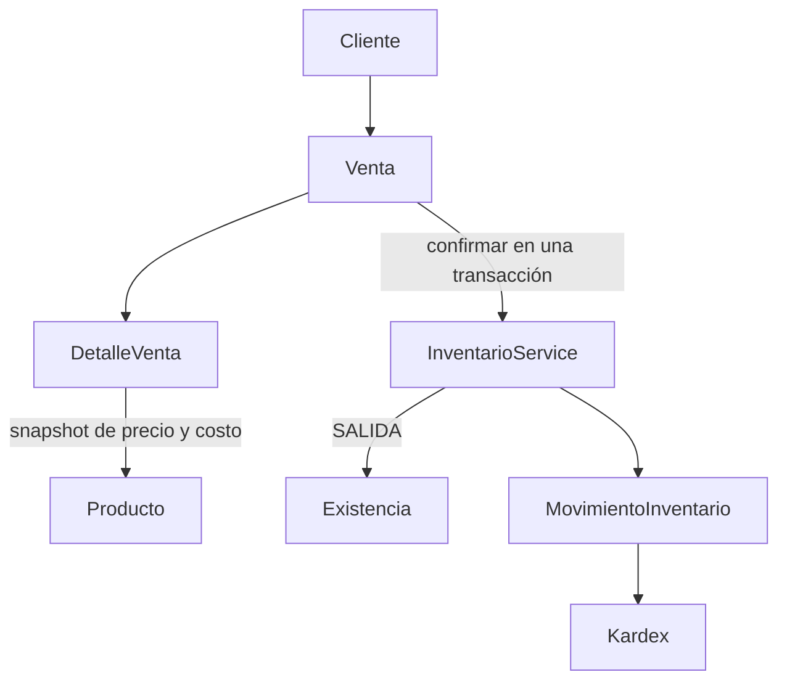

# Clientes y ventas

Extensión del backend existente NestJS, ESM y Prisma ORM 8 RC Contracts. Conserva Compras, Inventario y sus endpoints. No cambia dependencias. Inventario sigue siendo la única autoridad que modifica Existencia y registra movimientos.

## Arquitectura



Compra recibida genera ENTRADA; venta confirmada genera SALIDA. Ventas nunca ejecuta UPDATE de Existencia ni llama HTTP internamente. Crear BORRADOR no descuenta ni reserva stock.

## Modelos, relaciones y restricciones

Cliente: id, nombre, apellido, razonSocial, rfc, email, telefono, direccion, activo, createdAt y updatedAt. Nombre obligatorio. Otros textos opcionales; activo default true. RFC se normaliza uppercase y es UNIQUE cuando está informado, siguiendo Proveedores y evitando duplicar una identidad comercial. Clientes sin RFC pueden coexistir; no se hace validación fiscal avanzada. Un RFC genérico compartido entre clientes no está modelado: omitirlo cuando no se conoce una identidad específica. Email se valida y normaliza lowercase. PATCH parcial rechaza null y permite limpiar apellido/razonSocial/telefono/direccion con string vacío.

Venta: id, folio, clienteId, estado, subtotal, impuestos, total, costoTotal, utilidad, observacion, createdByUsuarioId, confirmadaPorUsuarioId, fechaConfirmacion, createdAt y updatedAt.

DetalleVenta: id, ventaId, productoId, cantidad, precioUnitario, costoUnitario, subtotal, costoSubtotal y createdAt.

Relaciones:

- Cliente 1→N Venta.
- Venta 1→N DetalleVenta.
- Producto 1→N DetalleVenta.
- Venta N→1 Usuario creador; N→1 Usuario confirmador opcional.

Las cinco FK utilizan RESTRICT. UNIQUE: Cliente.rfc, Venta.folio y (ventaId,productoId). CHECK: cantidad positiva, snapshots no negativos, subtotal=cantidad×precioUnitario, costoSubtotal=cantidad×costoUnitario; encabezado no negativo salvo utilidad, total=subtotal+impuestos y utilidad=subtotal−costoTotal. La confirmación exige receptor y fecha; otros estados deben tenerlos null. EstadoVenta sigue el patrón EstadoCompra: enum del contract sobre pg/text con CHECK de valores.

## Estados y DELETE

| Estado | Acción | Resultado |
|---|---|---|
| BORRADOR | editar | BORRADOR, recalcula importes |
| BORRADOR | confirmar | CONFIRMADA, SALIDA por detalle |
| BORRADOR | cancelar | CANCELADA, sin stock/movimientos |
| BORRADOR | DELETE | Elimina venta y detalles atómicamente |
| CONFIRMADA | editar/confirmar/cancelar/DELETE | 409 |
| CANCELADA | editar/confirmar/cancelar/DELETE | 409 |

Cancelar una confirmada requerirá devoluciones con movimientos compensatorios futuros. No se borran movimientos ni se repone stock directamente.

Cliente sin ventas puede eliminarse físicamente. Con cualquier venta, incluso CANCELADA, DELETE devuelve 409; usar desactivar. Crear/editar/confirmar exige cliente activo. Producto con detalles de venta devuelve 409 ante DELETE físico, incluso si nunca tuvo movimientos, para preservar referencias. Eliminar un BORRADOR elimina sus detalles y libera esas referencias. Activar/desactivar repetido devuelve 409.

## Endpoints y seguridad

Todas las rutas están bajo `/api/v1`, requieren JWT y conservan JwtAuthGuard/RolesGuard. GET admite usuarios autenticados. Modificaciones requieren ADMINISTRADOR.

| Método | Ruta | Resultado |
|---|---|---|
| GET | /clientes | Listado paginado |
| GET | /clientes/:id | Cliente individual |
| POST | /clientes | Crear activo, 201 |
| PATCH | /clientes/:id | Editar parcialmente, 200 |
| PATCH | /clientes/:id/desactivar | Baja lógica, 200 |
| PATCH | /clientes/:id/activar | Reactivar, 200 |
| DELETE | /clientes/:id | Sin ventas, 200 |
| GET | /ventas | Listado paginado |
| GET | /ventas/:id | Encabezado, detalles, productos y usuarios públicos |
| POST | /ventas | Crear BORRADOR, 201 |
| PATCH | /ventas/:id | Editar BORRADOR, 200 |
| POST | /ventas/:id/confirmar | Confirmación atómica, 201 |
| POST | /ventas/:id/cancelar | Cancelar BORRADOR, 201 |
| DELETE | /ventas/:id | Eliminar BORRADOR y detalles, 200 |

DTOs: CreateClienteDto, UpdateClienteDto, ClienteQueryDto, VentaDetalleDto, CreateVentaDto, UpdateVentaDto y VentaQueryDto. ValidationPipe conserva transform/whitelist/forbidNonWhitelisted. No se introduce DTO vacío de acción: SinCuerpoPipe permite body ausente o `{}` y rechaza propiedades, arrays y valores escalares.

No se aceptan folio, estado, subtotal, total, costoTotal, utilidad, precios/costos del detalle, fechas de confirmación ni autoría del cliente. Creador/confirmador provienen de CurrentUser/JWT; se verifica que el usuario siga activo dentro de la transacción. Las relaciones de usuario proyectan solamente id/nombre/email. No se exponen password, hashes o tokens en ventas/Kardex.

## Folio

`VENT-<año UTC>-<UUID completo uppercase>`, generado en backend y respaldado por UNIQUE. No usa MAX(id)+1 y no es consecutivo ni folio fiscal.

## Dinero, utilidad y snapshot histórico

Los helpers monetarios compartidos viven ahora en `src/common/dinero.ts`. Compras conserva las exportaciones de su archivo original, sin cambiar sus resultados. Ventas reutiliza centavos, importe y calcularTotales; importeConSigno representa utilidad negativa correctamente, incluso `-0.50`.

Decimal PostgreSQL ↔ string ↔ BigInt centavos. No hay cálculos monetarios binarios con Float. Impuestos son número JSON no negativo, máximo 1000000000000 y dos decimales; default cero. Detalles solo reciben productoId y cantidad entera positiva int4. Se permiten 1..100 detalles únicos por producto.

- detalle.subtotal=cantidad×precioUnitario.
- detalle.costoSubtotal=cantidad×costoUnitario.
- venta.subtotal=SUM(subtotales).
- venta.costoTotal=SUM(costoSubtotales).
- venta.total=subtotal+impuestos.
- venta.utilidad=subtotal−costoTotal; impuestos no aportan utilidad.

Precio y costo provienen del catálogo bajo bloqueo al crear, se validan como importes no negativos de hasta dos decimales y se guardan en DetalleVenta. Pueden generar utilidad negativa; no se exige precio>=costo. La versión implementa utilidad bruta en dinero, no un indicador porcentual de margen.

Consultar o confirmar jamás reconstruye snapshots con Producto.precio/costo actuales. include de Producto proyecta solo id/SKU/nombre; los importes históricos están en DetalleVenta.

PATCH sin detalles conserva todos los snapshots. Si envía detalles, representa la colección final completa:

- Producto y cantidad idénticos conservan snapshot, ID y createdAt del detalle, aunque cambie el catálogo.
- Producto nuevo toma precio/costo actuales.
- Cambiar cantidad de un producto existente se considera modificar el detalle: toma ambos valores actuales y recalcula sus subtotales. Conserva ID/createdAt de la fila.
- Detalles omitidos de la colección se eliminan.

Los totales siempre se recalculan desde los detalles resultantes. Ordenar de otra forma la misma colección no refresca snapshots. El snapshot es deliberadamente comercial: no calcula costo promedio de inventario ni FIFO. Compra recibida tampoco cambia automáticamente Producto.costo.

## Confirmación, stock y transacción

`VentasService.confirmar` usa una sola `db.transaction`:

1. SELECT de Venta FOR UPDATE parametrizado.
2. Leer estado después del bloqueo; exigir BORRADOR.
3. Validar usuario activo y bloquear/validar Cliente activo.
4. Leer detalles persistidos ordenados por productoId ASC.
5. Cada detalle llama `InventarioService.salidaEnTransaccion(tx,dto,usuarioId)`.
6. Inventario usa el núcleo existente registrarEnTransaccion: bloquea Producto FOR UPDATE, verifica actividad/usuario, lee Existencia, valida saldo, modifica stock y crea SALIDA.
7. Cambiar Venta a CONFIRMADA y guardar confirmador/fechaConfirmacion.
8. Leer respuesta con el mismo tx; commit si todo tuvo éxito.

salidaEnTransaccion es un wrapper equivalente a entradaEnTransaccion; no abre transacción anidada ni duplica reglas. SALIDA manual sigue abriendo su propia transacción y comparte el mismo núcleo. ENTRADA/AJUSTE conservan sus semánticas.

La validación autoritativa de stock está dentro del bloqueo de Inventario. Crear una venta sin stock es válido; confirmar falla con 409. No se prevalidan saldos fuera de la transacción para decidir la confirmación.

Stock insuficiente, producto inactivo o error de persistencia revierte TODAS las salidas, stocks y movimientos anteriores. Venta permanece BORRADOR sin confirmador/fecha. También se probó fallo de inserción del segundo movimiento después de actualizar su stock.

Edición/cancelación/DELETE bloquean la misma Venta, por lo que no compiten con la confirmación. Crear/editar bloquean Cliente y productos antes de leer precios; la consulta del catálogo es por lote y los bloqueos se adquieren en orden ascendente.

## Concurrencia y Kardex

Misma venta confirmada dos veces simultáneamente: una responde 201; otra 409 tras observar CONFIRMADA. No hay salidas duplicadas.

Ventas distintas de 7 cada una con saldo 10: la primera descuenta a 3; la segunda, después de adquirir el bloqueo, rechaza saldo insuficiente. Solo una SALIDA 7.

Dos ventas con mismos productos en órdenes inversos: se ordenan por productoId ASC antes de adquirir bloqueos y ambas pueden terminar si hay stock. Las pruebas usan clientes distintos para que el bloqueo de cliente no oculte esta carrera entre productos. El mismo orden se conserva en Compras e Inventario.

Cada SALIDA conserva usuario confirmador, cantidad positiva, stockAnterior, stockNuevo y fecha. Observación: `Salida por venta <folio>`. Se mantiene referencia textual, como Compras, sin agregar FK comercial a MovimientoInventario. Folio inmutable y retención de venta confirmada permiten identificar el origen; una relación estructurada queda para futuras devoluciones.

## Paginación, filtros y búsqueda

Clientes: page=1, limit=20; búsqueda case-insensitive por nombre, apellido, razonSocial, RFC, email y teléfono. Orden id desc.

Ventas: page=1, limit=20, sortBy=createdAt, sortOrder=desc. limit 1..100 y page positivo int4. Filtros AND: clienteId, estado, fechaInicio, fechaFin y search. Search busca fragmentos de folio o nombre/apellido/razonSocial/RFC del cliente con predicados ORM parametrizados. %, _ y barra inversa se escapan como caracteres literales.

sortBy permitido: createdAt, folio, estado, total, utilidad. sortOrder: asc/desc; ID desempata en la misma dirección. Whitelist en DTO y servicio; no se interpolan columnas de usuario en SQL.

Fechas siguen la política existente: YYYY-MM-DD es un día UTC completo, inicio 00:00:00.000Z y fin 23:59:59.999Z inclusivo. Timestamp requiere Z u offset. Rango invertido=400. Filtran createdAt, no fechaConfirmacion.

Listados usan data/pagination, sin colecciones ilimitadas. totalPages=ceil(totalItems/limit); colección vacía=0; hasPreviousPage=page>1.

```json
{
  "data": [],
  "pagination": {
    "page": 1,
    "limit": 20,
    "totalItems": 0,
    "totalPages": 0,
    "hasNextPage": false,
    "hasPreviousPage": false
  }
}
```

Listado de ventas incluye cliente y usuarios públicos sin detalles. Individual añade detalles y productos mediante include anidado. No hay consultas de relaciones por cada elemento del listado.

Ejemplo individual (fechas e IDs ilustrativos):

```json
{
  "id": 1,
  "folio": "VENT-2026-925679C2-42B2-4C86-B948-9E3F28C93BD5",
  "clienteId": 1,
  "cliente": {"id": 1, "nombre": "Juan", "apellido": "Pérez", "rfc": null},
  "estado": "CONFIRMADA",
  "subtotal": "750.00",
  "impuestos": "0.00",
  "total": "750.00",
  "costoTotal": "500.00",
  "utilidad": "250.00",
  "observacion": "Venta mostrador",
  "createdByUsuarioId": 1,
  "creadoPor": {"id": 1, "nombre": "Administrador", "email": "admin@inventario.local"},
  "confirmadaPorUsuarioId": 1,
  "confirmadoPor": {"id": 1, "nombre": "Administrador", "email": "admin@inventario.local"},
  "fechaConfirmacion": "2026-10-02T23:00:00.000Z",
  "createdAt": "2026-10-02T22:00:00.000Z",
  "updatedAt": "2026-10-02T23:00:00.000Z",
  "detalles": [{
    "id": 1,
    "ventaId": 1,
    "productoId": 1,
    "producto": {"id": 1, "sku": "SKU-1", "nombre": "PRODUCTO"},
    "cantidad": 5,
    "precioUnitario": "150.00",
    "costoUnitario": "100.00",
    "subtotal": "750.00",
    "costoSubtotal": "500.00",
    "createdAt": "2026-10-02T22:00:00.000Z"
  }]
}
```

## Errores

400: DTO/query inválido, propiedades desconocidas, productos duplicados, rango invertido, importes inválidos, body de acción con datos. 401: JWT ausente/inválido o usuario comercial inexistente/inactivo. 403: mutación sin ADMINISTRADOR. 404: cliente/venta/producto inexistente. 409: RFC duplicado, estado incompatible, cliente/producto inactivo, DELETE con historial o stock insuficiente. La traducción de RFC duplicado usa el helper SQLSTATE 23505 existente; otros errores no se ocultan.

## Contract, índices y Prisma RC

Se ejecutaron contract emit, dry-run y revisión de las 16 operaciones exclusivamente aditivas antes de aplicar db update. No hubo operaciones destructivas ni cambios de columnas en inventario. Snapshot generado: `2accda33f716c6319f02d17513c42f6f15d5d332d713b7719de1caf9fea6c277`.

Índices de FK generados: Venta(clienteId), Venta(createdByUsuarioId), Venta(confirmadaPorUsuarioId), DetalleVenta(ventaId), DetalleVenta(productoId). UNIQUE aporta índices para folio/RFC/par venta-producto; además existen las PK. Cubren relaciones, filtro por cliente, carga de detalles y protección de DELETE. No se agregan índices especulativos de estado/createdAt; medir consultas con volumen real antes de índices compuestos.

Prisma RC utiliza Decimal string y `@default("0")`, aggregate(count), include anidado, tx.orm y tx.query. FOR UPDATE usa raw SQL parametrizado con returnsRow y el mismo tx. Algunas relaciones tienen tipos nullable incluso si son requeridas. No se usan PrismaClient clásico, $transaction o any.

## Postman

Variables: base_url=http://localhost:3000/api/v1, token válido, cliente_id, producto_id, venta_id. Guarda IDs reales de respuestas. Headers: Authorization: Bearer {{token}} y Content-Type: application/json para cuerpos JSON.

Crear cliente:

```text
POST {{base_url}}/clientes
```

```json
{
  "nombre": "Juan",
  "apellido": "Pérez",
  "email": "juan@example.com",
  "telefono": "9931234567"
}
```

Crear venta (sustituye IDs con los del entorno):

```text
POST {{base_url}}/ventas
```

```json
{
  "clienteId": 1,
  "observacion": "Venta mostrador",
  "impuestos": 0,
  "detalles": [{"productoId": 1, "cantidad": 2}]
}
```

```text
GET {{base_url}}/ventas/{{venta_id}}
POST {{base_url}}/ventas/{{venta_id}}/confirmar
GET {{base_url}}/ventas?page=1&limit=20
GET {{base_url}}/ventas?estado=CONFIRMADA&page=1&limit=20
GET {{base_url}}/ventas?clienteId={{cliente_id}}&fechaInicio=2026-09-01&fechaFin=2026-09-30&sortBy=utilidad&sortOrder=desc
GET {{base_url}}/ventas?search=Juan
GET {{base_url}}/clientes?page=1&limit=20&search=juan
GET {{base_url}}/inventario/kardex/{{producto_id}}?page=1&limit=20
GET {{base_url}}/inventario/existencias/{{producto_id}}
PATCH {{base_url}}/clientes/{{cliente_id}}/desactivar
PATCH {{base_url}}/clientes/{{cliente_id}}/activar
```

Confirmar lleva body vacío; repetir devuelve 409. Editar otro BORRADOR:

```text
PATCH {{base_url}}/ventas/{{venta_id}}
{"observacion":"Venta actualizada","impuestos":10.50}

PATCH {{base_url}}/clientes/{{cliente_id}}
{"telefono":"9939876543"}
```

Cancelar/eliminar solo BORRADOR; usa una venta diferente de la ya confirmada:

```text
POST {{base_url}}/ventas/2/cancelar
DELETE {{base_url}}/ventas/3
DELETE {{base_url}}/clientes/{{cliente_id}}
```

## Pruebas y limitaciones

Baseline real verificado antes de modificar código: 184 unitarias + 53 E2E = 237. Se conservan todas.

Las pruebas nuevas cubren DTOs, valores monetarios exactos grandes y negativos, CRUD/UNICIDAD concurrente de RFC, snapshots y cambios parciales, confirmación, rollback multiproducto y falla de inserción, stock insuficiente, doble confirmación, dos ventas que compiten por stock, productos en orden inverso, cancelación/DELETE, seguridad, filtros/fechas y flujo comercial completo. Limpieza por IDs propios y asserts contra PostgreSQL comprueban que no quedan fixtures de la suite.

Resultado comercial probado: producto costo100/precio150/stock0; Compra×20 recibida deja20; Venta×5 BORRADOR conserva20, confirmada deja15; Kardex contiene ENTRADA20 y SALIDA5; subtotal750/costoTotal500/utilidad250. Cambiar catálogo a precio200/costo120 conserva snapshot150/100 de la venta anterior; la nueva toma200/120.

No hay pagos, crédito, CFDI, cuentas por cobrar, reservaciones, descuentos, promociones, devoluciones o notas de crédito. Stock solo se garantiza al confirmar. No hay recalculo de costo por lote ni conversión de moneda. Auditoría separada de ediciones/cancelaciones y referencia estructurada del origen quedan pendientes. Count/página no comparten snapshot y OFFSET profundo/ILIKE requieren medición. Cliente y producto muestran nombres actuales; solamente precios/costos son snapshots históricos. El costo de bloqueo de hasta100 detalles es explícito. Los CHECK no sustituyen al servicio para SUM entre filas ni impiden por sí solos ediciones administrativas directas de ventas confirmadas.

## Validación ejecutada al cierre

- `tsc --noEmit --incremental false -p tsconfig.json`: pasa.
- `npm run build`: pasa.
- `npm run lint`: pasa; conserva tres warnings previos en Categorias/Usuarios, sin warnings nuevos.
- `npm test`: 254 pruebas unitarias (184 anteriores +70 nuevas).
- `TEST_INVENTARIO_DB=1 npm run test:e2e`: 92 E2E contra PostgreSQL (53 anteriores +39 nuevas).
- Total: 346 pruebas; se conservan las237 anteriores.
- `npx prisma db verify`: esquema y marcador coinciden con el contrato, sin warnings de esquema.
- `npx prisma db update --dry-run` final: cero operaciones pendientes.
- Consulta real de cierre: cero existencias negativas, cero movimientos huérfanos, cero detalles de venta huérfanos y cero fixtures de productos/clientes/usuarios de las suites comprobadas. La suite además verifica por IDs propios la limpieza de ventas, detalles, existencias y movimientos.
- Prisma CLI advierte que sus skills locales no están sincronizadas y que la política de control excluye el namespace externo `__unbound__`; no afecta la verificación del espacio app ni requirió cambios de dependencias.
