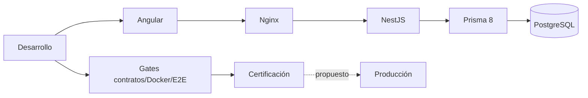

# Arquitectura Inventario — documentación maestra

Auditoría integral **2026-10-07**. Backend `4189fa483ecbbed242946cefc6d4282e0e13dfe8`; frontend `be0f12e0bf48d6df05afb1eced092b34c915e1cf`.

## Tabla de contenidos

- [Estado ejecutivo](#estado-ejecutivo)
- [Mapa documental](#mapa-documental)
- [Historia y arquitectura](#historia-y-arquitectura)
- [Certificación](#certificación)
- [Despliegue y decisiones](#despliegue-y-decisiones)
- [Control de calidad](#control-de-calidad)

## Estado ejecutivo

Angular 20.3.18 standalone/zoneless, NestJS lock 12.0.4, PostgreSQL 17 y Prisma 8 contract-first orm-postgres 8.0.0-rc.11. Monolito modular REST con catálogos, inventario, compras, ventas, devoluciones, precios/vigencias, importación CSV/XLSX, dashboard/reportes y auditoría. 23 tablas con PK/FK/UNIQUE/CHECK/índices; garantía GiST externa al contrato impide solapamiento activo de precios.

Documentación de todo el sistema, no sólo Sprint 7. Hechos de código, historia local/Git, evidencia remota y propuestas se distinguen. Untracked docs/snapshots fueron clasificados y conservados.

## Mapa documental

| Documento | Uso |
| --- | --- |
| [Guía de lectura y alcance](arquitectura/00-README.md) | Guía de lectura y alcance |
| [Arquitectura general e historia](arquitectura/01-ARQUITECTURA-GENERAL.md) | Arquitectura general e historia |
| [Entorno de desarrollo](arquitectura/02-ENTORNO-DESARROLLO.md) | Entorno de desarrollo |
| [PostgreSQL y Prisma](arquitectura/03-BASE-DATOS.md) | PostgreSQL y Prisma |
| [Backend NestJS](arquitectura/04-BACKEND.md) | Backend NestJS |
| [Frontend Angular](arquitectura/05-FRONTEND.md) | Frontend Angular |
| [Seguridad](arquitectura/06-SEGURIDAD.md) | Seguridad |
| [Estrategia y evidencia de pruebas](arquitectura/07-TESTING.md) | Estrategia y evidencia de pruebas |
| [Docker y ejecución](arquitectura/08-DOCKER.md) | Docker y ejecución |
| [CI y certificación](arquitectura/09-CI-CD.md) | CI y certificación |
| [Despliegue y rollback](arquitectura/10-DESPLIEGUE.md) | Despliegue y rollback |
| [Flujo Git propuesto](arquitectura/11-GIT-WORKFLOW.md) | Flujo Git propuesto |
| [Runbook operativo](arquitectura/12-RUNBOOK.md) | Runbook operativo |
| [Postmortem Sprint 7](arquitectura/13-POSTMORTEM-SPRINT-7.md) | Postmortem Sprint 7 |
| [Hallazgos y deuda técnica](arquitectura/14-DEUDA-TECNICA.md) | Hallazgos y deuda técnica |
| [Checklist de release](arquitectura/15-CHECKLIST-RELEASE.md) | Checklist de release |

## Historia y arquitectura

Git backend inicia 2026-10-05 con módulos desarrollados; frontend 2026-10-06. No demuestra cronología individual de funcionalidades previas. Validaciones 5A fiscal/unidades, 5B listas/vigencias y 5C importaciones preservan JSON/contratos y reglas comerciales; inferencias se marcan. Historia fallida no se reescribe.

## Certificación

**BASELINE VERDE / CERTIFICADO DEL SPRINT 7**: SHA backend arriba. [Run 37679392828](https://github.com/Dennis9901/inventario_back/actions/runs/37679392828) **completed/success** comprobado por API/logs/artifacts con pareja frontend exacta.

| Gate | Evidencia |
| --- | --- |
| Backend unit | 567/567 |
| Frontend unit | 450/450 |
| Integración ci-1/ci-2 | 312/312 cada ciclo |
| Browser ci-1/ci-2 | 26 passed y 1 reader skipped permitido cada ciclo |
| Docker gateway | 3 aprobadas |
| Business/destrucción/upload | success ambos ciclos |
| Certification | success |

Retención: diagnóstico 7 días; certification.json 30 días. Run fallido previo 310/312 confirma dos ENOENT evidence 5A/5C; commit 5600978 prepara directorios y final 312/312 confirma fix. Certificar pareja SHA/gates no equivale disponibilidad productiva ni cero skipped browser.

## Despliegue y decisiones

Docker Compose productivo-local y runtime endurecido/tools administrativos disponibles. No registry/CD productivo/restore automatizado encontrado. Bootstrap BD nueva/vacía aplica esquema/GiST; arranque schema verify no migra existente. E2E aplica SQL aparte.

Prioridades: migraciones formales/snapshot actual rastreado revisado, imágenes inmutables/TLS/secrets, backup/restore, observabilidad y política JWT. Baja/cambio rol no invalida JWT hasta expiración. Warnings lint/actions comprobados sin corrección.

Develop local **ya existe** en 0252b61. Con autorización futura conservar ref histórica y crear nombre develop exactamente desde baseline; procedimiento en Git workflow. Nada creado/movido ahora.

## Control de calidad

Matrices extraídas y contrastadas: endpoints código/OpenAPI, DB contrato emitido, scripts package.json y grafo CI YAML. TypeScript backend sin emisión/incremental, lint exit 0/7 warnings y unit 567/567 nuevos; builds/frontend/integración comprobados remotos. Sin conexión a DB existente, cambios funcionales, staging/commit/push/cambio de rama/eliminación. Documentos locales para revisión. Enlaces/whitespace/secrets se comprueban antes de cierre.
