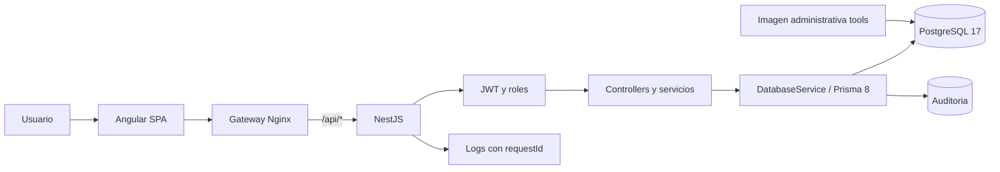
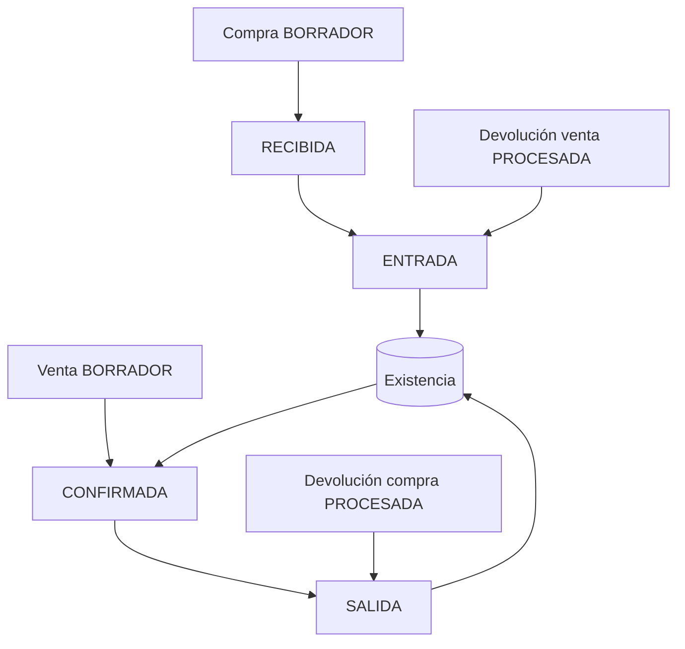

# Arquitectura general e historia

Auditoría 2026-10-07 · Backend `4189fa483ecbbed242946cefc6d4282e0e13dfe8` · Frontend `be0f12e0bf48d6df05afb1eced092b34c915e1cf`.

[Índice](00-README.md) · [Documento maestro](../ARQUITECTURA-INVENTARIO.md)

## Contenido

- [Arquitectura del sistema](#arquitectura-del-sistema)
- [Versiones reales](#versiones-reales)
- [Dominio y flujos](#dominio-y-flujos)
- [Cronología demostrable en Git](#cronología-demostrable-en-git)
- [Evolución previa documentada](#evolución-previa-documentada)
- [Fuentes](#fuentes)

## Arquitectura del sistema

SPA Angular y API REST NestJS con PostgreSQL. Monolito modular con una BD compartida, transacciones y locks. No hay evidencia de microservicios, SSR o colas externas. Desarrollo consume localhost:3000; producción local usa API relativa a través de Nginx.

## Versiones reales

Rango declarado y resolución exacta del lockfile se distinguen. La skill local Prisma coincide con orm-postgres instalado rc.11.

| Repo | Paquete | Declaración | Lockfile |
| --- | --- | --- | --- |
| Backend | @nestjs/core | ^12.0.1 | 12.0.4 |
| Backend | @nestjs/swagger | ^12.0.2 | 12.0.2 |
| Backend | @prisma/orm-postgres | ^8.0.0-rc.11 | 8.0.0-rc.11 |
| Backend | @prisma/client | ^7.10.0 | 7.10.0 |
| Backend | prisma | ^8.0.0-rc.15 | 8.0.0-rc.15 |
| Backend | typescript | ^6.0.2 | 6.0.3 |
| Backend | vitest | ^4.1.2 | 4.1.11 |
| Backend | supertest | ^7.0.0 | 7.3.0 |
| Backend | argon2 | ^0.45.1 | 0.45.1 |
| Backend | helmet | ^8.3.0 | 8.3.0 |
| Frontend | @angular/core | 20.3.18 | 20.3.18 |
| Frontend | @angular/cli | 20.3.21 | 20.3.21 |
| Frontend | @angular/build | 20.3.21 | 20.3.21 |
| Frontend | typescript | ~5.9.3 | 5.9.3 |
| Frontend | vitest | ^4.1.11 | 4.1.11 |
| Frontend | @playwright/test | ^1.63.0 | 1.63.0 |
| Frontend | rxjs | ~7.8.2 | 7.8.2 |
| Frontend | eslint | 9.39.1 | 9.39.1 |

Node CI: 24.21.0. Docker Node: node:24-bookworm-slim fijado por digest. PostgreSQL Compose major 17; no se inventa versión minor de producción.

## Dominio y flujos

| Dominio | Responsabilidad y efecto |
| --- | --- |
| Auth/roles/usuarios | Login, JWT, roles y usuarios activos |
| Categorías/productos/unidades | SKU, costo/precio base, unidad legacy y referencia opcional, metadata SAT |
| Clientes/proveedores | Contrapartes; fiscal y domicilio opcionales de cliente |
| Inventario | Existencia, ENTRADA/SALIDA/AJUSTE y kardex |
| Compras | BORRADOR → RECIBIDA genera entrada; cancelar borrador no afecta stock |
| Ventas | BORRADOR → CONFIRMADA genera salida; cancelar borrador no afecta stock |
| Devoluciones | Venta procesada aumenta stock; compra procesada lo reduce, con snapshots originales |
| Listas/precios | Vigencias, fallback base, exclusión concurrente |
| Importaciones | CSV/XLSX, preview/plan y confirmación atómica |
| Dashboard/reportes | Agregación administrativa real, stock/utilidad/actividad |
| Auditoría/health | Evidencia administrativa, correlación HTTP y disponibilidad |

Decimal/string y helpers BigInt preservan dinero exacto. Detalles comerciales guardan snapshots: cambiar catálogo/precios no recalcula historia. CHECK y servicios transaccionales impiden saldos inválidos bajo reglas implementadas.

## Cronología demostrable en Git

| Repo | Commit | Fecha | Descripción |
| --- | --- | --- | --- |
| Backend | 0252b61 | 2026-10-05T10:14:03-06:00 | Initial commit |
| Backend | c2f9486 | 2026-10-07T11:31:17-06:00 | feat(sprint-7): industrialize backend with CI Docker and production hardening |
| Backend | 3c8a42f | 2026-10-07T11:41:30-06:00 | fix(ci): version OpenAPI contract for cross-repo validation |
| Backend | 397c9d5 | 2026-10-07T12:11:57-06:00 | fix(docker): include database guarantees script in tools image |
| Backend | e7f5b6c | 2026-10-07T12:26:32-06:00 | fix(ci): version database guarantees SQL for E2E |
| Backend | 5600978 | 2026-10-07T13:17:12-06:00 | fix(ci): create E2E evidence directories before writing OpenAPI |
| Backend | 4189fa4 | 2026-10-07T14:05:23-06:00 | fix(ci): avoid Playwright system dependency install |
| Frontend | 1b315a5 | 2026-10-06T15:07:28-06:00 | Initial commit |
| Frontend | 544d7ce | 2026-10-07T11:31:17-06:00 | feat(sprint-7): industrialize frontend with CI Docker and deterministic E2E |
| Frontend | be0f12e | 2026-10-07T11:41:32-06:00 | fix(ci): preserve public directory for Docker build |

El primer commit backend 2026-10-05 contiene ya PostgreSQL/Prisma/auth/usuarios/roles y los módulos comerciales, incluidas ampliaciones 5A/5B/5C. El primer frontend 2026-10-06 contiene implementación previa al Sprint 7. Git no permite asignar un commit separado a cada incorporación anterior ni demostrar fecha de concepción.

## Evolución previa documentada

| Etapa | Evidencia | Interpretación |
| --- | --- | --- |
| Núcleo catálogo/comercial | README, INVENTARIO, COMPRAS, VENTAS y tests | Presente en initial commit, sin fechas individuales |
| Devoluciones | DEVOLUCIONES y validación local 2026-10-05 | Flujos, snapshots, concurrencia e integridad |
| Dashboard/reportes | DASHBOARD, REPORTES y evidencias | Lecturas/agregaciones y pruebas acumuladas |
| Infraestructura API | API, AUDITORIA, OBSERVABILIDAD y API-VALIDACION | Swagger, errores/requestId, seguridad/health |
| Backend 5A | VALIDACION-BACKEND-5A y JSON | Fiscal opcional, domicilio, unidades/SAT |
| Backend 5B | VALIDACION-BACKEND-5B y JSON | Listas/vigencias/precio resuelto/EXCLUDE |
| Backend 5C | VALIDACION-BACKEND-5C y JSON | Importador COMESI CSV/XLSX y atomicidad |
| Frontend sprints 1–5 | Reportes/módulos en frontend/docs | SPA, formularios, compras/ventas/devoluciones/precios/importaciones |
| Sprint 6 | REPORTE-SPRINT-6 y cierre-e2e frontend | Cierre browser histórico, con limitaciones explícitas |
| Sprint 7 fase 1 | FASE-1-E2E-DETERMINISTICO | Dos ciclos locales descartables, identidad/cleanup |
| Sprint 7 fase 2A | FASE-2A-DOCKER-PRODUCCION | Imágenes y stack productivo-local |
| Sprint 7 fase 2B/fixes | Git + runs remotos | Industrialización y certificación final |

**Inferencia basada en** snapshots de 2 a 23 tablas: crecimiento progresivo del contrato. Hash/contenido no prueban por sí solos orden temporal ni aplicación productiva. Los documentos 2B que dicen “run remoto pendiente” conservan estado histórico; el run verde posterior lo supera.

## Fuentes

- [backend/src/app.module.ts](../../src/app.module.ts)
- [backend/src/prisma/contract.prisma](../../src/prisma/contract.prisma)
- [backend/README.md](../../README.md)
- [backend/INVENTARIO.md](../../INVENTARIO.md)
- [backend/COMPRAS.md](../../COMPRAS.md)
- [backend/VENTAS.md](../../VENTAS.md)
- [backend/DEVOLUCIONES.md](../../DEVOLUCIONES.md)
- [backend/DASHBOARD.md](../../DASHBOARD.md)
- [backend/REPORTES.md](../../REPORTES.md)

[frontend/docs/ARQUITECTURA-FRONTEND.md](../../../inventario_front/docs/ARQUITECTURA-FRONTEND.md)

[frontend/docs/REPORTE-SPRINT-6.md](../../../inventario_front/docs/REPORTE-SPRINT-6.md)
