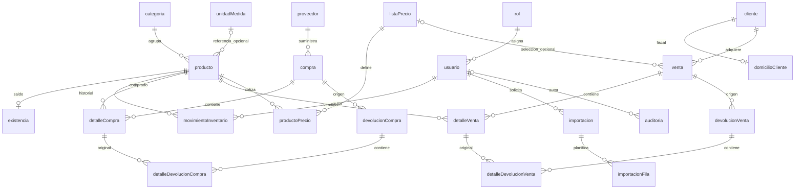

# PostgreSQL y Prisma

Auditoría 2026-10-07 · Backend `4189fa483ecbbed242946cefc6d4282e0e13dfe8` · Frontend `be0f12e0bf48d6df05afb1eced092b34c915e1cf`.

[Índice](00-README.md) · [Documento maestro](../ARQUITECTURA-INVENTARIO.md)

## Contenido

- [Arquitectura y fuente de verdad](#arquitectura-y-fuente-de-verdad)
- [Relaciones](#relaciones)
- [Reglas de integridad](#reglas-de-integridad)
- [ProductoPrecio y EXCLUDE](#productoprecio-y-exclude)
- [Migraciones y snapshots](#migraciones-y-snapshots)
- [Diccionario completo del contrato](#diccionario-completo-del-contrato)
- [Enums del dominio](#enums-del-dominio)
- [Fuentes](#fuentes)

## Arquitectura y fuente de verdad

PostgreSQL 17, schema public, Prisma 8 contract-first. Fuente contract.prisma → contract.json/contract.d.ts; runtime postgres<Contract> en db.ts. @prisma/client 7.10 está declarado pero no es el cliente usado por estos servicios.

Definiciones extraídas del contrato emitido, no de una conexión actual productiva. storageHash `b78d79ccbcabf28fdf4dba47579f2629edb1ed96518efc6fb2624f015a289793`, igual que refs/db.json. **23 tablas**; todos los modelos tienen id Int autoincremental como PK. Nombres de constraints emitidos pueden contener hash.


| Modelo | Tabla | PK | Columnas | FK |
| --- | --- | --- | --- | --- |
| Auditoria | auditoria | id | 9 | 1 |
| Categoria | categoria | id | 6 | 0 |
| Cliente | cliente | id | 18 | 0 |
| Compra | compra | id | 13 | 3 |
| DetalleCompra | detalleCompra | id | 7 | 2 |
| DetalleDevolucionCompra | detalleDevolucionCompra | id | 8 | 3 |
| DetalleDevolucionVenta | detalleDevolucionVenta | id | 10 | 3 |
| DetalleVenta | detalleVenta | id | 9 | 2 |
| DevolucionCompra | devolucionCompra | id | 12 | 3 |
| DevolucionVenta | devolucionVenta | id | 13 | 3 |
| DomicilioCliente | domicilioCliente | id | 14 | 1 |
| Existencia | existencia | id | 5 | 1 |
| Importacion | importacion | id | 18 | 1 |
| ImportacionFila | importacionFila | id | 10 | 1 |
| ListaPrecio | listaPrecio | id | 8 | 0 |
| MovimientoInventario | movimientoInventario | id | 9 | 2 |
| Producto | producto | id | 16 | 2 |
| ProductoPrecio | productoPrecio | id | 9 | 2 |
| Proveedor | proveedor | id | 11 | 0 |
| Rol | rol | id | 6 | 0 |
| UnidadMedida | unidadMedida | id | 6 | 0 |
| Usuario | usuario | id | 9 | 1 |
| Venta | venta | id | 16 | 4 |

## Relaciones



Diagrama resumido; diccionario contiene todas las FK de autor/procesador. RESTRICT preserva historia; Auditoria.usuarioId usa SET NULL. No deducir políticas de borrado por nombre: ver FK emitidas abajo.

## Reglas de integridad

Existencia única por producto y no negativa. Movimiento conserva balance stockAnterior/stockNuevo según tipo. Documentos tienen estados/totales válidos y recepción/confirmación/procesamiento auditados. Detalles mantienen cantidades/importes/snapshots. Predeterminada única activa con índice parcial y CHECK. Importaciones tienen conteos/hashes/estados coherentes y unicidad parcial de archivo en uso.

CHECK por fila no valida por sí solo acumulados entre tablas, devoluciones excedidas o todo saldo derivado. Servicios transaccionales, FOR UPDATE/advisory locks y verificadores complementan reglas. DatabaseService.transaction integra auditoría al commit comercial. Datos monetarios Decimal/strings, helpers BigInt; fechas TimestamptzString.

## ProductoPrecio y EXCLUDE

Modelo ProductoPrecio, tabla public."productoPrecio". Índice lista/producto/fecha; CHECK importe no negativo, máximo y dos decimales; CHECK fin posterior al inicio. Complemento:

```sql
ALTER TABLE public."productoPrecio"
  ADD CONSTRAINT producto_precio_sin_solapamiento
  EXCLUDE USING gist (
    int8range("productoId"::bigint, "productoId"::bigint, '[]') WITH &&,
    int8range("listaPrecioId"::bigint, "listaPrecioId"::bigint, '[]') WITH &&,
    tstzrange("vigenciaDesde", "vigenciaHasta", '[)') WITH &&
  ) WHERE (activo);
```

EXCLUDE USING gist impide dos filas que cumplan simultáneamente todas las comparaciones && (solapamiento). IDs se representan como rangos singleton cerrados int8range(id,id,'[]'); canonización entera mantiene solapamiento sólo para el mismo ID. Se aprovecha GiST nativo de rangos, sin btree_gist para igualdad escalar.

tstzrange compara instantes con zona. '[)' incluye inicio/excluye fin: fin T e inicio T adyacentes son válidos. vigenciaHasta NULL deja extremo superior ilimitado. WHERE (activo) excluye filas inactivas de la garantía. Funciona frente a SQL directo y carreras, SQLSTATE 23P01, traducido a conflicto 409 donde se maneja.

La RC instalada admite índices/CHECK pero no expresa esta EXCLUDE en el contrato. No generalizar a futuras versiones Prisma. garantias.sql es definición revisable; aplicar-garantias.mjs incorpora el mismo SQL y consulta pg_constraint antes de aplicar. Idempotencia por nombre no comprueba definición ni serializa dos administradores concurrentes: ejecutar una vez con control DDL y datos compatibles.

### Docker y E2E

Tools copia aplicar-garantias.mjs, permitido en .dockerignore. Entrypoint bootstrap exige BD Compose vacía e identidad/opt-in, ejecuta db update --no-interactive, garantías y db verify. Runtime serve no contiene/aplica garantía. Schema Compose usa verify por defecto; bootstrap nuevo es tarea separada. Lifecycle E2E del frontend aplica garantias.sql tras construir esquema descartable.

Prisma db verify no demuestra esta garantía externa al contrato. Inspeccionar pg_constraint/pg_get_constraintdef y verificar integridad explícitamente; verificador 5B lo hace. No basta readiness SELECT 1.

## Migraciones y snapshots

migrations/app sólo tiene refs/db.json, **ningún paquete migration.ts**. Snapshots son estructura/IR, no backup de registros ni down migrations.


| Snapshot hash | Tablas | Estado Git |
| --- | --- | --- |
| 11c83ba093125a7d8f9085b6693466c828f1b841b2d1fd802efba191a763e3eb | 6 | tracked |
| 2accda33f716c6319f02d17513c42f6f15d5d332d713b7719de1caf9fea6c277 | 12 | tracked |
| 40d5b7165d057f159663e518b49f6bd0b1212362aaada2a70672f75f4e0f2bce | 3 | tracked |
| 58967f64d7b152f0db7f71e891bc2614c11e0c19f9ff484db945243e6be9a7b9 | 4 | tracked |
| 6d75197f7d54105000e0db8f963af2a42673452a5dbe679dae9add1b85feea39 | 21 | untracked |
| a36958ed10ba820c2f208cbd46e0fa5ea14890ce3c3751520fe8b27cfe75e998 | 2 | tracked |
| b78d79ccbcabf28fdf4dba47579f2629edb1ed96518efc6fb2624f015a289793 | 23 | untracked |
| b9a8807046b84f126ed0a60ee96eec34330e8d6f608df0da2277662a796c4cc8 | 17 | untracked |
| d28539c0287b7019f02a166e1316ce3a201cd7758f319bef5ead6d1fc9568002 | 9 | tracked |
| d3361dc82e881fecf6ae6556bfe9fbc9ce131b5d2f3aae753c6c34c9d0ce6911 | 16 | untracked |
| db41c5fbcbec46dea1641008cb39379a18bfee57ff707cb94f34ea1b0fda1284 | 19 | untracked |

La ref actual depende del snapshot b78d79... untracked; clon limpio no recibe ese snapshot. CI crea esquema de prueba desde contrato mediante lifecycle; no sustituye historial compartido replayable. Conservar los cinco snapshots untracked y comparar hash/referencia antes de decidir versionado.

### Actualización local existente

```bash
# Únicamente BD development propia y destino identificado
npm run contract:emit
npx prisma db update --dry-run
# Revisar antes de aplicar
npx prisma db update
npm run build
node docs/backend-5b/aplicar-garantias.mjs
npx prisma db verify
```

db update no escribe paquetes migration.ts, sí puede actualizar ref/snapshots. Script requiere dist/prisma/db.js compilado. No usar receta development como migración productiva sin planificación.

### Propuesta compartida y rollback

Establecer origen conocido y migraciones formales con migration plan --from <ref-o-hash> --name <nombre>, revisar plan/SQL complementario, probar replay y db migrate --show antes de db migrate. Confirmar flags en CLI instalada. Skill Prisma 8: origen --from, luego ref db, no “última carpeta”; @empty sólo cuando corresponda. No usar migrate deploy de Prisma 7 para este diseño.

No hay down migration/restore productivo automatizado. Revert de código no revierte datos. Proponer cambios aditivos compatibles, backup/restauración ensayados y migración compensatoria; restaurar backup requiere evaluar escrituras posteriores y RPO.

## Diccionario completo del contrato


### auditoria

Modelo `Auditoria`; PK `id`.

| Columna | Tipo PostgreSQL | NULL | Default |
| --- | --- | --- | --- |
| accion | text | No | — |
| createdAt | timestamptz | No | now() |
| descripcion | text | Sí | — |
| entidad | text | No | — |
| entidadId | int4 | Sí | — |
| id | int4 | No | autoincrement() |
| metadata | text | Sí | — |
| requestId | text | No | — |
| usuarioId | int4 | Sí | — |


| FK origen | Destino | ON DELETE |
| --- | --- | --- |
| usuarioId | usuario(id) | setNull |


| Índice | Columnas | Único | Predicado |
| --- | --- | --- | --- |
| auditoria_createdAt_id_idx_3855cff1 | createdAt,id | False | — |
| auditoria_usuarioId_idx_5f01c7d6 | usuarioId | False | — |


| CHECK nombre emitido | Expresión |
| --- | --- |
| auditoria_campos_validos_0b137340 | `length("requestId") = 36 AND length(accion) BETWEEN 1 AND 80 AND length(entidad) BETWEEN 1 AND 80` |


### categoria

Modelo `Categoria`; PK `id`.

| Columna | Tipo PostgreSQL | NULL | Default |
| --- | --- | --- | --- |
| activo | bool | No | true |
| createdAt | timestamptz | No | now() |
| descripcion | text | Sí | — |
| id | int4 | No | autoincrement() |
| nombre | text | No | — |
| updatedAt | timestamptz | No | — |


| UNIQUE nombre | Columnas |
| --- | --- |
| — | nombre |


### cliente

Modelo `Cliente`; PK `id`.

| Columna | Tipo PostgreSQL | NULL | Default |
| --- | --- | --- | --- |
| activo | bool | No | true |
| apellido | text | Sí | — |
| celular | text | Sí | — |
| createdAt | timestamptz | No | now() |
| direccion | text | Sí | — |
| email | text | Sí | — |
| emailAlterno | text | Sí | — |
| id | int4 | No | autoincrement() |
| nombre | text | No | — |
| nombreComercial | text | Sí | — |
| numeroRegistroTributario | text | Sí | — |
| razonSocial | text | Sí | — |
| regimenFiscal | text | Sí | — |
| residenciaFiscal | text | Sí | — |
| rfc | text | Sí | — |
| telefono | text | Sí | — |
| updatedAt | timestamptz | No | — |
| usoCfdi | text | Sí | — |


| UNIQUE nombre | Columnas |
| --- | --- |
| — | rfc |


### compra

Modelo `Compra`; PK `id`.

| Columna | Tipo PostgreSQL | NULL | Default |
| --- | --- | --- | --- |
| createdAt | timestamptz | No | now() |
| createdByUsuarioId | int4 | No | — |
| estado | text | No | "BORRADOR" |
| fechaRecepcion | timestamptz | Sí | — |
| folio | text | No | — |
| id | int4 | No | autoincrement() |
| impuestos | numeric | No | "0" |
| observacion | text | Sí | — |
| proveedorId | int4 | No | — |
| recibidaPorUsuarioId | int4 | Sí | — |
| subtotal | numeric | No | — |
| total | numeric | No | — |
| updatedAt | timestamptz | No | — |


| FK origen | Destino | ON DELETE |
| --- | --- | --- |
| proveedorId | proveedor(id) | restrict |
| createdByUsuarioId | usuario(id) | restrict |
| recibidaPorUsuarioId | usuario(id) | restrict |


| UNIQUE nombre | Columnas |
| --- | --- |
| — | folio |


| Índice | Columnas | Único | Predicado |
| --- | --- | --- | --- |
| compra_createdByUsuarioId_idx_7796cc7d | createdByUsuarioId | False | — |
| compra_proveedorId_idx_9d4cb4ca | proveedorId | False | — |
| compra_recibidaPorUsuarioId_idx_cbd19f6a | recibidaPorUsuarioId | False | — |


| CHECK nombre emitido | Expresión |
| --- | --- |
| compra_estado_check_0c92f224 | `"estado" IN ('BORRADOR', 'RECIBIDA', 'CANCELADA')` |
| compra_estado_valido_6b5105ff | `estado IN ('BORRADOR', 'RECIBIDA', 'CANCELADA')` |
| compra_recepcion_auditada_a641c448 | `(estado = 'RECIBIDA' AND "recibidaPorUsuarioId" IS NOT NULL AND "fechaRecepcion" IS NOT NULL) OR (estado <> 'RECIBIDA' AND "recibidaPorUsuarioId" IS NULL AND "fechaRecepcion" IS NULL)` |
| compra_totales_validos_252c087c | `subtotal >= 0 AND impuestos >= 0 AND total = subtotal + impuestos` |


### detalleCompra

Modelo `DetalleCompra`; PK `id`.

| Columna | Tipo PostgreSQL | NULL | Default |
| --- | --- | --- | --- |
| cantidad | int4 | No | — |
| compraId | int4 | No | — |
| costoUnitario | numeric | No | — |
| createdAt | timestamptz | No | now() |
| id | int4 | No | autoincrement() |
| productoId | int4 | No | — |
| subtotal | numeric | No | — |


| FK origen | Destino | ON DELETE |
| --- | --- | --- |
| compraId | compra(id) | restrict |
| productoId | producto(id) | restrict |


| UNIQUE nombre | Columnas |
| --- | --- |
| — | compraId,productoId |


| Índice | Columnas | Único | Predicado |
| --- | --- | --- | --- |
| detalleCompra_compraId_idx_d088a211 | compraId | False | — |
| detalleCompra_productoId_idx_cc0c10f0 | productoId | False | — |


| CHECK nombre emitido | Expresión |
| --- | --- |
| detalle_compra_importes_validos_699c8d68 | `cantidad > 0 AND "costoUnitario" >= 0 AND subtotal = cantidad * "costoUnitario"` |


### detalleDevolucionCompra

Modelo `DetalleDevolucionCompra`; PK `id`.

| Columna | Tipo PostgreSQL | NULL | Default |
| --- | --- | --- | --- |
| cantidad | int4 | No | — |
| costoUnitario | numeric | No | — |
| createdAt | timestamptz | No | now() |
| detalleCompraId | int4 | No | — |
| devolucionCompraId | int4 | No | — |
| id | int4 | No | autoincrement() |
| productoId | int4 | No | — |
| subtotal | numeric | No | — |


| FK origen | Destino | ON DELETE |
| --- | --- | --- |
| devolucionCompraId | devolucionCompra(id) | restrict |
| detalleCompraId | detalleCompra(id) | restrict |
| productoId | producto(id) | restrict |


| UNIQUE nombre | Columnas |
| --- | --- |
| — | devolucionCompraId,detalleCompraId |


| Índice | Columnas | Único | Predicado |
| --- | --- | --- | --- |
| detalleDevolucionCompra_detalleCompraId_idx_7c994ef4 | detalleCompraId | False | — |
| detalleDevolucionCompra_devolucionCompraId_idx_4ad8aed2 | devolucionCompraId | False | — |
| detalleDevolucionCompra_productoId_idx_cc0c10f0 | productoId | False | — |


| CHECK nombre emitido | Expresión |
| --- | --- |
| detalle_devolucion_compra_importes_validos_699c8d68 | `cantidad > 0 AND "costoUnitario" >= 0 AND subtotal = cantidad * "costoUnitario"` |


### detalleDevolucionVenta

Modelo `DetalleDevolucionVenta`; PK `id`.

| Columna | Tipo PostgreSQL | NULL | Default |
| --- | --- | --- | --- |
| cantidad | int4 | No | — |
| costoSubtotal | numeric | No | — |
| costoUnitario | numeric | No | — |
| createdAt | timestamptz | No | now() |
| detalleVentaId | int4 | No | — |
| devolucionVentaId | int4 | No | — |
| id | int4 | No | autoincrement() |
| precioUnitario | numeric | No | — |
| productoId | int4 | No | — |
| subtotal | numeric | No | — |


| FK origen | Destino | ON DELETE |
| --- | --- | --- |
| devolucionVentaId | devolucionVenta(id) | restrict |
| detalleVentaId | detalleVenta(id) | restrict |
| productoId | producto(id) | restrict |


| UNIQUE nombre | Columnas |
| --- | --- |
| — | devolucionVentaId,detalleVentaId |


| Índice | Columnas | Único | Predicado |
| --- | --- | --- | --- |
| detalleDevolucionVenta_detalleVentaId_idx_d213b404 | detalleVentaId | False | — |
| detalleDevolucionVenta_devolucionVentaId_idx_5fb3df2f | devolucionVentaId | False | — |
| detalleDevolucionVenta_productoId_idx_cc0c10f0 | productoId | False | — |


| CHECK nombre emitido | Expresión |
| --- | --- |
| detalle_devolucion_venta_importes_validos_7d32b172 | `cantidad > 0 AND "costoUnitario" >= 0 AND "precioUnitario" >= 0 AND subtotal = cantidad * "precioUnitario" AND "costoSubtotal" = cantidad * "costoUnitario"` |


### detalleVenta

Modelo `DetalleVenta`; PK `id`.

| Columna | Tipo PostgreSQL | NULL | Default |
| --- | --- | --- | --- |
| cantidad | int4 | No | — |
| costoSubtotal | numeric | No | — |
| costoUnitario | numeric | No | — |
| createdAt | timestamptz | No | now() |
| id | int4 | No | autoincrement() |
| precioUnitario | numeric | No | — |
| productoId | int4 | No | — |
| subtotal | numeric | No | — |
| ventaId | int4 | No | — |


| FK origen | Destino | ON DELETE |
| --- | --- | --- |
| ventaId | venta(id) | restrict |
| productoId | producto(id) | restrict |


| UNIQUE nombre | Columnas |
| --- | --- |
| — | ventaId,productoId |


| Índice | Columnas | Único | Predicado |
| --- | --- | --- | --- |
| detalleVenta_productoId_idx_cc0c10f0 | productoId | False | — |
| detalleVenta_ventaId_idx_4eec5214 | ventaId | False | — |


| CHECK nombre emitido | Expresión |
| --- | --- |
| detalle_venta_importes_validos_71cd39d8 | `cantidad > 0 AND "precioUnitario" >= 0 AND "costoUnitario" >= 0 AND subtotal = cantidad * "precioUnitario" AND "costoSubtotal" = cantidad * "costoUnitario"` |


### devolucionCompra

Modelo `DevolucionCompra`; PK `id`.

| Columna | Tipo PostgreSQL | NULL | Default |
| --- | --- | --- | --- |
| compraId | int4 | No | — |
| createdAt | timestamptz | No | now() |
| createdByUsuarioId | int4 | No | — |
| estado | text | No | "BORRADOR" |
| fechaProcesamiento | timestamptz | Sí | — |
| folio | text | No | — |
| id | int4 | No | autoincrement() |
| motivo | text | No | — |
| observacion | text | Sí | — |
| procesadaPorUsuarioId | int4 | Sí | — |
| subtotal | numeric | No | — |
| updatedAt | timestamptz | No | — |


| FK origen | Destino | ON DELETE |
| --- | --- | --- |
| compraId | compra(id) | restrict |
| createdByUsuarioId | usuario(id) | restrict |
| procesadaPorUsuarioId | usuario(id) | restrict |


| UNIQUE nombre | Columnas |
| --- | --- |
| — | folio |


| Índice | Columnas | Único | Predicado |
| --- | --- | --- | --- |
| devolucionCompra_compraId_idx_d088a211 | compraId | False | — |
| devolucionCompra_createdByUsuarioId_idx_7796cc7d | createdByUsuarioId | False | — |
| devolucionCompra_procesadaPorUsuarioId_idx_2d9b338b | procesadaPorUsuarioId | False | — |


| CHECK nombre emitido | Expresión |
| --- | --- |
| devolucionCompra_estado_check_92c58b33 | `"estado" IN ('BORRADOR', 'PROCESADA', 'CANCELADA')` |
| devolucion_compra_estado_valido_b2cd6f04 | `estado IN ('BORRADOR', 'PROCESADA', 'CANCELADA')` |
| devolucion_compra_importes_validos_3ccfff9f | `subtotal >= 0` |
| devolucion_compra_motivo_requerido_905a7f7a | `length(trim(motivo)) > 0` |
| devolucion_compra_procesamiento_auditado_8a3ce104 | `(estado = 'PROCESADA' AND "procesadaPorUsuarioId" IS NOT NULL AND "fechaProcesamiento" IS NOT NULL) OR (estado <> 'PROCESADA' AND "procesadaPorUsuarioId" IS NULL AND "fechaProcesamiento" IS NULL)` |


### devolucionVenta

Modelo `DevolucionVenta`; PK `id`.

| Columna | Tipo PostgreSQL | NULL | Default |
| --- | --- | --- | --- |
| costoTotal | numeric | No | — |
| createdAt | timestamptz | No | now() |
| createdByUsuarioId | int4 | No | — |
| estado | text | No | "BORRADOR" |
| fechaProcesamiento | timestamptz | Sí | — |
| folio | text | No | — |
| id | int4 | No | autoincrement() |
| motivo | text | No | — |
| observacion | text | Sí | — |
| procesadaPorUsuarioId | int4 | Sí | — |
| subtotal | numeric | No | — |
| updatedAt | timestamptz | No | — |
| ventaId | int4 | No | — |


| FK origen | Destino | ON DELETE |
| --- | --- | --- |
| ventaId | venta(id) | restrict |
| createdByUsuarioId | usuario(id) | restrict |
| procesadaPorUsuarioId | usuario(id) | restrict |


| UNIQUE nombre | Columnas |
| --- | --- |
| — | folio |


| Índice | Columnas | Único | Predicado |
| --- | --- | --- | --- |
| devolucionVenta_createdByUsuarioId_idx_7796cc7d | createdByUsuarioId | False | — |
| devolucionVenta_procesadaPorUsuarioId_idx_2d9b338b | procesadaPorUsuarioId | False | — |
| devolucionVenta_ventaId_idx_4eec5214 | ventaId | False | — |


| CHECK nombre emitido | Expresión |
| --- | --- |
| devolucionVenta_estado_check_92c58b33 | `"estado" IN ('BORRADOR', 'PROCESADA', 'CANCELADA')` |
| devolucion_venta_estado_valido_b2cd6f04 | `estado IN ('BORRADOR', 'PROCESADA', 'CANCELADA')` |
| devolucion_venta_importes_validos_692b7a30 | `subtotal >= 0 AND "costoTotal" >= 0` |
| devolucion_venta_motivo_requerido_905a7f7a | `length(trim(motivo)) > 0` |
| devolucion_venta_procesamiento_auditado_8a3ce104 | `(estado = 'PROCESADA' AND "procesadaPorUsuarioId" IS NOT NULL AND "fechaProcesamiento" IS NOT NULL) OR (estado <> 'PROCESADA' AND "procesadaPorUsuarioId" IS NULL AND "fechaProcesamiento" IS NULL)` |


### domicilioCliente

Modelo `DomicilioCliente`; PK `id`.

| Columna | Tipo PostgreSQL | NULL | Default |
| --- | --- | --- | --- |
| calle | text | Sí | — |
| clienteId | int4 | No | — |
| codigoPostal | text | Sí | — |
| colonia | text | Sí | — |
| createdAt | timestamptz | No | now() |
| estado | text | Sí | — |
| id | int4 | No | autoincrement() |
| localidad | text | Sí | — |
| municipio | text | Sí | — |
| numeroExterior | text | Sí | — |
| numeroInterior | text | Sí | — |
| pais | text | Sí | — |
| referencia | text | Sí | — |
| updatedAt | timestamptz | No | — |


| FK origen | Destino | ON DELETE |
| --- | --- | --- |
| clienteId | cliente(id) | restrict |


| UNIQUE nombre | Columnas |
| --- | --- |
| — | clienteId |


### existencia

Modelo `Existencia`; PK `id`.

| Columna | Tipo PostgreSQL | NULL | Default |
| --- | --- | --- | --- |
| cantidad | int4 | No | 0 |
| createdAt | timestamptz | No | now() |
| id | int4 | No | autoincrement() |
| productoId | int4 | No | — |
| updatedAt | timestamptz | No | — |


| FK origen | Destino | ON DELETE |
| --- | --- | --- |
| productoId | producto(id) | restrict |


| UNIQUE nombre | Columnas |
| --- | --- |
| — | productoId |


| CHECK nombre emitido | Expresión |
| --- | --- |
| existencia_cantidad_no_negativa_4987df16 | `cantidad >= 0` |


### importacion

Modelo `Importacion`; PK `id`.

| Columna | Tipo PostgreSQL | NULL | Default |
| --- | --- | --- | --- |
| completedAt | timestamptz | Sí | — |
| configuracion | text | No | — |
| confirmedAt | timestamptz | Sí | — |
| createdAt | timestamptz | No | now() |
| errorCodigo | text | Sí | — |
| estado | text | No | "PREVIEW" |
| failedAt | timestamptz | Sí | — |
| filasAdvertencia | int4 | No | — |
| filasError | int4 | No | — |
| filasValidas | int4 | No | — |
| hashArchivo | text | No | — |
| hashPlan | text | No | — |
| hojas | text | No | — |
| id | int4 | No | autoincrement() |
| nombreArchivo | text | No | — |
| tipo | text | No | — |
| totalFilas | int4 | No | — |
| usuarioId | int4 | No | — |


| FK origen | Destino | ON DELETE |
| --- | --- | --- |
| usuarioId | usuario(id) | restrict |


| Índice | Columnas | Único | Predicado |
| --- | --- | --- | --- |
| importacion_createdAt_id_idx_3855cff1 | createdAt,id | False | — |
| importacion_hash_en_uso_85358495 | tipo,hashArchivo | True | estado IN ('PREVIEW', 'PROCESANDO', 'COMPLETADA') |
| importacion_usuarioId_idx_5f01c7d6 | usuarioId | False | — |


| CHECK nombre emitido | Expresión |
| --- | --- |
| importacion_conteos_validos_ecbaf8e3 | `"totalFilas" > 0 AND "filasValidas" >= 0 AND "filasAdvertencia" >= 0 AND "filasError" >= 0 AND "totalFilas" = "filasValidas" + "filasAdvertencia" + "filasError"` |
| importacion_estado_check_f960c842 | `"estado" IN ('PREVIEW', 'PROCESANDO', 'COMPLETADA', 'FALLIDA', 'CANCELADA')` |
| importacion_estado_coherente_b03760db | `(estado = 'COMPLETADA' AND "confirmedAt" IS NOT NULL AND "completedAt" IS NOT NULL AND "failedAt" IS NULL) OR (estado = 'FALLIDA' AND "failedAt" IS NOT NULL AND "completedAt" IS NULL) OR (estado IN ('PREVIEW', 'CANCELADA') AND "confirmedAt" IS NULL AND "completedAt" IS NULL AND "failedAt" IS NULL) OR (estado = 'PROCESANDO' AND "confirmedAt" IS NOT NULL AND "completedAt" IS NULL AND "failedAt" IS NULL)` |
| importacion_hash_valido_a57cd10c | `length("hashArchivo") = 64 AND length("hashPlan") = 64` |
| importacion_tipo_check_eeb81a7c | `"tipo" IN ('CLIENTES', 'PRODUCTOS', 'PRECIOS')` |


### importacionFila

Modelo `ImportacionFila`; PK `id`.

| Columna | Tipo PostgreSQL | NULL | Default |
| --- | --- | --- | --- |
| advertencias | text | No | — |
| clave | text | No | — |
| datosNormalizados | text | No | — |
| errores | text | No | — |
| estado | text | No | — |
| id | int4 | No | autoincrement() |
| importacionId | int4 | No | — |
| numeroFila | int4 | No | — |
| plan | text | No | — |
| resultado | text | Sí | — |


| FK origen | Destino | ON DELETE |
| --- | --- | --- |
| importacionId | importacion(id) | restrict |


| UNIQUE nombre | Columnas |
| --- | --- |
| — | importacionId,numeroFila |


| Índice | Columnas | Único | Predicado |
| --- | --- | --- | --- |
| importacionFila_importacionId_idx_8e2c6a61 | importacionId | False | — |
| importacion_filas_estado_36f87978 | importacionId,estado | False | — |


| CHECK nombre emitido | Expresión |
| --- | --- |
| importacionFila_estado_check_56d42f9e | `"estado" IN ('VALIDA', 'ADVERTENCIA', 'ERROR')` |
| importacion_fila_numero_valido_c64b27d4 | `"numeroFila" > 0` |


### listaPrecio

Modelo `ListaPrecio`; PK `id`.

| Columna | Tipo PostgreSQL | NULL | Default |
| --- | --- | --- | --- |
| activo | bool | No | true |
| codigo | text | No | — |
| createdAt | timestamptz | No | now() |
| descripcion | text | Sí | — |
| esPredeterminada | bool | No | false |
| id | int4 | No | autoincrement() |
| nombre | text | No | — |
| updatedAt | timestamptz | No | — |


| UNIQUE nombre | Columnas |
| --- | --- |
| — | codigo |


| Índice | Columnas | Único | Predicado |
| --- | --- | --- | --- |
| lista_unica_predeterminada_09545f21 | esPredeterminada | True | "esPredeterminada" = true |


| CHECK nombre emitido | Expresión |
| --- | --- |
| lista_predeterminada_activa_e5017ac4 | `NOT "esPredeterminada" OR activo` |


### movimientoInventario

Modelo `MovimientoInventario`; PK `id`.

| Columna | Tipo PostgreSQL | NULL | Default |
| --- | --- | --- | --- |
| cantidad | int4 | No | — |
| createdAt | timestamptz | No | now() |
| id | int4 | No | autoincrement() |
| observacion | text | Sí | — |
| productoId | int4 | No | — |
| stockAnterior | int4 | No | — |
| stockNuevo | int4 | No | — |
| tipo | text | No | — |
| usuarioId | int4 | No | — |


| FK origen | Destino | ON DELETE |
| --- | --- | --- |
| productoId | producto(id) | restrict |
| usuarioId | usuario(id) | restrict |


| Índice | Columnas | Único | Predicado |
| --- | --- | --- | --- |
| movimientoInventario_productoId_idx_cc0c10f0 | productoId | False | — |
| movimientoInventario_usuarioId_idx_5f01c7d6 | usuarioId | False | — |


| CHECK nombre emitido | Expresión |
| --- | --- |
| movimientoInventario_tipo_check_3401cc7a | `"tipo" IN ('ENTRADA', 'SALIDA', 'AJUSTE')` |
| movimiento_balance_17f57d82 | `(tipo = 'ENTRADA' AND cantidad > 0 AND "stockNuevo"::bigint = "stockAnterior"::bigint + cantidad) OR (tipo = 'SALIDA' AND cantidad > 0 AND "stockNuevo"::bigint = "stockAnterior"::bigint - cantidad) OR (tipo = 'AJUSTE' AND cantidad::bigint = "stockNuevo"::bigint - "stockAnterior"::bigint)` |
| movimiento_stock_no_negativo_4dbe059d | `"stockAnterior" >= 0 AND "stockNuevo" >= 0` |


### producto

Modelo `Producto`; PK `id`.

| Columna | Tipo PostgreSQL | NULL | Default |
| --- | --- | --- | --- |
| activo | bool | No | true |
| categoriaId | int4 | No | — |
| claveProductoServicioSat | text | Sí | — |
| codigoBarras | text | Sí | — |
| costo | numeric | No | — |
| createdAt | timestamptz | No | now() |
| descripcion | text | Sí | — |
| id | int4 | No | autoincrement() |
| nombre | text | No | — |
| objetoImpuestoSat | text | Sí | — |
| precio | numeric | No | — |
| sku | text | No | — |
| stockMinimo | int4 | No | 0 |
| unidadMedida | text | No | "PIEZA" |
| unidadMedidaId | int4 | Sí | — |
| updatedAt | timestamptz | No | — |


| FK origen | Destino | ON DELETE |
| --- | --- | --- |
| unidadMedidaId | unidadMedida(id) | restrict |
| categoriaId | categoria(id) | sin declaración |


| UNIQUE nombre | Columnas |
| --- | --- |
| — | sku |
| — | codigoBarras |


| Índice | Columnas | Único | Predicado |
| --- | --- | --- | --- |
| producto_categoriaId_idx_63b46427 | categoriaId | False | — |
| producto_unidadMedidaId_idx_7809012f | unidadMedidaId | False | — |


### productoPrecio

Modelo `ProductoPrecio`; PK `id`.

| Columna | Tipo PostgreSQL | NULL | Default |
| --- | --- | --- | --- |
| activo | bool | No | true |
| createdAt | timestamptz | No | now() |
| id | int4 | No | autoincrement() |
| listaPrecioId | int4 | No | — |
| precio | numeric | No | — |
| productoId | int4 | No | — |
| updatedAt | timestamptz | No | — |
| vigenciaDesde | timestamptz | No | — |
| vigenciaHasta | timestamptz | Sí | — |


| FK origen | Destino | ON DELETE |
| --- | --- | --- |
| productoId | producto(id) | restrict |
| listaPrecioId | listaPrecio(id) | restrict |


| Índice | Columnas | Único | Predicado |
| --- | --- | --- | --- |
| precio_lista_producto_fecha_f5736691 | listaPrecioId,productoId,vigenciaDesde | False | — |
| productoPrecio_listaPrecioId_idx_d2df458c | listaPrecioId | False | — |
| productoPrecio_productoId_idx_cc0c10f0 | productoId | False | — |


| CHECK nombre emitido | Expresión |
| --- | --- |
| producto_precio_importe_valido_7d1a36dc | `precio >= 0 AND precio <= 1000000000000 AND precio = round(precio, 2)` |
| producto_precio_vigencia_valida_0d6f3ad6 | `"vigenciaHasta" IS NULL OR "vigenciaHasta" > "vigenciaDesde"` |


### proveedor

Modelo `Proveedor`; PK `id`.

| Columna | Tipo PostgreSQL | NULL | Default |
| --- | --- | --- | --- |
| activo | bool | No | true |
| contacto | text | Sí | — |
| createdAt | timestamptz | No | now() |
| direccion | text | Sí | — |
| email | text | Sí | — |
| id | int4 | No | autoincrement() |
| nombre | text | No | — |
| razonSocial | text | Sí | — |
| rfc | text | Sí | — |
| telefono | text | Sí | — |
| updatedAt | timestamptz | No | — |


| UNIQUE nombre | Columnas |
| --- | --- |
| — | rfc |


### rol

Modelo `Rol`; PK `id`.

| Columna | Tipo PostgreSQL | NULL | Default |
| --- | --- | --- | --- |
| activo | bool | No | true |
| createdAt | timestamptz | No | now() |
| descripcion | text | Sí | — |
| id | int4 | No | autoincrement() |
| nombre | text | No | — |
| updatedAt | timestamptz | No | — |


| UNIQUE nombre | Columnas |
| --- | --- |
| — | nombre |


### unidadMedida

Modelo `UnidadMedida`; PK `id`.

| Columna | Tipo PostgreSQL | NULL | Default |
| --- | --- | --- | --- |
| activo | bool | No | true |
| clave | text | No | — |
| createdAt | timestamptz | No | now() |
| id | int4 | No | autoincrement() |
| nombre | text | No | — |
| updatedAt | timestamptz | No | — |


| UNIQUE nombre | Columnas |
| --- | --- |
| — | clave |


### usuario

Modelo `Usuario`; PK `id`.

| Columna | Tipo PostgreSQL | NULL | Default |
| --- | --- | --- | --- |
| activo | bool | No | true |
| apellido | text | Sí | — |
| createdAt | timestamptz | No | now() |
| email | text | No | — |
| id | int4 | No | autoincrement() |
| nombre | text | No | — |
| password | text | No | — |
| rolId | int4 | No | — |
| updatedAt | timestamptz | No | — |


| FK origen | Destino | ON DELETE |
| --- | --- | --- |
| rolId | rol(id) | sin declaración |


| UNIQUE nombre | Columnas |
| --- | --- |
| — | email |


| Índice | Columnas | Único | Predicado |
| --- | --- | --- | --- |
| usuario_rolId_idx_6774d828 | rolId | False | — |


### venta

Modelo `Venta`; PK `id`.

| Columna | Tipo PostgreSQL | NULL | Default |
| --- | --- | --- | --- |
| clienteId | int4 | No | — |
| confirmadaPorUsuarioId | int4 | Sí | — |
| costoTotal | numeric | No | — |
| createdAt | timestamptz | No | now() |
| createdByUsuarioId | int4 | No | — |
| estado | text | No | "BORRADOR" |
| fechaConfirmacion | timestamptz | Sí | — |
| folio | text | No | — |
| id | int4 | No | autoincrement() |
| impuestos | numeric | No | "0" |
| listaPrecioId | int4 | Sí | — |
| observacion | text | Sí | — |
| subtotal | numeric | No | — |
| total | numeric | No | — |
| updatedAt | timestamptz | No | — |
| utilidad | numeric | No | — |


| FK origen | Destino | ON DELETE |
| --- | --- | --- |
| listaPrecioId | listaPrecio(id) | restrict |
| clienteId | cliente(id) | restrict |
| createdByUsuarioId | usuario(id) | restrict |
| confirmadaPorUsuarioId | usuario(id) | restrict |


| UNIQUE nombre | Columnas |
| --- | --- |
| — | folio |


| Índice | Columnas | Único | Predicado |
| --- | --- | --- | --- |
| venta_clienteId_idx_7ae16308 | clienteId | False | — |
| venta_confirmadaPorUsuarioId_idx_eeb19698 | confirmadaPorUsuarioId | False | — |
| venta_createdByUsuarioId_idx_7796cc7d | createdByUsuarioId | False | — |
| venta_listaPrecioId_idx_d2df458c | listaPrecioId | False | — |


| CHECK nombre emitido | Expresión |
| --- | --- |
| venta_confirmacion_auditada_505deae3 | `(estado = 'CONFIRMADA' AND "confirmadaPorUsuarioId" IS NOT NULL AND "fechaConfirmacion" IS NOT NULL) OR (estado <> 'CONFIRMADA' AND "confirmadaPorUsuarioId" IS NULL AND "fechaConfirmacion" IS NULL)` |
| venta_estado_check_3c343e22 | `"estado" IN ('BORRADOR', 'CONFIRMADA', 'CANCELADA')` |
| venta_importes_validos_86b035d0 | `subtotal >= 0 AND impuestos >= 0 AND "costoTotal" >= 0 AND total = subtotal + impuestos AND utilidad = subtotal - "costoTotal"` |

## Enums del dominio


| Enum | Valores declarados | Representación |
| --- | --- | --- |
| TipoMovimientoInventario | ENTRADA, SALIDA, AJUSTE | TEXT pg/text@1 |
| EstadoCompra | BORRADOR, RECIBIDA, CANCELADA | TEXT pg/text@1 |
| EstadoVenta | BORRADOR, CONFIRMADA, CANCELADA | TEXT pg/text@1 |
| EstadoDevolucion | BORRADOR, PROCESADA, CANCELADA | TEXT pg/text@1 |
| TipoImportacion | CLIENTES, PRODUCTOS, PRECIOS | TEXT pg/text@1 |
| EstadoImportacion | PREVIEW, PROCESANDO, COMPLETADA, FALLIDA, CANCELADA | TEXT pg/text@1 |
| EstadoImportacionFila | VALIDA, ADVERTENCIA, ERROR | TEXT pg/text@1 |


Los estados se complementan con CHECK emitidos y reglas de transición de servicios; no asumir tipos enum nativos PostgreSQL a partir del keyword de autoría.
## Fuentes

- [backend/src/prisma/contract.prisma](../../src/prisma/contract.prisma)
- [backend/src/prisma/contract.json](../../src/prisma/contract.json)
- [backend/src/prisma/contract.d.ts](../../src/prisma/contract.d.ts)
- [backend/src/prisma/db.ts](../../src/prisma/db.ts)
- [backend/prisma.config.ts](../../prisma.config.ts)
- [backend/migrations/app/refs/db.json](../../migrations/app/refs/db.json)
- [backend/docs/backend-5b/garantias.sql](../backend-5b/garantias.sql)
- [backend/docs/backend-5b/aplicar-garantias.mjs](../backend-5b/aplicar-garantias.mjs)
- [backend/docs/backend-5b/constraints.json](../backend-5b/constraints.json)
- [backend/docs/backend-5b/indexes.json](../backend-5b/indexes.json)
- [backend/docs/backend-5b/verificar-integridad.mjs](../backend-5b/verificar-integridad.mjs)
- [backend/docker/entrypoint.mjs](../../docker/entrypoint.mjs)

[frontend/scripts/e2e-lifecycle.mjs](../../../inventario_front/scripts/e2e-lifecycle.mjs)
