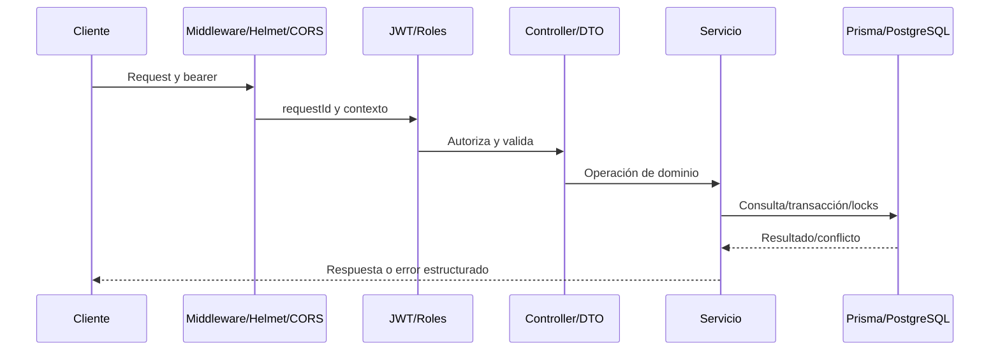
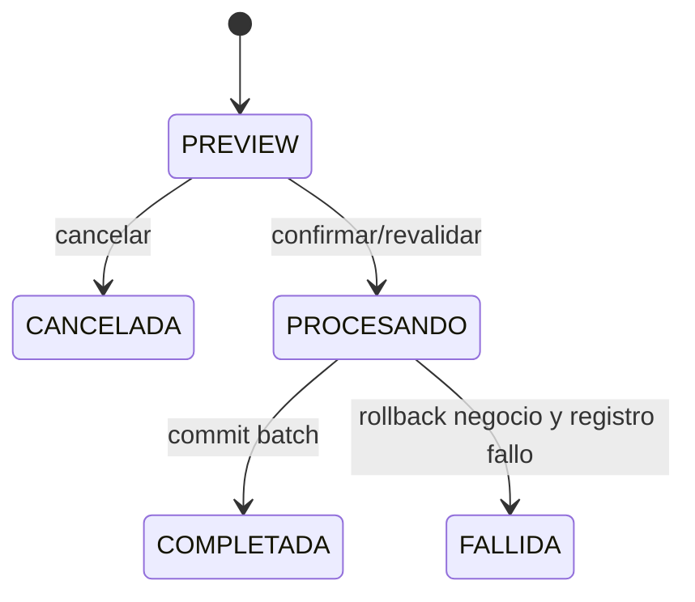

# Backend NestJS

Auditoría 2026-10-07 · Backend `4189fa483ecbbed242946cefc6d4282e0e13dfe8` · Frontend `be0f12e0bf48d6df05afb1eced092b34c915e1cf`.

[Índice](00-README.md) · [Documento maestro](../ARQUITECTURA-INVENTARIO.md)

## Contenido

- [Organización y ciclo HTTP](#organización-y-ciclo-http)
- [DTO y validaciones](#dto-y-validaciones)
- [Errores, logs y auditoría](#errores-logs-y-auditoría)
- [Acceso a datos y negocio](#acceso-a-datos-y-negocio)
- [Autenticación y autorización](#autenticación-y-autorización)
- [Matriz completa de endpoints](#matriz-completa-de-endpoints)
- [Contrato Swagger](#contrato-swagger)
- [Contratos de entrada y respuesta por operación](#contratos-de-entrada-y-respuesta-por-operación)
- [Mapa completo de módulos, servicios y DTO](#mapa-completo-de-módulos-servicios-y-dto)
- [Reglas prácticas para mantenimiento](#reglas-prácticas-para-mantenimiento)
- [Fuentes](#fuentes)

## Organización y ciclo HTTP

AppModule compone los dominios descritos y ConfiguracionModule, HttpModule, DatabaseModule. Cada módulo agrupa controller/servicio/DTO; helpers compartidos para consulta, dinero y errores. Inyección Nest facilita dobles en unitarias y API real en integración.

Prefijo global /api/v1; Swagger UI /api/docs y JSON /api/docs-json aparte. Guards explícitos, no APP_GUARD global: una nueva ruta no queda protegida automáticamente.

## DTO y validaciones

ValidationPipe transforma, whitelist y forbidNonWhitelisted, no devuelve target/value. DTO class-validator/class-transformer y anidados, ParseIntPipe de ruta y SinCuerpoPipe para acciones sin datos comerciales. Validation errors conservan campo/mensajes sin datos sensibles.

## Errores, logs y auditoría

Filtro global devuelve statusCode/code/message/errors/path/method/requestId/timestamp. 400 validación, 401 identidad, 403 rol, 404 recurso, 409 estado/integridad, 503 readiness. Mensajes internos 5xx ocultos al cliente; diagnóstico saneado en logs. SQL desconocido puede terminar 500.

RequestContext AsyncLocalStorage correlaciona UUID y X-Request-Id. Logs estructurados método/path sin query/status/duración/userId; redactan bearer, URLs DB, Argon2 y claves sensibles. Auditar declara acción/entidad. DatabaseService.transaction guarda evidencia dentro del commit; interceptor sólo persiste después si no fue transaccional. Si falla esa escritura posterior, registra audit_failure sin devolver falso fallo comercial.

## Acceso a datos y negocio

Runtime db.orm.public.Model, SQL tipado y raw parametrizado. FOR UPDATE de producto protege existencia incluso no creada; locks de documentos originales para devoluciones y advisory de precios/importaciones. Orden de locks evita carreras/deadlock en escenarios probados. Dinero strings/BigInt; snapshots históricos no se recalculan por precio actual. Estado terminal rechaza edición; borrar catálogo con historia devuelve 409.

## Autenticación y autorización

Login normaliza email, exige usuario/rol activos, verifica Argon2 y firma sub/email/rolId/rol. JwtAuthGuard verifica firma/expiración y copia payload; no consulta DB cada petición. RolesGuard lee metadata método/clase; literal ADMINISTRADOR. No hay tabla granular de permisos.

## Matriz completa de endpoints

Extraída del OpenAPI versionado y contrastada una a una con rutas/métodos de controllers. Auth/Rol provienen de guards/decoradores de código. Autenticado = JWT sin rol adicional declarado. {param} corresponde a :param Nest. Las rutas Swagger generadas están fuera de matriz.

| Módulo | Endpoint | Método | Auth | Rol | Descripción | Controller |
| --- | --- | --- | --- | --- | --- | --- |
| Health | `/api/v1` | GET | No | Público | App: getHello | [AppController](../../src/app.controller.ts) |
| Auditoria | `/api/v1/auditoria` | GET | JWT | ADMINISTRADOR | Auditoria: findAll | [AuditoriaController](../../src/modules/auditoria/auditoria.controller.ts) |
| Auditoria | `/api/v1/auditoria/{id}` | GET | JWT | ADMINISTRADOR | Auditoria: findOne | [AuditoriaController](../../src/modules/auditoria/auditoria.controller.ts) |
| Auth | `/api/v1/auth/login` | POST | No | Público | Auth: login | [AuthController](../../src/modules/auth/auth.controller.ts) |
| Auth | `/api/v1/auth/me` | GET | JWT | Autenticado | Auth: me | [AuthController](../../src/modules/auth/auth.controller.ts) |
| Categorias | `/api/v1/categorias` | GET | JWT | Autenticado | Categorias: findAll | [CategoriasController](../../src/modules/categorias/categorias.controller.ts) |
| Categorias | `/api/v1/categorias` | POST | JWT | ADMINISTRADOR | Categorias: create | [CategoriasController](../../src/modules/categorias/categorias.controller.ts) |
| Categorias | `/api/v1/categorias/{id}` | GET | JWT | Autenticado | Categorias: findOne | [CategoriasController](../../src/modules/categorias/categorias.controller.ts) |
| Categorias | `/api/v1/categorias/{id}` | PATCH | JWT | ADMINISTRADOR | Categorias: update | [CategoriasController](../../src/modules/categorias/categorias.controller.ts) |
| Categorias | `/api/v1/categorias/{id}` | DELETE | JWT | ADMINISTRADOR | Categorias: remove | [CategoriasController](../../src/modules/categorias/categorias.controller.ts) |
| Categorias | `/api/v1/categorias/{id}/activar` | PATCH | JWT | ADMINISTRADOR | Categorias: activar | [CategoriasController](../../src/modules/categorias/categorias.controller.ts) |
| Categorias | `/api/v1/categorias/{id}/desactivar` | PATCH | JWT | ADMINISTRADOR | Categorias: desactivar | [CategoriasController](../../src/modules/categorias/categorias.controller.ts) |
| Clientes | `/api/v1/clientes` | GET | JWT | Autenticado | Clientes: findAll | [ClientesController](../../src/modules/clientes/clientes.controller.ts) |
| Clientes | `/api/v1/clientes` | POST | JWT | ADMINISTRADOR | Clientes: create | [ClientesController](../../src/modules/clientes/clientes.controller.ts) |
| Clientes | `/api/v1/clientes/{id}` | GET | JWT | Autenticado | Clientes: findOne | [ClientesController](../../src/modules/clientes/clientes.controller.ts) |
| Clientes | `/api/v1/clientes/{id}` | PATCH | JWT | ADMINISTRADOR | Clientes: update | [ClientesController](../../src/modules/clientes/clientes.controller.ts) |
| Clientes | `/api/v1/clientes/{id}` | DELETE | JWT | ADMINISTRADOR | Clientes: remove | [ClientesController](../../src/modules/clientes/clientes.controller.ts) |
| Clientes | `/api/v1/clientes/{id}/activar` | PATCH | JWT | ADMINISTRADOR | Clientes: activar | [ClientesController](../../src/modules/clientes/clientes.controller.ts) |
| Clientes | `/api/v1/clientes/{id}/desactivar` | PATCH | JWT | ADMINISTRADOR | Clientes: desactivar | [ClientesController](../../src/modules/clientes/clientes.controller.ts) |
| Compras | `/api/v1/compras` | GET | JWT | Autenticado | Compras: findAll | [ComprasController](../../src/modules/compras/compras.controller.ts) |
| Compras | `/api/v1/compras` | POST | JWT | ADMINISTRADOR | Compras: create | [ComprasController](../../src/modules/compras/compras.controller.ts) |
| Compras | `/api/v1/compras/{id}` | GET | JWT | Autenticado | Compras: findOne | [ComprasController](../../src/modules/compras/compras.controller.ts) |
| Compras | `/api/v1/compras/{id}` | PATCH | JWT | ADMINISTRADOR | Compras: update | [ComprasController](../../src/modules/compras/compras.controller.ts) |
| Compras | `/api/v1/compras/{id}` | DELETE | JWT | ADMINISTRADOR | Compras: remove | [ComprasController](../../src/modules/compras/compras.controller.ts) |
| Compras | `/api/v1/compras/{id}/cancelar` | POST | JWT | ADMINISTRADOR | Compras: cancelar | [ComprasController](../../src/modules/compras/compras.controller.ts) |
| Compras | `/api/v1/compras/{id}/recibir` | POST | JWT | ADMINISTRADOR | Compras: recibir | [ComprasController](../../src/modules/compras/compras.controller.ts) |
| Dashboard | `/api/v1/dashboard/actividad-reciente` | GET | JWT | ADMINISTRADOR | Dashboard: actividadReciente | [DashboardController](../../src/modules/dashboard/dashboard.controller.ts) |
| Dashboard | `/api/v1/dashboard/clientes-principales` | GET | JWT | ADMINISTRADOR | Dashboard: clientesPrincipales | [DashboardController](../../src/modules/dashboard/dashboard.controller.ts) |
| Dashboard | `/api/v1/dashboard/compras` | GET | JWT | ADMINISTRADOR | Dashboard: compras | [DashboardController](../../src/modules/dashboard/dashboard.controller.ts) |
| Dashboard | `/api/v1/dashboard/movimientos-recientes` | GET | JWT | ADMINISTRADOR | Dashboard: movimientosRecientes | [DashboardController](../../src/modules/dashboard/dashboard.controller.ts) |
| Dashboard | `/api/v1/dashboard/productos-mas-vendidos` | GET | JWT | ADMINISTRADOR | Dashboard: productosMasVendidos | [DashboardController](../../src/modules/dashboard/dashboard.controller.ts) |
| Dashboard | `/api/v1/dashboard/proveedores-principales` | GET | JWT | ADMINISTRADOR | Dashboard: proveedoresPrincipales | [DashboardController](../../src/modules/dashboard/dashboard.controller.ts) |
| Dashboard | `/api/v1/dashboard/resumen` | GET | JWT | ADMINISTRADOR | Dashboard: resumen | [DashboardController](../../src/modules/dashboard/dashboard.controller.ts) |
| Dashboard | `/api/v1/dashboard/stock-bajo` | GET | JWT | ADMINISTRADOR | Dashboard: stockBajo | [DashboardController](../../src/modules/dashboard/dashboard.controller.ts) |
| Dashboard | `/api/v1/dashboard/ventas` | GET | JWT | ADMINISTRADOR | Dashboard: ventas | [DashboardController](../../src/modules/dashboard/dashboard.controller.ts) |
| Devoluciones | `/api/v1/devoluciones/compras` | GET | JWT | Autenticado | Devoluciones: findAll | [DevolucionesCompraController](../../src/modules/devoluciones/devoluciones-compra.controller.ts) |
| Devoluciones | `/api/v1/devoluciones/compras` | POST | JWT | ADMINISTRADOR | Devoluciones: create | [DevolucionesCompraController](../../src/modules/devoluciones/devoluciones-compra.controller.ts) |
| Devoluciones | `/api/v1/devoluciones/compras/disponible/{compraId}` | GET | JWT | Autenticado | Devoluciones: disponible | [DevolucionesCompraController](../../src/modules/devoluciones/devoluciones-compra.controller.ts) |
| Devoluciones | `/api/v1/devoluciones/compras/{id}` | GET | JWT | Autenticado | Devoluciones: findOne | [DevolucionesCompraController](../../src/modules/devoluciones/devoluciones-compra.controller.ts) |
| Devoluciones | `/api/v1/devoluciones/compras/{id}` | DELETE | JWT | ADMINISTRADOR | Devoluciones: remove | [DevolucionesCompraController](../../src/modules/devoluciones/devoluciones-compra.controller.ts) |
| Devoluciones | `/api/v1/devoluciones/compras/{id}/cancelar` | POST | JWT | ADMINISTRADOR | Devoluciones: cancelar | [DevolucionesCompraController](../../src/modules/devoluciones/devoluciones-compra.controller.ts) |
| Devoluciones | `/api/v1/devoluciones/compras/{id}/procesar` | POST | JWT | ADMINISTRADOR | Devoluciones: procesar | [DevolucionesCompraController](../../src/modules/devoluciones/devoluciones-compra.controller.ts) |
| Devoluciones | `/api/v1/devoluciones/ventas` | GET | JWT | Autenticado | Devoluciones: findAll | [DevolucionesVentaController](../../src/modules/devoluciones/devoluciones-venta.controller.ts) |
| Devoluciones | `/api/v1/devoluciones/ventas` | POST | JWT | ADMINISTRADOR | Devoluciones: create | [DevolucionesVentaController](../../src/modules/devoluciones/devoluciones-venta.controller.ts) |
| Devoluciones | `/api/v1/devoluciones/ventas/disponible/{ventaId}` | GET | JWT | Autenticado | Devoluciones: disponible | [DevolucionesVentaController](../../src/modules/devoluciones/devoluciones-venta.controller.ts) |
| Devoluciones | `/api/v1/devoluciones/ventas/{id}` | GET | JWT | Autenticado | Devoluciones: findOne | [DevolucionesVentaController](../../src/modules/devoluciones/devoluciones-venta.controller.ts) |
| Devoluciones | `/api/v1/devoluciones/ventas/{id}` | DELETE | JWT | ADMINISTRADOR | Devoluciones: remove | [DevolucionesVentaController](../../src/modules/devoluciones/devoluciones-venta.controller.ts) |
| Devoluciones | `/api/v1/devoluciones/ventas/{id}/cancelar` | POST | JWT | ADMINISTRADOR | Devoluciones: cancelar | [DevolucionesVentaController](../../src/modules/devoluciones/devoluciones-venta.controller.ts) |
| Devoluciones | `/api/v1/devoluciones/ventas/{id}/procesar` | POST | JWT | ADMINISTRADOR | Devoluciones: procesar | [DevolucionesVentaController](../../src/modules/devoluciones/devoluciones-venta.controller.ts) |
| Health | `/api/v1/health` | GET | No | Público | Health: health | [HealthController](../../src/modules/health/health.controller.ts) |
| Health | `/api/v1/health/ready` | GET | No | Público | Health: ready | [HealthController](../../src/modules/health/health.controller.ts) |
| Importaciones | `/api/v1/importaciones` | GET | JWT | ADMINISTRADOR | Importacion | [ImportacionesController](../../src/modules/importaciones/importaciones.controller.ts) |
| Importaciones | `/api/v1/importaciones/clientes/preview` | POST | JWT | ADMINISTRADOR | Preview CSV clientes; sin escrituras comerciales | [ImportacionesController](../../src/modules/importaciones/importaciones.controller.ts) |
| Importaciones | `/api/v1/importaciones/precios/preview` | POST | JWT | ADMINISTRADOR | Preview XLSX/CSV precios; hoja, columnas/listas y vigencia explícitas | [ImportacionesController](../../src/modules/importaciones/importaciones.controller.ts) |
| Importaciones | `/api/v1/importaciones/productos/preview` | POST | JWT | ADMINISTRADOR | Preview CSV productos; categoría/costo y unidades explícitos | [ImportacionesController](../../src/modules/importaciones/importaciones.controller.ts) |
| Importaciones | `/api/v1/importaciones/{id}` | GET | JWT | ADMINISTRADOR | Importacion | [ImportacionesController](../../src/modules/importaciones/importaciones.controller.ts) |
| Importaciones | `/api/v1/importaciones/{id}/cancelar` | POST | JWT | ADMINISTRADOR | Solo PREVIEW; no deshace datos históricos | [ImportacionesController](../../src/modules/importaciones/importaciones.controller.ts) |
| Importaciones | `/api/v1/importaciones/{id}/confirmar` | POST | JWT | ADMINISTRADOR | Confirma hash y autorizaciones; revalida y aplica batch atómico. Conflictos 409 | [ImportacionesController](../../src/modules/importaciones/importaciones.controller.ts) |
| Importaciones | `/api/v1/importaciones/{id}/filas` | GET | JWT | ADMINISTRADOR | ImportacionFila | [ImportacionesController](../../src/modules/importaciones/importaciones.controller.ts) |
| Inventario | `/api/v1/inventario/existencias` | GET | JWT | Autenticado | Inventario: findExistencias | [InventarioController](../../src/modules/inventario/inventario.controller.ts) |
| Inventario | `/api/v1/inventario/existencias/{productoId}` | GET | JWT | Autenticado | Inventario: findExistencia | [InventarioController](../../src/modules/inventario/inventario.controller.ts) |
| Inventario | `/api/v1/inventario/kardex/{productoId}` | GET | JWT | Autenticado | Inventario: findKardex | [InventarioController](../../src/modules/inventario/inventario.controller.ts) |
| Inventario | `/api/v1/inventario/movimientos` | GET | JWT | Autenticado | Inventario: findMovimientos | [InventarioController](../../src/modules/inventario/inventario.controller.ts) |
| Inventario | `/api/v1/inventario/movimientos/ajuste` | POST | JWT | ADMINISTRADOR | Inventario: ajuste | [InventarioController](../../src/modules/inventario/inventario.controller.ts) |
| Inventario | `/api/v1/inventario/movimientos/entrada` | POST | JWT | ADMINISTRADOR | Inventario: entrada | [InventarioController](../../src/modules/inventario/inventario.controller.ts) |
| Inventario | `/api/v1/inventario/movimientos/producto/{productoId}` | GET | JWT | Autenticado | Inventario: findMovimientosProducto | [InventarioController](../../src/modules/inventario/inventario.controller.ts) |
| Inventario | `/api/v1/inventario/movimientos/salida` | POST | JWT | ADMINISTRADOR | Inventario: salida | [InventarioController](../../src/modules/inventario/inventario.controller.ts) |
| ListasPrecios | `/api/v1/listas-precios` | GET | JWT | Autenticado | ListaPrecio | [ListasPreciosController](../../src/modules/listas-precios/listas-precios.controller.ts) |
| ListasPrecios | `/api/v1/listas-precios` | POST | JWT | ADMINISTRADOR | ListaPrecio | [ListasPreciosController](../../src/modules/listas-precios/listas-precios.controller.ts) |
| ListasPrecios | `/api/v1/listas-precios/{id}` | GET | JWT | Autenticado | ListaPrecio | [ListasPreciosController](../../src/modules/listas-precios/listas-precios.controller.ts) |
| ListasPrecios | `/api/v1/listas-precios/{id}` | PATCH | JWT | ADMINISTRADOR | ListaPrecio | [ListasPreciosController](../../src/modules/listas-precios/listas-precios.controller.ts) |
| ListasPrecios | `/api/v1/listas-precios/{id}` | DELETE | JWT | ADMINISTRADOR | Deleted | [ListasPreciosController](../../src/modules/listas-precios/listas-precios.controller.ts) |
| ListasPrecios | `/api/v1/listas-precios/{id}/activar` | PATCH | JWT | ADMINISTRADOR | ListaPrecio | [ListasPreciosController](../../src/modules/listas-precios/listas-precios.controller.ts) |
| ListasPrecios | `/api/v1/listas-precios/{id}/desactivar` | PATCH | JWT | ADMINISTRADOR | ListaPrecio | [ListasPreciosController](../../src/modules/listas-precios/listas-precios.controller.ts) |
| ListasPrecios | `/api/v1/listas-precios/{id}/predeterminada` | PATCH | JWT | ADMINISTRADOR | ListaPrecio | [ListasPreciosController](../../src/modules/listas-precios/listas-precios.controller.ts) |
| ListasPrecios | `/api/v1/listas-precios/{id}/productos` | GET | JWT | Autenticado | ProductoPrecio | [ListasPreciosController](../../src/modules/listas-precios/listas-precios.controller.ts) |
| ListasPrecios | `/api/v1/listas-precios/{id}/productos` | POST | JWT | ADMINISTRADOR | ProductoPrecio | [ListasPreciosController](../../src/modules/listas-precios/listas-precios.controller.ts) |
| ListasPrecios | `/api/v1/listas-precios/{id}/productos/{precioId}` | GET | JWT | Autenticado | ProductoPrecio | [ListasPreciosController](../../src/modules/listas-precios/listas-precios.controller.ts) |
| ListasPrecios | `/api/v1/listas-precios/{id}/productos/{precioId}` | PATCH | JWT | ADMINISTRADOR | ProductoPrecio | [ListasPreciosController](../../src/modules/listas-precios/listas-precios.controller.ts) |
| Productos | `/api/v1/productos` | GET | JWT | Autenticado | Productos: findAll | [ProductosController](../../src/modules/productos/productos.controller.ts) |
| Productos | `/api/v1/productos` | POST | JWT | ADMINISTRADOR | Productos: create | [ProductosController](../../src/modules/productos/productos.controller.ts) |
| Productos | `/api/v1/productos/{id}` | GET | JWT | Autenticado | Productos: findOne | [ProductosController](../../src/modules/productos/productos.controller.ts) |
| Productos | `/api/v1/productos/{id}` | PATCH | JWT | ADMINISTRADOR | Productos: update | [ProductosController](../../src/modules/productos/productos.controller.ts) |
| Productos | `/api/v1/productos/{id}` | DELETE | JWT | ADMINISTRADOR | Productos: remove | [ProductosController](../../src/modules/productos/productos.controller.ts) |
| Productos | `/api/v1/productos/{id}/activar` | PATCH | JWT | ADMINISTRADOR | Productos: activar | [ProductosController](../../src/modules/productos/productos.controller.ts) |
| Productos | `/api/v1/productos/{id}/desactivar` | PATCH | JWT | ADMINISTRADOR | Productos: desactivar | [ProductosController](../../src/modules/productos/productos.controller.ts) |
| Productos | `/api/v1/productos/{productoId}/precio` | GET | JWT | Autenticado | Precio actual UTC; fallback Producto.precio si falta vigencia; sin lista usa precio base | [PrecioProductoController](../../src/modules/listas-precios/listas-precios.controller.ts) |
| Proveedores | `/api/v1/proveedores` | GET | JWT | Autenticado | Proveedores: findAll | [ProveedoresController](../../src/modules/proveedores/proveedores.controller.ts) |
| Proveedores | `/api/v1/proveedores` | POST | JWT | ADMINISTRADOR | Proveedores: create | [ProveedoresController](../../src/modules/proveedores/proveedores.controller.ts) |
| Proveedores | `/api/v1/proveedores/{id}` | GET | JWT | Autenticado | Proveedores: findOne | [ProveedoresController](../../src/modules/proveedores/proveedores.controller.ts) |
| Proveedores | `/api/v1/proveedores/{id}` | PATCH | JWT | ADMINISTRADOR | Proveedores: update | [ProveedoresController](../../src/modules/proveedores/proveedores.controller.ts) |
| Proveedores | `/api/v1/proveedores/{id}` | DELETE | JWT | ADMINISTRADOR | Proveedores: remove | [ProveedoresController](../../src/modules/proveedores/proveedores.controller.ts) |
| Proveedores | `/api/v1/proveedores/{id}/activar` | PATCH | JWT | ADMINISTRADOR | Proveedores: activar | [ProveedoresController](../../src/modules/proveedores/proveedores.controller.ts) |
| Proveedores | `/api/v1/proveedores/{id}/desactivar` | PATCH | JWT | ADMINISTRADOR | Proveedores: desactivar | [ProveedoresController](../../src/modules/proveedores/proveedores.controller.ts) |
| Reportes | `/api/v1/reportes/compras` | GET | JWT | ADMINISTRADOR | Reportes: compras | [ReportesController](../../src/modules/reportes/reportes.controller.ts) |
| Reportes | `/api/v1/reportes/inventario` | GET | JWT | ADMINISTRADOR | Reportes: inventarioActual | [ReportesController](../../src/modules/reportes/reportes.controller.ts) |
| Reportes | `/api/v1/reportes/kardex` | GET | JWT | ADMINISTRADOR | Reportes: kardex | [ReportesController](../../src/modules/reportes/reportes.controller.ts) |
| Reportes | `/api/v1/reportes/utilidad` | GET | JWT | ADMINISTRADOR | Reportes: utilidad | [ReportesController](../../src/modules/reportes/reportes.controller.ts) |
| Reportes | `/api/v1/reportes/ventas` | GET | JWT | ADMINISTRADOR | Reportes: ventas | [ReportesController](../../src/modules/reportes/reportes.controller.ts) |
| Roles | `/api/v1/roles` | GET | JWT | ADMINISTRADOR | Roles: findAll | [RolesController](../../src/modules/roles/roles.controller.ts) |
| Roles | `/api/v1/roles` | POST | JWT | ADMINISTRADOR | Roles: create | [RolesController](../../src/modules/roles/roles.controller.ts) |
| UnidadesMedida | `/api/v1/unidades-medida` | GET | JWT | Autenticado | UnidadesMedida: findAll | [UnidadesMedidaController](../../src/modules/unidades-medida/unidades-medida.controller.ts) |
| UnidadesMedida | `/api/v1/unidades-medida` | POST | JWT | ADMINISTRADOR | UnidadesMedida: create | [UnidadesMedidaController](../../src/modules/unidades-medida/unidades-medida.controller.ts) |
| UnidadesMedida | `/api/v1/unidades-medida/{id}` | GET | JWT | Autenticado | UnidadesMedida: findOne | [UnidadesMedidaController](../../src/modules/unidades-medida/unidades-medida.controller.ts) |
| UnidadesMedida | `/api/v1/unidades-medida/{id}` | PATCH | JWT | ADMINISTRADOR | UnidadesMedida: update | [UnidadesMedidaController](../../src/modules/unidades-medida/unidades-medida.controller.ts) |
| UnidadesMedida | `/api/v1/unidades-medida/{id}` | DELETE | JWT | ADMINISTRADOR | UnidadesMedida: remove | [UnidadesMedidaController](../../src/modules/unidades-medida/unidades-medida.controller.ts) |
| UnidadesMedida | `/api/v1/unidades-medida/{id}/activar` | PATCH | JWT | ADMINISTRADOR | UnidadesMedida: activar | [UnidadesMedidaController](../../src/modules/unidades-medida/unidades-medida.controller.ts) |
| UnidadesMedida | `/api/v1/unidades-medida/{id}/desactivar` | PATCH | JWT | ADMINISTRADOR | UnidadesMedida: desactivar | [UnidadesMedidaController](../../src/modules/unidades-medida/unidades-medida.controller.ts) |
| Usuarios | `/api/v1/usuarios` | GET | JWT | Autenticado | Usuarios: findAll | [UsuariosController](../../src/modules/usuarios/usuarios.controller.ts) |
| Usuarios | `/api/v1/usuarios` | POST | JWT | ADMINISTRADOR | Usuarios: create | [UsuariosController](../../src/modules/usuarios/usuarios.controller.ts) |
| Ventas | `/api/v1/ventas` | GET | JWT | Autenticado | Ventas: findAll | [VentasController](../../src/modules/ventas/ventas.controller.ts) |
| Ventas | `/api/v1/ventas` | POST | JWT | ADMINISTRADOR | Ventas: create | [VentasController](../../src/modules/ventas/ventas.controller.ts) |
| Ventas | `/api/v1/ventas/{id}` | GET | JWT | Autenticado | Ventas: findOne | [VentasController](../../src/modules/ventas/ventas.controller.ts) |
| Ventas | `/api/v1/ventas/{id}` | PATCH | JWT | ADMINISTRADOR | Ventas: update | [VentasController](../../src/modules/ventas/ventas.controller.ts) |
| Ventas | `/api/v1/ventas/{id}` | DELETE | JWT | ADMINISTRADOR | Ventas: remove | [VentasController](../../src/modules/ventas/ventas.controller.ts) |
| Ventas | `/api/v1/ventas/{id}/cancelar` | POST | JWT | ADMINISTRADOR | Ventas: cancelar | [VentasController](../../src/modules/ventas/ventas.controller.ts) |
| Ventas | `/api/v1/ventas/{id}/confirmar` | POST | JWT | ADMINISTRADOR | Ventas: confirmar | [VentasController](../../src/modules/ventas/ventas.controller.ts) |

**117 operaciones en 85 rutas**, comprobadas contra código.

## Contrato Swagger

ApiModulo/ApiResultado y openapi.schemas.ts complementan DTO/respuestas. docs/api-openapi.json se versionó para clones limpios. Frontend usa snapshot y genera tipos; igualdad de snapshots no demuestra drift de API viva.

## Contratos de entrada y respuesta por operación

Listado de parámetros query, body y respuesta 2xx del snapshot comprobado. Los detalles de obligatoriedad y límites están en DTO/OpenAPI enlazados; respuesta nominal no sustituye reglas de estado.

| Operación | Query | Body / media type | Respuesta 2xx |
| --- | --- | --- | --- |
| GET /api/v1 | — | — | 200 string |
| GET /api/v1/auditoria | page opcional, limit opcional, usuarioId opcional, accion opcional, entidad opcional, entidadId opcional, fechaInicio opcional, fechaFin opcional, search opcional, sortOrder opcional | — | 200 object |
| GET /api/v1/auditoria/{id} | — | — | 200 Auditoria |
| POST /api/v1/auth/login | — | application/json: LoginDto | 200 Login |
| GET /api/v1/auth/me | — | — | 200 CurrentUser |
| GET /api/v1/categorias | — | — | 200 Categoria[] |
| POST /api/v1/categorias | — | application/json: CreateCategoriaDto | 201 Categoria |
| GET /api/v1/categorias/{id} | — | — | 200 Categoria |
| PATCH /api/v1/categorias/{id} | — | application/json: UpdateCategoriaDto | 200 Categoria |
| DELETE /api/v1/categorias/{id} | — | — | 200 Deleted |
| PATCH /api/v1/categorias/{id}/activar | — | — | 200 Categoria |
| PATCH /api/v1/categorias/{id}/desactivar | — | — | 200 Categoria |
| GET /api/v1/clientes | page opcional, limit opcional, search opcional | — | 200 object |
| POST /api/v1/clientes | — | application/json: CreateClienteDto | 201 Cliente |
| GET /api/v1/clientes/{id} | — | — | 200 Cliente |
| PATCH /api/v1/clientes/{id} | — | application/json: UpdateClienteDto | 200 Cliente |
| DELETE /api/v1/clientes/{id} | — | — | 200 Deleted |
| PATCH /api/v1/clientes/{id}/activar | — | — | 200 Cliente |
| PATCH /api/v1/clientes/{id}/desactivar | — | — | 200 Cliente |
| GET /api/v1/compras | page opcional, limit opcional, proveedorId opcional, estado opcional, fechaInicio opcional, fechaFin opcional, search opcional, sortBy opcional, sortOrder opcional | — | 200 object |
| POST /api/v1/compras | — | application/json: CreateCompraDto | 201 CompraDetalle |
| GET /api/v1/compras/{id} | — | — | 200 CompraDetalle |
| PATCH /api/v1/compras/{id} | — | application/json: UpdateCompraDto | 200 CompraDetalle |
| DELETE /api/v1/compras/{id} | — | — | 200 Deleted |
| POST /api/v1/compras/{id}/cancelar | — | application/json: object | 201 CompraDetalle |
| POST /api/v1/compras/{id}/recibir | — | application/json: object | 201 CompraDetalle |
| GET /api/v1/dashboard/actividad-reciente | limit opcional | — | 200 object |
| GET /api/v1/dashboard/clientes-principales | fechaInicio opcional, fechaFin opcional, limit opcional | — | 200 object |
| GET /api/v1/dashboard/compras | fechaInicio opcional, fechaFin opcional, agrupacion opcional | — | 200 object |
| GET /api/v1/dashboard/movimientos-recientes | limit opcional | — | 200 object |
| GET /api/v1/dashboard/productos-mas-vendidos | fechaInicio opcional, fechaFin opcional, limit opcional | — | 200 object |
| GET /api/v1/dashboard/proveedores-principales | fechaInicio opcional, fechaFin opcional, limit opcional | — | 200 object |
| GET /api/v1/dashboard/resumen | fechaInicio opcional, fechaFin opcional | — | 200 DashboardResumen |
| GET /api/v1/dashboard/stock-bajo | limit opcional | — | 200 object |
| GET /api/v1/dashboard/ventas | fechaInicio opcional, fechaFin opcional, agrupacion opcional | — | 200 object |
| GET /api/v1/devoluciones/compras | page opcional, limit opcional, estado opcional, fechaInicio opcional, fechaFin opcional, search opcional, sortBy opcional, sortOrder opcional, compraId opcional, proveedorId opcional | — | 200 object |
| POST /api/v1/devoluciones/compras | — | application/json: CreateDevolucionCompraDto | 201 DevolucionCompraDetalle |
| GET /api/v1/devoluciones/compras/disponible/{compraId} | — | — | 200 DisponibilidadCompra |
| GET /api/v1/devoluciones/compras/{id} | — | — | 200 DevolucionCompraDetalle |
| DELETE /api/v1/devoluciones/compras/{id} | — | — | 200 Deleted |
| POST /api/v1/devoluciones/compras/{id}/cancelar | — | application/json: object | 201 DevolucionCompraDetalle |
| POST /api/v1/devoluciones/compras/{id}/procesar | — | application/json: object | 201 DevolucionCompraDetalle |
| GET /api/v1/devoluciones/ventas | page opcional, limit opcional, estado opcional, fechaInicio opcional, fechaFin opcional, search opcional, sortBy opcional, sortOrder opcional, ventaId opcional, clienteId opcional | — | 200 object |
| POST /api/v1/devoluciones/ventas | — | application/json: CreateDevolucionVentaDto | 201 DevolucionVentaDetalle |
| GET /api/v1/devoluciones/ventas/disponible/{ventaId} | — | — | 200 DisponibilidadVenta |
| GET /api/v1/devoluciones/ventas/{id} | — | — | 200 DevolucionVentaDetalle |
| DELETE /api/v1/devoluciones/ventas/{id} | — | — | 200 Deleted |
| POST /api/v1/devoluciones/ventas/{id}/cancelar | — | application/json: object | 201 DevolucionVentaDetalle |
| POST /api/v1/devoluciones/ventas/{id}/procesar | — | application/json: object | 201 DevolucionVentaDetalle |
| GET /api/v1/health | — | — | 200 Health |
| GET /api/v1/health/ready | — | — | 200 Readiness |
| GET /api/v1/importaciones | page opcional, limit opcional, tipo opcional, estado opcional | — | 200 object |
| POST /api/v1/importaciones/clientes/preview | — | multipart/form-data: object | 201 Importacion |
| POST /api/v1/importaciones/precios/preview | — | multipart/form-data: object | 201 Importacion |
| POST /api/v1/importaciones/productos/preview | — | multipart/form-data: object | 201 Importacion |
| GET /api/v1/importaciones/{id} | — | — | 200 Importacion |
| POST /api/v1/importaciones/{id}/cancelar | — | — | 201 Importacion |
| POST /api/v1/importaciones/{id}/confirmar | — | application/json: ConfirmarImportacionDto | 201 Importacion |
| GET /api/v1/importaciones/{id}/filas | page opcional, limit opcional, estado opcional, search opcional | — | 200 object |
| GET /api/v1/inventario/existencias | page opcional, limit opcional, search opcional, stockBajo opcional | — | 200 object |
| GET /api/v1/inventario/existencias/{productoId} | — | — | 200 Existencia |
| GET /api/v1/inventario/kardex/{productoId} | page opcional, limit opcional, tipo opcional, fechaInicio opcional, fechaFin opcional, sortBy opcional, sortOrder opcional | — | 200 Kardex |
| GET /api/v1/inventario/movimientos | page opcional, limit opcional, tipo opcional, fechaInicio opcional, fechaFin opcional, sortBy opcional, sortOrder opcional, productoId opcional, usuarioId opcional | — | 200 object |
| POST /api/v1/inventario/movimientos/ajuste | — | application/json: AjusteInventarioDto | 201 Movimiento |
| POST /api/v1/inventario/movimientos/entrada | — | application/json: EntradaInventarioDto | 201 Movimiento |
| GET /api/v1/inventario/movimientos/producto/{productoId} | page opcional, limit opcional, tipo opcional, fechaInicio opcional, fechaFin opcional, sortBy opcional, sortOrder opcional | — | 200 object |
| POST /api/v1/inventario/movimientos/salida | — | application/json: SalidaInventarioDto | 201 Movimiento |
| GET /api/v1/listas-precios | page opcional, limit opcional, search opcional, activo opcional | — | 200 object |
| POST /api/v1/listas-precios | — | application/json: CreateListaPrecioDto | 201 ListaPrecio |
| GET /api/v1/listas-precios/{id} | — | — | 200 ListaPrecio |
| PATCH /api/v1/listas-precios/{id} | — | application/json: UpdateListaPrecioDto | 200 ListaPrecio |
| DELETE /api/v1/listas-precios/{id} | — | — | 200 Deleted |
| PATCH /api/v1/listas-precios/{id}/activar | — | — | 200 ListaPrecio |
| PATCH /api/v1/listas-precios/{id}/desactivar | — | — | 200 ListaPrecio |
| PATCH /api/v1/listas-precios/{id}/predeterminada | — | — | 200 ListaPrecio |
| GET /api/v1/listas-precios/{id}/productos | page opcional, limit opcional, search opcional, activo opcional, productoId opcional, vigenteEn opcional | — | 200 object |
| POST /api/v1/listas-precios/{id}/productos | — | application/json: CreateProductoPrecioDto | 201 ProductoPrecio |
| GET /api/v1/listas-precios/{id}/productos/{precioId} | — | — | 200 ProductoPrecio |
| PATCH /api/v1/listas-precios/{id}/productos/{precioId} | — | application/json: UpdateProductoPrecioDto | 200 ProductoPrecio |
| GET /api/v1/productos | — | — | 200 Producto[] |
| POST /api/v1/productos | — | application/json: CreateProductoDto | 201 Producto |
| GET /api/v1/productos/{id} | — | — | 200 Producto |
| PATCH /api/v1/productos/{id} | — | application/json: UpdateProductoDto | 200 Producto |
| DELETE /api/v1/productos/{id} | — | — | 200 Deleted |
| PATCH /api/v1/productos/{id}/activar | — | — | 200 Producto |
| PATCH /api/v1/productos/{id}/desactivar | — | — | 200 Producto |
| GET /api/v1/productos/{productoId}/precio | listaPrecioId opcional | — | 200 PrecioResuelto |
| GET /api/v1/proveedores | page opcional, limit opcional, search opcional | — | 200 object |
| POST /api/v1/proveedores | — | application/json: CreateProveedorDto | 201 Proveedor |
| GET /api/v1/proveedores/{id} | — | — | 200 Proveedor |
| PATCH /api/v1/proveedores/{id} | — | application/json: UpdateProveedorDto | 200 Proveedor |
| DELETE /api/v1/proveedores/{id} | — | — | 200 Deleted |
| PATCH /api/v1/proveedores/{id}/activar | — | — | 200 Proveedor |
| PATCH /api/v1/proveedores/{id}/desactivar | — | — | 200 Proveedor |
| GET /api/v1/reportes/compras | page opcional, limit opcional, proveedorId opcional, estado opcional, fechaInicio opcional, fechaFin opcional, search opcional, sortBy opcional, sortOrder opcional | — | 200 object |
| GET /api/v1/reportes/inventario | page opcional, limit opcional, search opcional, stockBajo opcional, categoriaId opcional, sinExistencia opcional, activo opcional | — | 200 object |
| GET /api/v1/reportes/kardex | page opcional, limit opcional, tipo opcional, fechaInicio opcional, fechaFin opcional, sortBy opcional, sortOrder opcional, productoId opcional, usuarioId opcional | — | 200 object |
| GET /api/v1/reportes/utilidad | fechaInicio opcional, fechaFin opcional, agrupacion opcional | — | 200 ReporteUtilidad |
| GET /api/v1/reportes/ventas | page opcional, limit opcional, clienteId opcional, estado opcional, fechaInicio opcional, fechaFin opcional, search opcional, sortBy opcional, sortOrder opcional | — | 200 object |
| GET /api/v1/roles | — | — | 200 Rol[] |
| POST /api/v1/roles | — | application/json: CreateRolDto | 201 Rol |
| GET /api/v1/unidades-medida | — | — | 200 UnidadMedida[] |
| POST /api/v1/unidades-medida | — | application/json: CreateUnidadMedidaDto | 201 UnidadMedida |
| GET /api/v1/unidades-medida/{id} | — | — | 200 UnidadMedida |
| PATCH /api/v1/unidades-medida/{id} | — | application/json: UpdateUnidadMedidaDto | 200 UnidadMedida |
| DELETE /api/v1/unidades-medida/{id} | — | — | 200 Deleted |
| PATCH /api/v1/unidades-medida/{id}/activar | — | — | 200 UnidadMedida |
| PATCH /api/v1/unidades-medida/{id}/desactivar | — | — | 200 UnidadMedida |
| GET /api/v1/usuarios | — | — | 200 Usuario[] |
| POST /api/v1/usuarios | — | application/json: CreateUsuarioDto | 201 Usuario |
| GET /api/v1/ventas | page opcional, limit opcional, clienteId opcional, estado opcional, fechaInicio opcional, fechaFin opcional, search opcional, sortBy opcional, sortOrder opcional | — | 200 object |
| POST /api/v1/ventas | — | application/json: CreateVentaDto | 201 VentaDetalle |
| GET /api/v1/ventas/{id} | — | — | 200 VentaDetalle |
| PATCH /api/v1/ventas/{id} | — | application/json: UpdateVentaDto | 200 VentaDetalle |
| DELETE /api/v1/ventas/{id} | — | — | 200 Deleted |
| POST /api/v1/ventas/{id}/cancelar | — | application/json: object | 201 VentaDetalle |
| POST /api/v1/ventas/{id}/confirmar | — | application/json: object | 201 VentaDetalle |

## Mapa completo de módulos, servicios y DTO

| Dominio | Module | Servicios | DTO |
| --- | --- | --- | --- |
| auditoria | [src/modules/auditoria/auditoria.module.ts](../../src/modules/auditoria/auditoria.module.ts) | [src/modules/auditoria/auditoria.service.ts](../../src/modules/auditoria/auditoria.service.ts) | [src/modules/auditoria/dto/auditoria-query.dto.ts](../../src/modules/auditoria/dto/auditoria-query.dto.ts) |
| auth | [src/modules/auth/auth.module.ts](../../src/modules/auth/auth.module.ts) | [src/modules/auth/auth.service.ts](../../src/modules/auth/auth.service.ts) | [src/modules/auth/dto/login.dto.ts](../../src/modules/auth/dto/login.dto.ts) |
| categorias | [src/modules/categorias/categorias.module.ts](../../src/modules/categorias/categorias.module.ts) | [src/modules/categorias/categorias.service.ts](../../src/modules/categorias/categorias.service.ts) | [src/modules/categorias/dto/create-categoria.dto.ts](../../src/modules/categorias/dto/create-categoria.dto.ts) [src/modules/categorias/dto/update-categoria.dto.ts](../../src/modules/categorias/dto/update-categoria.dto.ts) |
| clientes | [src/modules/clientes/clientes.module.ts](../../src/modules/clientes/clientes.module.ts) | [src/modules/clientes/clientes.service.ts](../../src/modules/clientes/clientes.service.ts) | [src/modules/clientes/dto/cliente-query.dto.ts](../../src/modules/clientes/dto/cliente-query.dto.ts) [src/modules/clientes/dto/create-cliente.dto.ts](../../src/modules/clientes/dto/create-cliente.dto.ts) [src/modules/clientes/dto/domicilio-cliente.dto.ts](../../src/modules/clientes/dto/domicilio-cliente.dto.ts) [src/modules/clientes/dto/update-cliente.dto.ts](../../src/modules/clientes/dto/update-cliente.dto.ts) |
| compras | [src/modules/compras/compras.module.ts](../../src/modules/compras/compras.module.ts) | [src/modules/compras/compras.service.ts](../../src/modules/compras/compras.service.ts) | [src/modules/compras/dto/accion-compra.dto.ts](../../src/modules/compras/dto/accion-compra.dto.ts) [src/modules/compras/dto/compra-detalle.dto.ts](../../src/modules/compras/dto/compra-detalle.dto.ts) [src/modules/compras/dto/compra-query.dto.ts](../../src/modules/compras/dto/compra-query.dto.ts) [src/modules/compras/dto/create-compra.dto.ts](../../src/modules/compras/dto/create-compra.dto.ts) [src/modules/compras/dto/update-compra.dto.ts](../../src/modules/compras/dto/update-compra.dto.ts) |
| dashboard | [src/modules/dashboard/dashboard.module.ts](../../src/modules/dashboard/dashboard.module.ts) | [src/modules/dashboard/dashboard.service.ts](../../src/modules/dashboard/dashboard.service.ts) | [src/modules/dashboard/dto/dashboard-query.dto.ts](../../src/modules/dashboard/dto/dashboard-query.dto.ts) |
| devoluciones | [src/modules/devoluciones/devoluciones.module.ts](../../src/modules/devoluciones/devoluciones.module.ts) | [src/modules/devoluciones/devoluciones-compra.service.ts](../../src/modules/devoluciones/devoluciones-compra.service.ts) [src/modules/devoluciones/devoluciones-venta.service.ts](../../src/modules/devoluciones/devoluciones-venta.service.ts) | [src/modules/devoluciones/dto/create-devolucion-compra.dto.ts](../../src/modules/devoluciones/dto/create-devolucion-compra.dto.ts) [src/modules/devoluciones/dto/create-devolucion-venta.dto.ts](../../src/modules/devoluciones/dto/create-devolucion-venta.dto.ts) [src/modules/devoluciones/dto/devolucion-query.dto.ts](../../src/modules/devoluciones/dto/devolucion-query.dto.ts) |
| health | [src/modules/health/health.module.ts](../../src/modules/health/health.module.ts) | [src/modules/health/health.service.ts](../../src/modules/health/health.service.ts) | — |
| importaciones | [src/modules/importaciones/importaciones.module.ts](../../src/modules/importaciones/importaciones.module.ts) | [src/modules/importaciones/importaciones.service.ts](../../src/modules/importaciones/importaciones.service.ts) | [src/modules/importaciones/dto/importaciones.dto.ts](../../src/modules/importaciones/dto/importaciones.dto.ts) |
| inventario | [src/modules/inventario/inventario.module.ts](../../src/modules/inventario/inventario.module.ts) | [src/modules/inventario/inventario.service.ts](../../src/modules/inventario/inventario.service.ts) | [src/modules/inventario/dto/ajuste-inventario.dto.ts](../../src/modules/inventario/dto/ajuste-inventario.dto.ts) [src/modules/inventario/dto/consulta-inventario.dto.ts](../../src/modules/inventario/dto/consulta-inventario.dto.ts) [src/modules/inventario/dto/entrada-inventario.dto.ts](../../src/modules/inventario/dto/entrada-inventario.dto.ts) [src/modules/inventario/dto/salida-inventario.dto.ts](../../src/modules/inventario/dto/salida-inventario.dto.ts) |
| listas-precios | [src/modules/listas-precios/listas-precios.module.ts](../../src/modules/listas-precios/listas-precios.module.ts) | [src/modules/listas-precios/listas-precios.service.ts](../../src/modules/listas-precios/listas-precios.service.ts) | [src/modules/listas-precios/dto/listas-precios.dto.ts](../../src/modules/listas-precios/dto/listas-precios.dto.ts) |
| productos | [src/modules/productos/productos.module.ts](../../src/modules/productos/productos.module.ts) | [src/modules/productos/productos.service.ts](../../src/modules/productos/productos.service.ts) | [src/modules/productos/dto/create-producto.dto.ts](../../src/modules/productos/dto/create-producto.dto.ts) [src/modules/productos/dto/update-producto.dto.ts](../../src/modules/productos/dto/update-producto.dto.ts) |
| proveedores | [src/modules/proveedores/proveedores.module.ts](../../src/modules/proveedores/proveedores.module.ts) | [src/modules/proveedores/proveedores.service.ts](../../src/modules/proveedores/proveedores.service.ts) | [src/modules/proveedores/dto/create-proveedor.dto.ts](../../src/modules/proveedores/dto/create-proveedor.dto.ts) [src/modules/proveedores/dto/proveedor-query.dto.ts](../../src/modules/proveedores/dto/proveedor-query.dto.ts) [src/modules/proveedores/dto/update-proveedor.dto.ts](../../src/modules/proveedores/dto/update-proveedor.dto.ts) |
| reportes | [src/modules/reportes/reportes.module.ts](../../src/modules/reportes/reportes.module.ts) | [src/modules/reportes/reportes.service.ts](../../src/modules/reportes/reportes.service.ts) | [src/modules/reportes/dto/reportes-query.dto.ts](../../src/modules/reportes/dto/reportes-query.dto.ts) |
| roles | [src/modules/roles/roles.module.ts](../../src/modules/roles/roles.module.ts) | [src/modules/roles/roles.service.ts](../../src/modules/roles/roles.service.ts) | [src/modules/roles/dto/create-rol.dto.ts](../../src/modules/roles/dto/create-rol.dto.ts) |
| unidades-medida | [src/modules/unidades-medida/unidades-medida.module.ts](../../src/modules/unidades-medida/unidades-medida.module.ts) | [src/modules/unidades-medida/unidades-medida.service.ts](../../src/modules/unidades-medida/unidades-medida.service.ts) | [src/modules/unidades-medida/dto/unidad-medida.dto.ts](../../src/modules/unidades-medida/dto/unidad-medida.dto.ts) |
| usuarios | [src/modules/usuarios/usuarios.module.ts](../../src/modules/usuarios/usuarios.module.ts) | [src/modules/usuarios/usuarios.service.ts](../../src/modules/usuarios/usuarios.service.ts) | [src/modules/usuarios/dto/create-usuario.dto.ts](../../src/modules/usuarios/dto/create-usuario.dto.ts) |
| ventas | [src/modules/ventas/ventas.module.ts](../../src/modules/ventas/ventas.module.ts) | [src/modules/ventas/ventas.service.ts](../../src/modules/ventas/ventas.service.ts) | [src/modules/ventas/dto/create-venta.dto.ts](../../src/modules/ventas/dto/create-venta.dto.ts) [src/modules/ventas/dto/update-venta.dto.ts](../../src/modules/ventas/dto/update-venta.dto.ts) [src/modules/ventas/dto/venta-detalle.dto.ts](../../src/modules/ventas/dto/venta-detalle.dto.ts) [src/modules/ventas/dto/venta-query.dto.ts](../../src/modules/ventas/dto/venta-query.dto.ts) |

## Reglas prácticas para mantenimiento

- Listas: lock comercial global advisory (5,5002), exclusivo en configuración y compartido al tomar snapshots de venta. Índice parcial mantiene máximo una predeterminada. La predeterminada no se asigna automáticamente a ventas legacy sin lista.
- Vigencias: POST crea precio; PATCH sólo cierra/reduce fin permitido. Precio/producto/lista/inicio inmutables; no DELETE de ProductoPrecio. Cierre y alta por API son dos requests; importación CERRAR_Y_CREAR los integra en una transacción autorizada.
- Devoluciones: máximo 100 líneas sin original repetido; cantidad disponible = original − ya devuelta procesada. Bloquear documento original serializa confirmaciones y evita exceder acumulados.
- Importación: identificadores explícitos RFC/SKU y mappings de listas/hojas, no deduplicación por nombre ni costo inventado. Preview sin negocio; confirmar revalida, aplica batch atómico y guarda resultados. Cancelar preview no deshace importación completada.
- Dashboard: periodo por defecto mes UTC; exigir ambas fechas o ninguna. Series día/semana/mes acotadas. Utilidad ajustada = ventas brutas − devoluciones − costo vendido + costo devuelto; impuestos no equivalen utilidad comercial. Reporte por documento y agregado por periodo tienen filtros distintos: consultar DTO y servicio.

PROCESANDO es parte de transacción: un crash/rollback no implica estado intermedio comprometido durable. FALLIDA se registra después del rollback cuando el flujo de error lo permite. Preview obsoleto/conflictos pueden conservar PREVIEW y requerir nuevo plan: no todo 409 convierte sesión en FALLIDA.

## Fuentes

- [backend/src/app.module.ts](../../src/app.module.ts)
- [backend/src/main.ts](../../src/main.ts)
- [backend/src/database/database.service.ts](../../src/database/database.service.ts)
- [backend/src/common/http/configurar-http.ts](../../src/common/http/configurar-http.ts)
- [backend/src/common/http/validation.ts](../../src/common/http/validation.ts)
- [backend/src/common/http/global-exception.filter.ts](../../src/common/http/global-exception.filter.ts)
- [backend/src/common/http/auditoria.interceptor.ts](../../src/common/http/auditoria.interceptor.ts)
- [backend/src/common/http/openapi.schemas.ts](../../src/common/http/openapi.schemas.ts)
- [backend/src/common/errores-db.ts](../../src/common/errores-db.ts)
- [backend/docs/api-openapi.json](../api-openapi.json)
- [backend/API.md](../../API.md)
- [backend/AUDITORIA.md](../../AUDITORIA.md)
- [backend/OBSERVABILIDAD.md](../../OBSERVABILIDAD.md)
