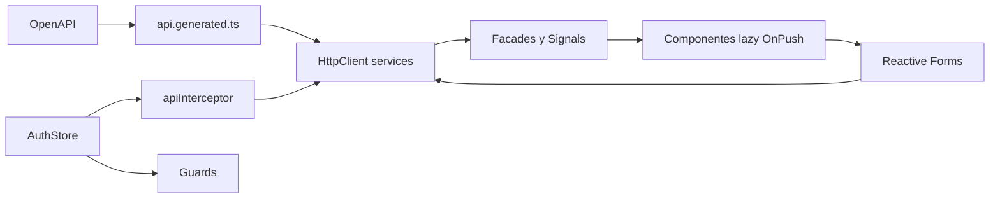

# Frontend Angular

Auditoría 2026-10-07 · Backend `4189fa483ecbbed242946cefc6d4282e0e13dfe8` · Frontend `be0f12e0bf48d6df05afb1eced092b34c915e1cf`.

[Índice](00-README.md) · [Documento maestro](../ARQUITECTURA-INVENTARIO.md)

## Contenido

- [Arquitectura Angular real](#arquitectura-angular-real)
- [Routing y lazy loading](#routing-y-lazy-loading)
- [Autenticación y estado](#autenticación-y-estado)
- [Formularios y consumo REST](#formularios-y-consumo-rest)
- [UI, build y ambientes](#ui-build-y-ambientes)
- [Contrato y pruebas](#contrato-y-pruebas)
- [Servicios y facades existentes](#servicios-y-facades-existentes)
- [Fuentes](#fuentes)

## Arquitectura Angular real

Angular 20.3.18 standalone SPA, sin SSR, zoneless. main.ts registra router con component input binding, HttpClient e interceptor funcional. No existe app.config.ts: bootstrap está en main.ts. OnPush/Signals/RxJS; no NgRx identificado como dependencia.

```text
src/app/core/       auth, guards, interceptor, modelos API, configuración/HTTP
src/app/features/   servicios, facades, pantallas y formularios
src/app/layout/     shell/navegación
src/app/shared/     componentes/utilidades comunes
src/app/testing/    contexto Angular y dobles
src/environments/  development/production
src/styles/        tokens/estilos
```



## Routing y lazy loading

loadComponent carga todas las pantallas. Shell usa authGuard; login guestGuard. RoleGuard ADMINISTRADOR en dashboard/productos/importaciones y creación/edición comercial donde se declara. Listados/detalles requieren sesión del shell; mutaciones verifican AuthStore y servidor.

| Rutas | Acceso/finalidad |
| --- | --- |
| /login | GuestGuard, login/returnUrl local |
| /dashboard | Admin, resumen/series reales |
| /productos | Admin, catálogo/editor/detalle |
| /inventario/movimientos | Sesión, movimientos/existencias/kardex |
| /categorias; /proveedores; /clientes; /unidades-medida | Sesión, catálogo compartido; acciones admin |
| /listas-precios; /listas-precios/:id | Sesión, listas/vigencias; acciones admin |
| /importaciones; /importaciones/:id | Admin, wizard/detalle |
| /compras; /compras/:id | Sesión, listado/detalle |
| /compras/nueva; /compras/:id/editar | Admin |
| /ventas; /ventas/:id | Sesión, listado/detalle |
| /ventas/nueva; /ventas/:id/editar | Admin |
| /devoluciones | Redirect devoluciones/ventas |
| /devoluciones/ventas; /devoluciones/compras | Sesión, listado por tipo |
| /devoluciones/ventas/nueva; /devoluciones/compras/nueva | Admin |
| /devoluciones/ventas/:id; /devoluciones/compras/:id | Sesión, detalle |
| /sin-permisos; ** | Mensaje acceso/página inexistente |

futureModules incluye reportes y auditoria **sin rutas funcionales propias**. Backend tiene ambos; no documentarlos como pantallas terminadas.

## Autenticación y estado

AuthStore mantiene token/user/perfil/loading con Signals. Login POST auth/login, luego GET auth/me y programa expiración. Restauración comparte promesa; revision de sesión evita que respuestas antiguas revivan sesión cancelada. TokenStorage usa sessionStorage y localStorage al recordar; accesibles a JavaScript.

Interceptor añade bearer sólo a base API exacta, excepto login; mantiene online/offline/requestId. 401 de sesión aún vigente limpia/redirige con returnUrl seguro; normalizeError conserva código/campos/requestId. Guards no reemplazan autorización servidor.

## Formularios y consumo REST

Servicios HttpClient tipados; facades de compras/ventas/listas/importaciones separan estado y llamadas. CatalogosComponent comparte UI por route.data.catalog. Reactive Forms: domicilio fiscal FormGroup anidado, strings conservan ceros, metadata SAT opcional, precio/costo exacto con reglas backend. Compra recibe, venta confirma, devolución usa disponible original; frontend no inventa stock ni precios históricos.

Importación multipart archivo/opciones, preview/plan/issues, confirmación con hash y autorizaciones. Listas cierran vigencia explícitamente; dos requests no se presentan como transacción atómica. Error 409 requiere reconciliar estado; no sobrescritura silenciosa.

## UI, build y ambientes

SCSS/tokens, sidebar/shell, tablas responsive, modal/confirmación/toast/loading/empty/error. Breakpoints y decisiones en DESIGN-SYSTEM. Builder Angular application; AOT/strictTemplates, production default, assets hashed y budgets. Nginx fallback SPA pero assets inexistentes 404. Environment production /api/v1; development localhost:3000, file replacement Angular. No secretos del servidor en bundle.

## Contrato y pruebas

api:generate escribe api.generated.ts; api:check exige reproducibilidad sin escribir. ci-contracts compara snapshots backend/frontend. Vitest node + test setup/HttpTestingController; Playwright navegador real con servidores explícitos.

## Servicios y facades existentes


| Archivo | Responsabilidad |
| --- | --- |
| [frontend/src/app/core/auth/token-storage.service.ts](../../../inventario_front/src/app/core/auth/token-storage.service.ts) | Servicio |
| [frontend/src/app/features/categorias/categorias.service.ts](../../../inventario_front/src/app/features/categorias/categorias.service.ts) | Servicio |
| [frontend/src/app/features/clientes/clientes.service.ts](../../../inventario_front/src/app/features/clientes/clientes.service.ts) | Servicio |
| [frontend/src/app/features/compras/compras.facade.ts](../../../inventario_front/src/app/features/compras/compras.facade.ts) | Facade estado |
| [frontend/src/app/features/compras/compras.service.ts](../../../inventario_front/src/app/features/compras/compras.service.ts) | Servicio |
| [frontend/src/app/features/dashboard/dashboard.facade.ts](../../../inventario_front/src/app/features/dashboard/dashboard.facade.ts) | Facade estado |
| [frontend/src/app/features/dashboard/dashboard.service.ts](../../../inventario_front/src/app/features/dashboard/dashboard.service.ts) | Servicio |
| [frontend/src/app/features/devoluciones/devoluciones.facade.ts](../../../inventario_front/src/app/features/devoluciones/devoluciones.facade.ts) | Facade estado |
| [frontend/src/app/features/devoluciones/devoluciones.service.ts](../../../inventario_front/src/app/features/devoluciones/devoluciones.service.ts) | Servicio |
| [frontend/src/app/features/importaciones/importaciones.facade.ts](../../../inventario_front/src/app/features/importaciones/importaciones.facade.ts) | Facade estado |
| [frontend/src/app/features/importaciones/importaciones.service.ts](../../../inventario_front/src/app/features/importaciones/importaciones.service.ts) | Servicio |
| [frontend/src/app/features/inventario/inventario-consulta.service.ts](../../../inventario_front/src/app/features/inventario/inventario-consulta.service.ts) | Servicio |
| [frontend/src/app/features/inventario/movimientos.facade.ts](../../../inventario_front/src/app/features/inventario/movimientos.facade.ts) | Facade estado |
| [frontend/src/app/features/inventario/movimientos.service.ts](../../../inventario_front/src/app/features/inventario/movimientos.service.ts) | Servicio |
| [frontend/src/app/features/listas-precios/listas-precios.facade.ts](../../../inventario_front/src/app/features/listas-precios/listas-precios.facade.ts) | Facade estado |
| [frontend/src/app/features/listas-precios/listas-precios.service.ts](../../../inventario_front/src/app/features/listas-precios/listas-precios.service.ts) | Servicio |
| [frontend/src/app/features/productos/productos.facade.ts](../../../inventario_front/src/app/features/productos/productos.facade.ts) | Facade estado |
| [frontend/src/app/features/productos/productos.service.ts](../../../inventario_front/src/app/features/productos/productos.service.ts) | Servicio |
| [frontend/src/app/features/proveedores/proveedores.service.ts](../../../inventario_front/src/app/features/proveedores/proveedores.service.ts) | Servicio |
| [frontend/src/app/features/unidades-medida/unidades-medida.service.ts](../../../inventario_front/src/app/features/unidades-medida/unidades-medida.service.ts) | Servicio |
| [frontend/src/app/features/ventas/ventas.facade.ts](../../../inventario_front/src/app/features/ventas/ventas.facade.ts) | Facade estado |
| [frontend/src/app/features/ventas/ventas.service.ts](../../../inventario_front/src/app/features/ventas/ventas.service.ts) | Servicio |

## Fuentes

- [frontend/src/main.ts](../../../inventario_front/src/main.ts)
- [frontend/src/app/app.routes.ts](../../../inventario_front/src/app/app.routes.ts)
- [frontend/src/app/core/auth/auth.store.ts](../../../inventario_front/src/app/core/auth/auth.store.ts)
- [frontend/src/app/core/auth/token-storage.service.ts](../../../inventario_front/src/app/core/auth/token-storage.service.ts)
- [frontend/src/app/core/guards/auth.guard.ts](../../../inventario_front/src/app/core/guards/auth.guard.ts)
- [frontend/src/app/core/interceptors/api.interceptor.ts](../../../inventario_front/src/app/core/interceptors/api.interceptor.ts)
- [frontend/src/app/core/config/api.config.ts](../../../inventario_front/src/app/core/config/api.config.ts)
- [frontend/docs/ARQUITECTURA-FRONTEND.md](../../../inventario_front/docs/ARQUITECTURA-FRONTEND.md)
- [frontend/docs/DESIGN-SYSTEM.md](../../../inventario_front/docs/DESIGN-SYSTEM.md)
- [frontend/angular.json](../../../inventario_front/angular.json)
- [frontend/vitest.config.mts](../../../inventario_front/vitest.config.mts)
- [frontend/playwright.config.mjs](../../../inventario_front/playwright.config.mjs)
