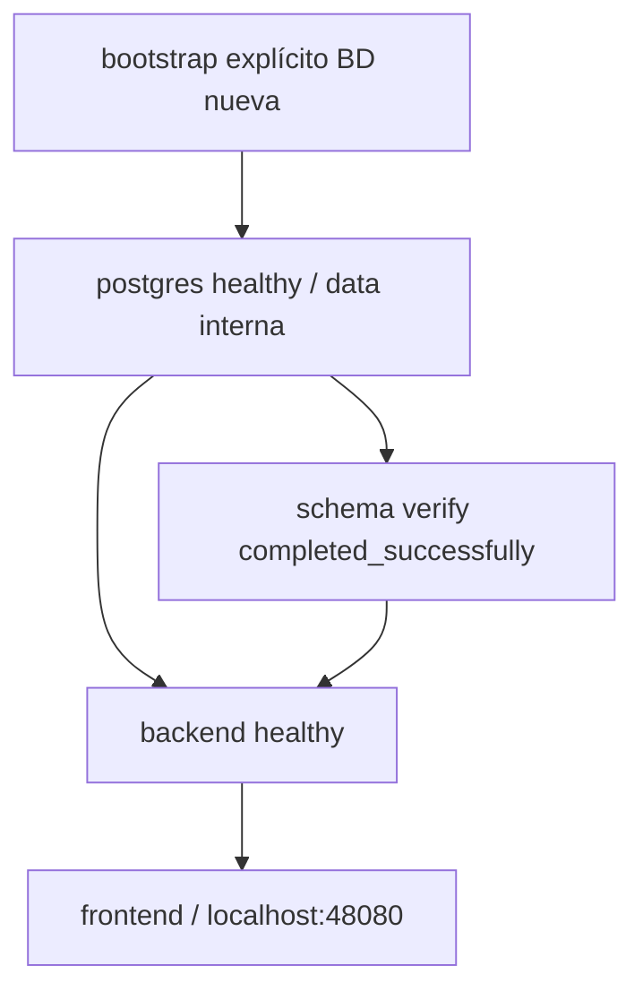

# Docker y ejecución

Auditoría 2026-10-07 · Backend `4189fa483ecbbed242946cefc6d4282e0e13dfe8` · Frontend `be0f12e0bf48d6df05afb1eced092b34c915e1cf`.

[Índice](00-README.md) · [Documento maestro](../ARQUITECTURA-INVENTARIO.md)

## Contenido

- [Imágenes y stages](#imágenes-y-stages)
- [Contextos y dockerignore](#contextos-y-dockerignore)
- [Compose servicios y redes](#compose-servicios-y-redes)
- [Entrypoint y health](#entrypoint-y-health)
- [Gateway](#gateway)
- [Comandos disponibles](#comandos-disponibles)
- [Fuentes](#fuentes)

## Imágenes y stages

| Stage | Propósito |
| --- | --- |
| Backend dependencies | npm ci lockfile/ignore-scripts |
| Backend build | contract emit offline y Nest build |
| Backend production-dependencies | prune omit dev/optional y scripts |
| Backend runtime | dist, producción deps, entrypoint; USER node/CMD serve |
| Backend tools | CLI/build y script garantías; migrations writable; USER node/CMD verify |
| Frontend build | Angular production |
| Frontend runtime | Nginx unprivileged SPA/proxy/healthz |

Node y Nginx digests fijados; PostgreSQL Compose digest fijado, lifecycle E2E postgres:17 flotante. Tags locales phase2a no constituyen release inmutable productiva.

## Contextos y dockerignore

Compose frontend context '.', backend ../inventario_back. Backend excluye Git/skills/secrets/deps/dist/tests/docs/migrations, excepto docs/backend-5b/aplicar-garantias.mjs. SQL no se copia a tools; script embebe sentencia. Migrations excluido y carpeta vacía creada tools: no contiene historial formal.

Git y dockerignore son filtros distintos: permitido pero untracked falta en checkout limpio. Fixes reales añadieron snapshot OpenAPI, script/SQL garantías y public/.gitkeep frontend. Commit 397c9d5 versiona script, no modifica whitelist ya existente.

## Compose servicios y redes



| Servicio | Persistencia/exposición |
| --- | --- |
| postgres | Volumen postgres_data; sin puerto host en Compose productivo-local |
| schema | Job verify, restart no, bootstrap separado |
| backend | data/application, sin puerto host, read_only/tmpfs/cap_drop ALL/no-new-privileges |
| frontend | application, 127.0.0.1:48080→8080, cap_drop/no-new-privileges |

Frontend no declara read_only en Compose. PG healthy → schema completed → backend healthy → frontend. Volumen persistente no debe eliminarse como rutina de restart.

## Entrypoint y health

Entrypoint construye DATABASE_URL desde DB_* si falta y admite _FILE excluyente. serve importa dist/main.js; verify llama Prisma db verify. bootstrap exige identidad/BD vacía/opt-in y aplica esquema+garantía. seed-local restringido a cuenta sintética y nombres DB locales permitidos; no administrador productivo.

Backend HEALTHCHECK ready cada 10s, timeout 3s, start 15s, retries 6. Readiness SELECT 1 con límite 2s; no integridad completa. Front healthz sólo Nginx.

## Gateway

/api/ tiene prioridad sobre SPA, conserva prefijo/códigos, DNS Docker por solicitud y requestId/forwarded headers. API/index no-store; hashes JS/CSS immutable un año, assets inexistentes 404; fallback index para pantalla. Headers nosniff/same-origin/SAMEORIGIN. Sin TLS listener productivo configurado.

## Comandos disponibles

```bash
cd ~/Proyectos/inventario_front
# .env.production.local propio configurado
npm run docker:config
npm run docker:build
# Sólo primera BD local Compose vacía:
npm run docker:bootstrap
npm run docker:up
npm run docker:ps
```

up verifica, no migra automáticamente BD existente. Bootstrap no es reparación de datos. Ver runbook/despliegue para límites y propuesta productiva.

## Fuentes

- [backend/Dockerfile](../../Dockerfile)
- [backend/.dockerignore](../../.dockerignore)
- [backend/docker/entrypoint.mjs](../../docker/entrypoint.mjs)
- [backend/docker-compose.yml](../../docker-compose.yml)

[frontend/Dockerfile](../../../inventario_front/Dockerfile)

[frontend/docker-compose.prod.yml](../../../inventario_front/docker-compose.prod.yml)

[frontend/docker/nginx.conf.template](../../../inventario_front/docker/nginx.conf.template)

[frontend/docker/security-headers.conf](../../../inventario_front/docker/security-headers.conf)
