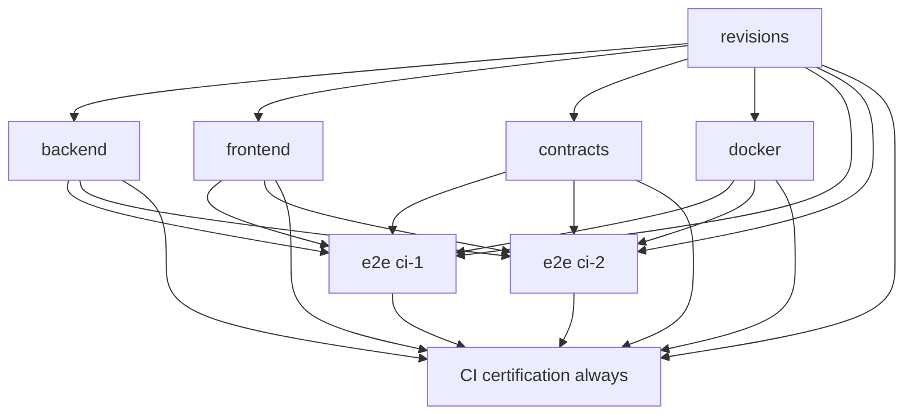

# CI y certificación

Auditoría 2026-10-07 · Backend `4189fa483ecbbed242946cefc6d4282e0e13dfe8` · Frontend `be0f12e0bf48d6df05afb1eced092b34c915e1cf`.

[Índice](00-README.md) · [Documento maestro](../ARQUITECTURA-INVENTARIO.md)

## Contenido

- [Triggers y permisos](#triggers-y-permisos)
- [Grafo real de needs](#grafo-real-de-needs)
- [Jobs](#jobs)
- [Checkout y pinning](#checkout-y-pinning)
- [Variables e instalaciones](#variables-e-instalaciones)
- [E2E y artifacts](#e2e-y-artifacts)
- [Baseline y significado](#baseline-y-significado)
- [Fuentes](#fuentes)

## Triggers y permisos

Workflow Sprint 7 CI: pull_request cualquier rama, push main/develop/sprint/**, workflow_dispatch. contents read. Concurrency workflow/ref, cancel-in-progress false. Ubuntu 24.04, Node aplicación 24.21.0. Actions SHA fijados checkout v4.2.2/setup-node v4.4.0/upload-artifact v4.6.2. Persist-credentials false.

CI_REPO_READ_TOKEN secreto de lectura compañero con fallback github.token; CI_FRONTEND_REF variable elige ref inicial, default main. No secret de registry/deploy en YAML backend.

## Grafo real de needs

Contracts no depende backend y Docker no depende frontend: ambos dependen revisions. E2E espera todos los gates. Certification always rechaza failure/cancelled/skipped de cualquiera.

## Jobs

| Job | needs | Timeout | Gate |
| --- | --- | --- | --- |
| revisions | — | 5 min | Checkout compañero/resuelve SHA único |
| backend | revisions | 30 min | Emit/diff limpio/tsc/lint/unit/build; mínimo 567 |
| frontend | revisions | 30 min | Typecheck/unused/lint/unit/build/componentes/node tests; mínimo 450 |
| contracts | revisions | 30 min | api:check y snapshots iguales |
| docker | revisions | 30 min | Build 3 imágenes/Chromium/representative validation skip integration/browser mínimo 3 |
| e2e | revisions + 4 gates | 35 min | Matrix ci-1/ci-2, fail-fast false, integración/browser/business/cleanup |
| certification | todos | 5 min | result success de cada dependency/resumen/upload |

## Checkout y pinning

Repos hermanos inventario_back/inventario_front. Revisions fija companion SHA una vez; todos los jobs reutilizan y guardan ambos sha.txt. Backend evento usa revisión del evento: PR puede ser merge context, no asumir head branch. Pareja certificada 4189fa.../be0f12e...

Frontend tiene workflow equivalente con CI_BACKEND_REF. Revisar pareja compatible para PR entre repos. Ref default flotante se resuelve una vez por run, no entre jobs.

## Variables e instalaciones

CI true, evidence dirs .ci-evidence/fase-1 y fase-2a, telemetry disabled, NODE_ENV test, URL DB/JWT sintéticos, TEST_INVENTARIO_DB 0/E2E_ALLOW_MUTATIONS 0 global. Matrix sobreescribe E2E_DB_KIND test, ALLOW_MUTATIONS 1 y cycle. npm ci ignore-scripts/no-audit/no-fund ambos repos. No-audit no es análisis de vulnerabilidades.

Backend emite contrato explícito y git diff --exit-code exige generados coherentes. Validadores JSON comprueban números mínimos, totalidad passed y ausencia pending/fallidos; browser no retries/flaky y máximo un reader skipped autorizado.

## E2E y artifacts

Chromium sin --with-deps. Cada ciclo prepara PG propio, e2e-run --integration, contratos, mínimo 312 integración/26 browser, business evidence y cleanup always. Docker cleanup condicional al state propio. Upload always/if-no-files-found error; retención **7 días** para diagnósticos y **30 días** para certification.json. Paths cubren JSON/logs y results gateway específicos, no todo screenshot/trace implícitamente.

Nombres attempt 1: backend-1/frontend-1/contracts-1/docker-1/e2e-ci-1-1/e2e-ci-2-1 y **certification-1** (certification.json, retención 30 días). No publicación docker push, registry login, host/environment productivo ni deploy.

## Baseline y significado

[Run 37679392828](https://github.com/Dennis9901/inventario_back/actions/runs/37679392828) completed/success para SHA exacto 4189fa483ecbbed242946cefc6d4282e0e13dfe8. Todos jobs/ciclos, business/cleanup/upload success. Es baseline reproducible de gates y pareja SHA; no release automáticamente desplegada ni backup DB.

Logs confirman runtime actions Node 20 forzado a 24 por GitHub, separado de Node app 24.21.0. Actualizar SHAs en tarea dedicada y recertificar; no cambiado aquí.

## Fuentes

- [backend/.github/workflows/ci.yml](../../.github/workflows/ci.yml)

[frontend/.github/workflows/ci.yml](../../../inventario_front/.github/workflows/ci.yml)

[frontend/scripts/ci-results.mjs](../../../inventario_front/scripts/ci-results.mjs)

[frontend/scripts/ci-contracts.mjs](../../../inventario_front/scripts/ci-contracts.mjs)

[frontend/scripts/ci-cleanup.mjs](../../../inventario_front/scripts/ci-cleanup.mjs)
