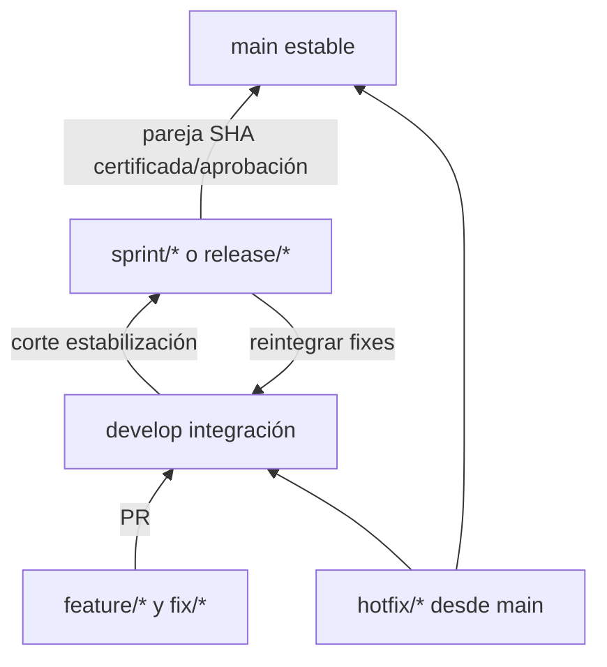

# Flujo Git propuesto

Auditoría 2026-10-07 · Backend `4189fa483ecbbed242946cefc6d4282e0e13dfe8` · Frontend `be0f12e0bf48d6df05afb1eced092b34c915e1cf`.

[Índice](00-README.md) · [Documento maestro](../ARQUITECTURA-INVENTARIO.md)

## Contenido

- [Estado Git comprobado](#estado-git-comprobado)
- [Flujo recomendado](#flujo-recomendado)
- [Convenciones](#convenciones)
- [Crear develop exactamente desde baseline](#crear-develop-exactamente-desde-baseline)
- [Releases y rollback Git](#releases-y-rollback-git)

## Estado Git comprobado

Backend activa sprint/7-industrializacion, HEAD 4189fa483ecbbed242946cefc6d4282e0e13dfe8. **Develop local ya existe** en 0252b610f56d4f324d2d8e5eb07f7d927e7571e8, igual que main local. No origin/develop en refs locales ni tags backend observados; no prueba ausencia remoto sin consulta. No se modificaron ramas.

Frontend activa sprint/7-industrializacion, HEAD be0f12e0bf48d6df05afb1eced092b34c915e1cf; ramas locales main y sprint/7-industrializacion, sin develop ni tags observados. Ambos repos historiales independientes. Integrar backend no integra frontend.

## Flujo recomendado



Feature/fix desde develop → PR develop. Sprint/release es corte de estabilización, no integración abierta tras freeze. Release validada → main y fixes → develop para evitar divergencia. Hotfix desde main estable → main/develop/release activa si corresponde. Para Sprint 7 cerrar con baseline y PR revisada según política, sin merges autorizados por esta auditoría.

## Convenciones

| Rama | Nombre/base |
| --- | --- |
| feature/* | feature/<ticket>-<descripcion>, develop |
| fix/* | fix/<ticket>-<descripcion>, develop |
| hotfix/* | hotfix/<ticket>-<descripcion>, main estable |
| sprint/* | sprint/<numero>-<objetivo>, corte develop |
| release/* | release/<version>, alternativa para entrega |

feat:/fix:/refactor:/test:/docs:/ci:/chore:, scope opcional y descripción concreta. Refactor no esconder comportamiento. PR coordinada registra compañero SHA/contrato/evidence. Proponer main/develop protegidas con CI certification y revisión; no se comprobó configuración efectiva de branch protection.

## Crear develop exactamente desde baseline

**Pendiente de autorización, no ejecutado.** git branch develop SHA fallaría ahora: nombre ya existe. Lectura previa:

```bash
cd ~/Proyectos/inventario_back
git status --short
git rev-parse 4189fa483ecbbed242946cefc6d4282e0e13dfe8^{commit}
git show-ref --verify refs/heads/develop
git ls-remote --heads origin develop
```

Recomendación conservar ref histórica renombrándola, luego crear develop exacta sin checkout/switch. Sólo después de autorización y comprobar nombre archivo libre:

```bash
git branch -m develop archive/develop-pre-sprint7
git branch develop 4189fa483ecbbed242946cefc6d4282e0e13dfe8
git rev-parse refs/heads/develop
# Publicar sólo con autorización y remoto compatible:
git push -u origin develop
```

Renombrado conserva commit pero cambia ref/nombre; requiere decisión. Si remoto develop ya existe y difiere, detener y definir integración, nunca force push. Alternativa crear develop-certified y decidir nombre después, pero ese nombre no coincide trigger develop actual.

## Releases y rollback Git

PR concreta describe behavior/tests/pareja SHA/migración, evidencia y riesgos. Ref compañero en CI debe ser compatible. Tags/releases sólo con política autorizada; hoy no hay tags backend. Revert en PR conserva historia pero escribe código y no es rollback de imagen/DB. No reset/clean/sobrescribir historial para recuperar producción.
